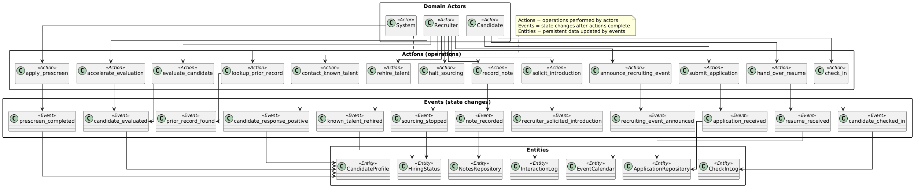
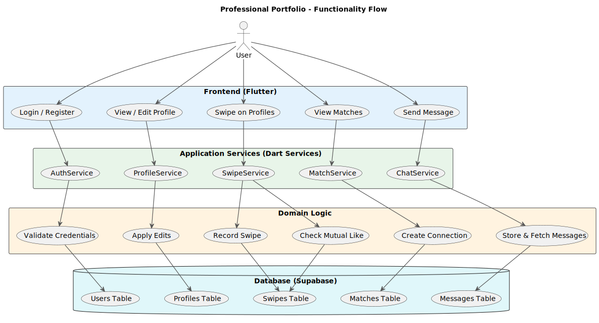
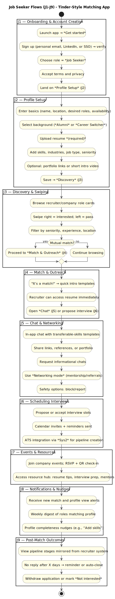
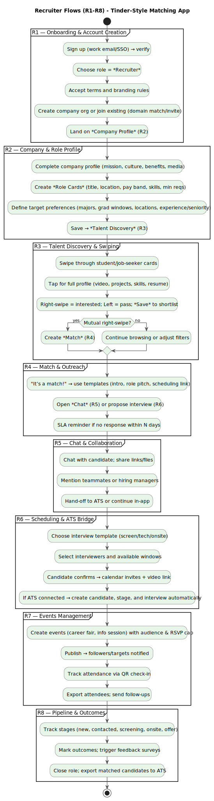
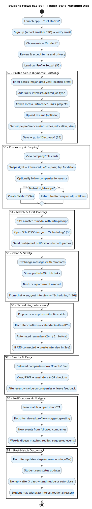
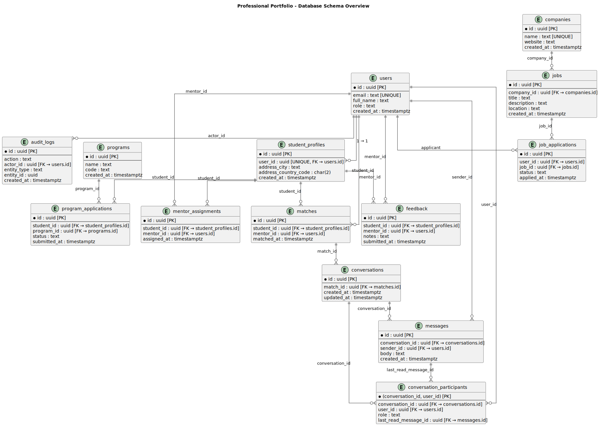
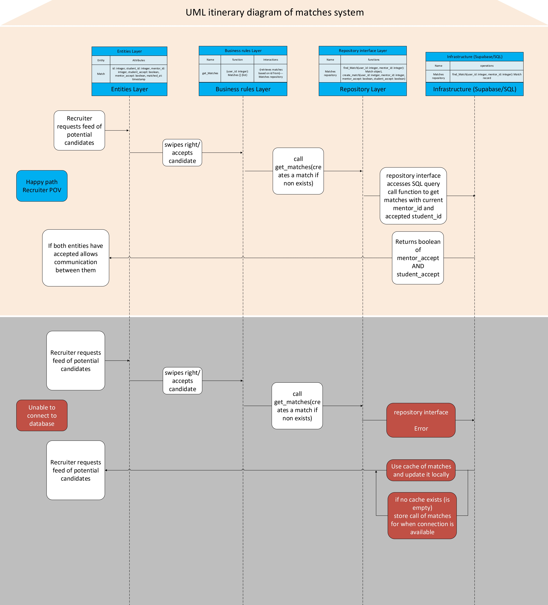
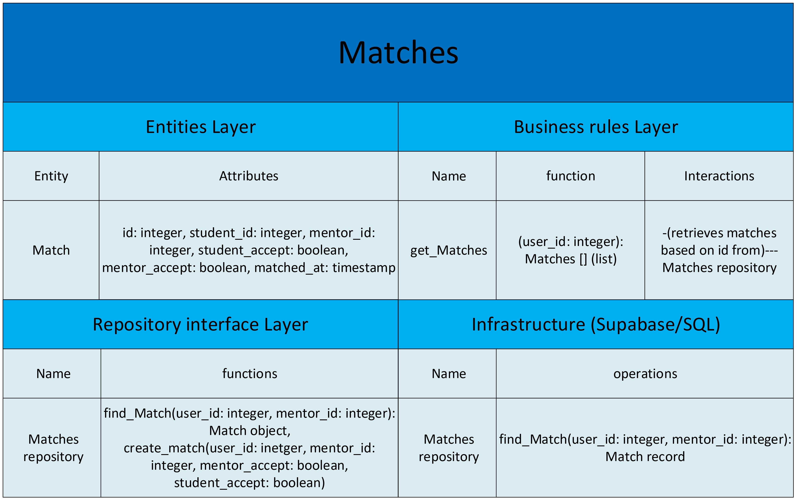

= Professional Portfolio Documentation
Third Milestone - Software Design - INSO 4117
Prof. Marko Schütz-Schmuck 
:doctype: book
:includedir: ../Images
:toc:
:sectnums:

[discrete]
== Notation for Changes
[cols="3,2,5",options="header"]
|===
| Symbol | Function | Example

| #Highlight#
| Added
| #This text is new.#

| [.underline]#Underline#
| Paraphrased 
| [.underline]#This text has been modified.#

| [line-through]#Strikethrough#
| Removed
| [line-through]#This text is no longer relevant.#
|===
'''


== Informative Part

=== Team

For Milestone 1, the team was organized into four functional groups. These are Research, Functionality, Design, and Documentation; plus three Managers. In this context, all team members are considered partners. No external partners have been identified for this milestone; if any arise, their roles and responsibilities will be documented. The lists are presented in alphabetical order and indicate each group’s Team Leader. The Tasks column is reserved for recording completed issues.

===== Managers:
[cols="3,2,5",options="header"]
|===
| Student| GitHub username | Tasks
| Kaysha L. Pagan López | link:https://github.com/Kay9876[@Kay9876] | 
| Juan R. Rivera Rodríguez | link:https://github.com/JRRR0912[@JRRR0912] | 
| Julian A. Vivas Gandarillas | link:https://github.com/julivivas[@julivivas] | 
|===

===== Developers:
[cols="3,2,5",options="header"]
|===
| Student | GitHub username | Tasks
| Luis J. Cruz Cruz _(Team Leader)_ | link:https://github.com/LuisJCruz[@LuisJCruz] | #4, #16, #45, #69, #76, #98
| Yandre Cabán Torres | link:https://github.com/YandreCaban[@YandreCaban] | #16, #35, #69, #72
| Carlos A. Ferrer Hayes | link:https://github.com/CarlosxFerrer[@CarlosxFerrer] | #16, #34, #69, #75
| Osvaldo F. Figueroa Canino | link:https://github.com/Osvaldoo1414[@Osvaldoo1414] | #16, #36, #60, #62, #69, #71, #91
| Ariana P. Rodríguez Méndez | link:https://github.com/arianrodz21[@arianrodz21] | #37, #69, #73
|===
[cols="3,2,5",options="header"]
|===
| Student | GitHub username | Tasks
| Jean P. I. Sánchez Félix _(Team Leader)_ | link:https://github.com/JeanSanchezFelix[@JeanSanchezFelix] | #2, #15, #23, #24, #26, #38, #45, #59, #76, #92, #96, #98
| Carlos E. Cabán González | link:https://github.com/Carloscaban[@Carloscaban] | #24, #32, #33
| Jahdiel E. Montero Alicea | link:https://github.com/JadStelar[@JadStelar] | #29, #30, #31, #67
| Kiara N. Pérez Rivera | link:https://github.com/kiarancole[@kiarancole] | #38, #39, #47, #48, #60, #61, #63, #99
| Pedro A. Rodríguez Vélez | link:https://github.com/PedroRodz[@PedroRodz] | #13, #14, #24, #26, #28, #38, #39, #41, #49, #52, #53, #57, #82
| Alexa M. Zaragoza Torres | link:https://github.com/alexamzt[@alexamzt] | #24, #25, #26, #27, #38, #39, #50, #51, #53, #54, #55, #56, #101
|===

[cols="3,2,5",options="header"]
|===
| Student | GitHub username | Tasks
| Diego Pérez Ganradillas _(Team Leader)_ | link:https://github.com/diegoperez16[@diegoperez16] | #17, #18, #21, #45, #65, #76, #78, #93, #94, #98, #103
| Axel A. Orta Félix | link:https://github.com/Axl47[@Axl47] | #20
| Carlos Pepin Delgado |  link:https://github.com/carlospepin23[@carlospepin23] | #19, #21, #40, #42, #43, #44, #83, #84, #85, #86, #181, #191, #194, #195, #197, #200, #218, #228, #336, #337, #338
| Ryan R. Vélez Villarrubia | link:https://github.com/RyanVelez101[@RyanVelez101] | #66, #95
|===

[cols="3,2,5",options="header"]
|===
| Student | GitHub username | Tasks
| Horeb Cotto Rosado _(Team Leader)_ | link:https://github.com/horebcotto21[@horebcotto21] | #6, #12, #45, #68, #76, #98
| Samarys Barreiro Meléndez | link:https://github.com/SamarysB[@SamarysB] | #7, #77
| Fernando Castro Cancel | link:https://github.com/fernan-castro[@fernan-castro] | #10, #74
| Abdiel Cotto Claudio | link:https://github.com/abdielcotto[@abdielcotto] | #11, #70
| Naedra J. Feliciano Agostini | link:https://github.com/Naedra[@Naedra] | #8, #79, #97
| Heribiell A. Rodríguez Cruz | link:https://github.com/LightPolution[@LightPolution] | #9, #38, #53, #58
|===

=== Current Situation, Needs, Ideas

==== Current Situation

Moving from school to a job can be tough for grads and companies. Lots of students feel like job hunting is cold and doesn't work well. They send out tons of applications and don't hear back. Forbes Advisor says almost 60% of job seekers feel like companies just disappear on them, which is annoying and makes them worried about their careers. But companies have problems, too. They get flooded with applications for starter jobs, and a lot of people aren't a good match. It takes up a lot of time and money to find the right people. This whole thing is inefficient and doesn't really show when a candidate and a company might actually be a good fit for each other's goals. It can be a pretty bad experience for everyone.

==== Need

Structural friction in early-career recruiting (lack of visibility, opaque communication, and operational overload) 
reveals needs that belong to domain actors, not to a platform. The needs are outlined below.

===== Applicant / Recent Graduates
* Be discoverable for roles that truly match skills, interests, eligibility, availability, and location.  
* Receive timely, transparent feedback about interest and status to reduce ghosting and uncertainty.  
* Ensure fair access to opportunities and maintain control over privacy when sharing work and personal data.  
* Obtain guidance to translate coursework, projects, and soft skills into recruiter-trusted signals.  

===== Employers / Recruiters
* Efficient triage toward candidates who meet must-have criteria and show mutual interest.  
* Rich, trustworthy evidence of capability and professional culture.  
* Predictable, compliant communication and scheduling to minimize drop-off and miscommunication.  

===== Cross-Cutting Needs
* Mutual-interest signaling before deep engagement.  
* Early expectation alignment on role scope, compensation range, work modality, and timeline.  
* Low-friction coordination for first conversations and follow-ups.  
* Trust and safety: identity assurance, respectful conduct, and clear reporting channels.  

===== Project-Internal Enabling Needs
* A shared domain description and a baseline set of requirements so the team understands needs independently of any system-to-be.  
* A consistent, ubiquitous language across analysis, design, and code to prevent concept drift.  
* Plans for requirements, architecture, component design, implementation, and testing to support whatever idea is chosen later.  


==== Ideas

We propose a three-part design focused on a personalized, efficient, and high-quality user experience. The foundation of this approach is a onboarding and profile system. The system would create two fundamentally different experiences based on the user, whether they are a recruiter or a candidate. The system will request only the most relevant information for each persona, such as portfolios for students or verifying company details for recruiters. The system will have an interface that avoids clutter and ensures the platform feels built for each user from their very first interaction. Making it easier and more inclusive without replacing the current infrastructure.

Once users are onboarded, the swiping mechanism would enhance the core matching process by moving beyond a simple binary decision. This means creating carefully designed cards that act as a information display. The profiles can have an simple view and a more detailed view. The key to this design is a hierarchy that is informed by user research and which surfaces key decision making data relevant to the user directly in the swiping interface to maximize informed matches without causing overload.

Finally, to ensure connections are meaningful and productive, the mutual Match connection and messaging gateway would unlock only after both parties have shown interest. Afterwards, the system would immediately facilitate the first message and it could include some kind of icebreaker or customizable openers. Furthermore, a dedicated inbox to keep users organized, allow for easy profile review, and potentially integrate scheduling tools, transforming a simple Match into a genuine gateway to opportunity.


=== Scope, Span, and Synopsis

==== Scope and Span

===== Scope
The project's scope is to develop a mobile application aimed at improving the connection between students and recruiters. The app will address issues with traditional job search platforms and career fairs, which are often impersonal and inefficient, leading to a lack of engagement and missed opportunities. The project will encompass several key areas:

* Domain Engineering: Analyze the current landscape of student-recruiter engagement, identifying pain points in job fairs, static job boards, and passive search platforms. The goal is to create a faster, more efficient, and more engaging way for students and recruiters to connect.

* Requirements Engineering: Define system requirements to enable students to showcase their skills, qualifications, portfolios, and preferences dynamically. Recruiters will also be able to display what their company is offering and looking for. Requirements will focus on improving job placement rates, event attendance, and reducing the time spent in the recruitment process. These requirements will be refined continuously using direct feedback from both students and recruiters.

* Software Architecture: The architecture will feature a mobile front-end with a swipe-based matching system, real-time notifications, and event integration. The back-end will connect with job boards, applicant tracking systems, career services, and on-campus event data to strengthen student-recruiter engagement.

* Software Design Process: The project will follow an iterative design and development process, beginning with a pilot test to evaluate performance and identify areas of improvement. User feedback will drive optimization of the user interface, swiping experience, and the matching algorithm.

===== Span
The project's span is focused on creating a scalable and user-friendly solution that streamlines the student-recruiter connection process. The app is designed to support efficient matching, real-time communication, and event integration.

* Specifics of the System: Students can create detailed profiles including videos, portfolios, and soft skills. Recruiters will also create company profiles that highlight roles, culture, and expectations. When both parties swipe right, they are notified of a Match and can begin communicating via chat or set up interviews. The app will also notify students about campus events that involve companies they have swiped right on, even if a Match has not occurred.

* Target Audience and Expansion: The initial span of the project involves a pilot test with a defined user base of students and recruiters. Expansion will include partnerships with recruiters, direct marketing to universities, and support for on-campus career fairs. Over time, the platform will expand to larger student and recruiter networks beyond the initial pilot.

* Methodology and Maintenance: The project will adopt an iterative methodology with regular update cycles guided by new technology trends and continuous user feedback. Effectiveness will be tracked through key metrics such as app usage frequency, Match success rate, recruiter follow-up rate, event attendance, and user satisfaction. The cycle of feedback, optimization and scaling will ensure the app remains relevant and impactful.

==== Synopsis

The project aims to develop a mobile application that modernizes how students and recruiters connect by addressing the inefficiencies of traditional job search methods. It uses a swiping-based interface to enable dynamic and real time engagement between students presenting their qualifications and recruiters offering opportunities. Throughout its lifecycle, the project will progress through several key phases: requirements engineering to define user and system needs, software architecture and design to establish the platform’s structure, implementation of both front-end and back-end components, and systematic testing and validation to ensure reliability and usability.# #An iterative approach will be adopted, allowing feedback to refine requirements and improve design over time. The final goal is to deliver a scalable and efficient application that enhances job placement success, fosters meaningful recruiter to student connections, and maintains user centered quality across all development stages.

=== Other Activities than Just Developing Source Code

#Although implementation is central to the project, a significant portion of the work since Milestone 1 consisted of non-coding activities that shaped the system’s direction, clarified requirements, validated assumptions, and prepared the team for upcoming development. This section documents planning, research, experimentation, testing preparation, and design exploration work that contributed directly to the system’s maturity.#

==== #Requirements Refinement and Domain Understanding#
Throughout Milestones 1-3, the team conducted several rounds of requirement clarification to reinforce the foundation of the system and align with the evolving domain model (Candidate, Recruiter, Profile, Opening, Application).

===== Domain Exploration Workshops
* Structured sessions focused on understanding student–recruiter interactions in job fair environments.
* Observations emphasized real-world constraints such as noise, fatigue, time limitations, lack of preparation, and poor recall.
* Insights from these workshops directly influenced the definition of aggregates and bounded contexts.

===== Persona and Scenario Development
* Personas included: overwhelmed student, fatigued recruiter, early-year undecided student, and highly prepared senior.
* Scenarios were refined to represent realistic workflows and stress points across both user types.

===== Requirements Revisions
* Several ambiguous requirements were rewritten to be measurable and testable.
* Non-functional requirements (responsiveness, clarity, adaptive interaction, information recall support) were clarified.
* Edge-case analysis led to new requirements around profile completeness and recruiter note structure.

===== Mapping Requirements to Domain Structures
* Requirements were systematically mapped to the emerging aggregates:
** *Candidate* – profile ownership, application submission, match visibility.
** *Recruiter* – opening ownership, candidate review workflows, note-taking.
** *Profile* – central reference for candidate attributes and matching.
** *Opening* – job description structure, eligibility constraints.
** *Application* – lifecycle events, status handling, duplicate prevention.

These activities ensured a deeper understanding of user needs and established a solid basis for design and implementation.

==== #Design and Architecture Exploration#

Multiple design-oriented sessions occurred to visualize and reason about the evolving system structure.

===== Domain Model Iterations
* Iterative refinement of early conceptual models revealed issues such as duplicated responsibilities in the Profile entity and unclear aggregate boundaries.
* Responsibilities were redistributed to reduce coupling, especially between Candidate and Recruiter roles.

===== UML Diagram Creation
* Class diagrams were drafted for all primary aggregates (Candidate, Recruiter, Profile, Opening, Application).
* Sequence diagrams were created for:
** Candidate applying to an opening.
** Recruiter reviewing matches.
** MatchService generating a ranking.
* State diagrams were explored for application status transitions.

===== Architecture Discussions
* Evaluations included modular monolith vs. service-split designs.
* Clearer separation between application layer and domain layer emerged from these discussions.
* The team emphasized a domain-driven design approach for maintainability and scalability.

===== Review of Aggregates and Bounded Contexts
* Candidate and Recruiter emerged as primary user-driven aggregates.
* Profile, Opening, and Application were validated as supporting aggregates with well-defined ownership.
* Ambiguous relationships (e.g., who owns profile edits during applications) were clarified.

===== Preliminary Interface and Interaction Flow Mapping
* Early workflow mapping included:
** Profile creation.
** Opening creation.
** Application submission.
** Match generation.
** Recruiter feedback loop.

These activities informed structural and behavioral foundations for upcoming implementation.

==== #Research and Technology Evaluation#

Significant research effort took place to guide development decisions and ensure alignment with industry standards.

===== Data Storage Approaches
* Comparison of relational vs. document-based models for profile and recruiter note data.
* Early sketches of hybrid approaches where structured attributes coexist with semi-structured notes.

===== Review of Similar Existing Systems
* Analysis of Handshake, LinkedIn, and other career platforms identified common features and missing opportunities.
* Findings informed the matching and interaction design.

===== Matching Algorithm Research
* Early exploration of:
** attribute weighting,
** recruiter preference scoring,
** profile completeness coefficients,
** potential future ML extension.

This research shaped the conceptual basis for MatchService and related components.

==== #Testing Activities#
This involves deciding how unit testing, integration testing, and usability evaluation will eventually be carried out once prototypes and code are available. In parallel, version control practices such as branching strategies, pull requests, and code reviews can already be defined so the team is prepared to manage collaboration effectively when development begins. These preparatory activities set the standard for a structured and reliable workflow.

===== Early Validation and Experimentation
* Manual walkthroughs simulating student–recruiter interactions.
* Scenario-driven tests examining typical flows:
** match generation,
** profile editing,
** application duplication.
* Pseudocode logic experiments for validating data flow in Profile and Opening interactions.
* Persona-based consistency checks to ensure realism.

===== Planning and Infrastructure for Future Testing
* Draft test strategy including unit tests, integration tests, and future usability tests.
* Early test case definitions:
** Profile completeness,
** Application submission rules,
** Opening eligibility checks.
* Error scenario mapping for likely failure points.

These activities ensured analytical rigor before any code was written.

==== #Project Management and Coordination#

Consistent coordination activities supported progress clarity and team alignment.

===== Milestone Planning Sessions
* Deliverables, deadlines, and responsibility distribution were set for each milestone.

===== Meeting Documentation
* Logs captured decisions, unresolved questions, design changes, and next steps.

===== Role Clarification
* Clear assignments for:
** domain modeling,
** testing preparation,
** documentation,
** research.

===== Communication Management
Project management and communication establish the general structure that ties everything together during this milestone. Setting clear milestone goals, assigning responsibilities, and documenting meeting outcomes help the team stay organized and avoid confusion. Regular communication ensures that issues are identified and addressed early, while planning for security, privacy, and future phases prepares the project for ongoing development. By combining documentation, early planning for testing and version control, and strong management practices with the coding that will follow, the team lays the foundation for a successful project.

===== #Documentation and Logbook Updates#
Source code development is a top priority on this project, its success depends on several activities that extend beyond programming. Documentation plays a crucial role in keeping the project aligned, covering goals, requirements, architectural decisions, and detailed contributions. Well-maintained records make it easier for members to integrate into new teams and ensure stakeholders remain informed about progress, scope, and direction throughout the project.


===== Domain Description Drafting
* Consolidation of observations, stakeholder statements, personas, and requirements.

===== Milestone Logbook Maintenance
* All design and modeling changes recorded with proper notation and revision trails.

===== Diagram Documentation
* All UML diagrams versioned with explanations for each update.

=== Derived Goals


A key outcome of this project is the emergence of several derived goals that extend beyond the primary function of matching recruiters and job seekers. These goals leverage the platform's unique data and position to create secondary, significant value.

One major derived goal is the generation of actionable market intelligence. The matching process naturally produces a rich stream of data on skills, salaries, and hiring trends. By systematically learning from this data, [.underline]#this intelligence enables strategic talent acquisition for recruiters by identifying hidden talent pools, providing competitive benchmarking on metrics like time-to-hire, and predicting emerging skill demands. Furthermore, this aggregate data serves as a critical feedback loop for the platform's own strategic development and product roadmap, ensuring the service remains optimally aligned with real-world market needs. This transforms the platform from a simple transactional tool into an indispensable, intelligent partner for talent leaders and the platform itself.#

A second derived goal involves creating a dynamic bridge between education and industry. The data generated provides [.underline]#a real-time, aggregate map of the skills employers need versus the skills the collective candidate pool possesses. This allows the platform to become a vital feedback mechanism for universities and bootcamps, helping them validate and modernize their curricula to close specific, large-scale skills gaps, such as a lack of training in high-demand tools like Docker. On a broader scale, this data can fuel regional economic development by helping cities and governments# identify critical talent shortages and create targeted workforce programs, ultimately building a stronger, more aligned local economy.

Finally, a crucial derived goal is to transform the job search from a black box into a guided journey for the candidate. The platform can leverage its collective data to demystify the process, providing unprecedented transparency. This includes empowering job seekers with data-backed salary insights that illuminate how specific skills impact pay, enabling confident negotiation. It also involves providing a realistic "mirror" to the market, showing candidates exactly how their profile measures up and pinpointing specific areas for improvement. By offering a "pulse" on typical hiring timelines and illuminating common career progression paths, the platform reduces the anxiety and uncertainty of job hunting. This shifts its value proposition from merely finding a job to becoming a trusted advisor for managing an entire career, thereby building immense user loyalty and trust.


== Descriptive Part

=== Domain Description

==== Domain Rough Sketch

NOTE: This is an unprocessed collection of notes, quotes, and observations from the domain (student–recruiter interactions). 
#However, analytic abstractions derived from these notes have been added inline.#


*Student (Abdul, Mechanical Engineering senior)*:  
“At last year’s fall job fair, I stood in line almost 40 minutes just to hand my résumé to a recruiter from Pratt & Whitney.  
The line wrapped around the Student Center atrium — people were sweating, holding folders, and trying to look composed.  
When I finally got to the table, the recruiter just smiled, took my résumé, and said they’d be in touch. I wasn’t sure if she’d even remember me by the end of the day.”  

- → *Observation:* Waiting fatigue, impersonal exchanges, uncertainty about follow-up.  

- → #**Derived concepts**: _queue duration_, _interaction brevity_, _candidate recognizability_, _physical discomfort_, _interaction outcome uncertainty_.#


*Recruiter (Corey, Lilly Pharmaceuticals)*:  
“We meet hundreds of students in just a few hours. By the end of the day, names and faces blur together.  
I jot quick notes on sticky labels: ‘Python — confident’, ‘Good communicator’, or sometimes just a checkmark.  
Later, when reviewing, I can’t always recall which student said what.”  

- → *Observation:* Recruiters rely on quick, shorthand impressions; limited retention of individual details.  
- → #**Derived concepts**: _meeting duration_, _candidate trait extraction_, _note/annotation_, _memory fade_, _reviewing constraints_.#


*Student (Maria, Computer Engineering junior)*:  
“This year I wore new shoes — bad idea. I had a class right before the fair and another right after, so I kept rushing back and forth between buildings.  
By the time I came back to the fair after my thermodynamics class, it was packed. I could barely hear anything; someone even stepped on my heel while I tried to talk to a recruiter from Google.  
It’s so loud you have to almost shout to be heard.”  

- → *Observation:* Physical fatigue and environmental noise affect both comfort and communication quality.  

- → #**Derived concepts**: _environmental noise_, _communication friction_, _mobility constraints_, _time pressure_, _crowd density_.#


*Recruiter (Daniel, local tech startup)*:  
“By noon, my voice is gone. I try to smile and look engaged, but it’s hard to remember each student’s story.  
We keep a spreadsheet open on the booth laptop — name, major, key skills — just enough to remember who’s who.  
If a student brings something visual, like a project or a QR code to their portfolio, it really helps.”  

- → *Observation:* Recruiters value portfolio evidence over résumé lines; digital aids improve recall. 
 
- → #**Derived concepts**: _information reinforcement_, _portfolio artifact_, _digital reference_, _interaction fatigue_, _memory support tools_.#


*Student (Lina, Electrical Engineering sophomore)*:  
“I applied on Handshake, then on LinkedIn, and again on the company website. I never knew if anyone actually saw it.  
After two months, no one replied, and I started to wonder if my applications were just getting lost somewhere.”  

- → *Observation:* Lack of transparency in the post-fair pipeline; unclear feedback loop between applicant systems.  

- → #**Derived concepts**: _application visibility_, _pipeline opacity_, _multi-platform submissions_, _response latency_.#


*Recruiter (Rafael, mid-sized design firm)*:  
“We usually contact students weeks later, but by then many already accepted other offers or stopped checking their student email.  
If the first batch of candidates looks good, we stop looking. There’s just too little time.”  

- → *Observation:* Recruiting process favors early applicants; short attention window post-fair.
  
- → #**Derived concepts**: _review window_, _candidate availability_, _early-selection bias_, _time-limited screening_.#


*Student (Jorge, freshman)*:  
“I was nervous to talk to recruiters because I didn’t even know what their companies did.  
Some just told me, ‘come back next year when you have more experience.’  
I mostly went this year just to practice — to get used to talking.”  

- → *Observation:* Early-year students attend fairs for exposure rather than placement; recruiters focus on upperclassmen.  

- → #**Derived concepts**: _experience gap_, _interaction purpose variance_, _preparation asymmetry_, _first-time candidate behavior_.#


*Recruiter (Helen, aerospace company)*:  
“A lot of students come unprepared — they don’t know which positions are open, or what our company even does.  
We’d love to pre-screen them, maybe through a short survey or a skill-based filter before the fair starts.”  

- → *Observation:* Recruiters express need for pre-fair filtering and digital preparation workflows.

- → #**Derived concepts**: _preparedness level_, _pre-screening questionnaire_, _role-awareness_, _skill matching_.#


*Student (Emilio, Software Engineering senior)*:  
“The fair feels like speed dating — you only get two minutes to impress, then they move on.  
It’s hard to show personality or teamwork skills when the line behind you is ten people long.”  

- → *Observation:* Limited interaction window leads to superficial evaluation; “soft skills” remain under-assessed.  

- → #**Derived concepts**: _interaction time constraint_, _soft-skill invisibility_, _queue pressure_, _rapid-assessment mode_.#


*Recruiter (Isabel, consulting firm)*:  
“We hand out branded tote bags and pens — it’s funny, but sometimes that’s what students remember us by.  
When I reach out later, they’ll reply ‘Oh, you were the ones with the blue water bottles!’”  

- → *Observation:* Brand association through physical tokens enhances recall; small sensory cues matter.  

- → #**Derived concepts**: _brand token_, _sensory cue_, _recall aid_, _brand-to-memory mapping_.#


*Student (Arjun, Industrial Engineering senior)*:  
“I wish I knew right away if I had a chance instead of waiting months. After the fair, you check your email every day, but mostly nothing happens.”  

- → *Observation:* Desire for instant or early feedback mechanisms post-interaction.  

- → #**Derived concepts**: _feedback latency_, _candidate anxiety cycle_, _instant-evaluation desire_.#


*Recruiter (Paula, tech recruiter)*:  
“We often rehire interns we already know. There’s trust there — we’ve seen their work.  
That’s why sometimes new applicants don’t get the same attention.”  

- → *Observation:* Prior familiarity skews fairness; existing relationships heavily influence hiring behavior.  

- → #**Derived concepts**: _familiarity bias_, _trust-weighted selection_, _returning applicant advantage_.#


*Student (Elena, Business Administration major)*:  
“The fairs are always packed — the noise, the pushing, it’s chaotic. I tried to ask a recruiter a question, but they just handed me a flyer and moved on.  
Later, I realized that the quieter booths in the back actually had time to talk.”  

- → *Observation:* Spatial arrangement and booth placement affect engagement quality.  

- → #**Derived concepts**: _booth location_, _interaction density_, _engagement opportunity_, _crowding effect_.#


*Career Advisor (Lucia, UPRM)*:  
“We encourage students to bring a ‘target list’ of companies, but many still wander without a plan.  
On the other side, recruiters tell us they want better visibility into who’s coming — maybe an advance roster of students and their profiles.”  

- → *Observation:* Advisors recognize preparation asymmetry; opportunities for platform pre-matching. 

- → #**Derived concepts**: _target-list preparation_, _candidate pre-registration_, _roster visibility_, _pre-match potential_.#

==== Terminology

[NOTE]
====
Each term below is derived from raw observations in the Domain Rough Sketch (2.1.1) and refined through concept analysis. Terms are presented with their classification (entity, actor, event, etc.), domain scope, and traceability to source observations. The derivation of each term is explicitly shown through annotations linking back to specific observations, quotes, and patterns from the rough sketch.

This structured approach ensures transparency in how our domain vocabulary emerged from real-world observations rather than being imposed artificially. When new terms are needed, they should follow this same pattern of clear derivation from documented domain phenomena.

#The terms are now organized into Domain Nouns, Domain Verbs, and Domain Constraints to align with ubiquitous language structure in Domain-Driven Design.#
====

[discrete]
=== #Domain Nouns (entities, objects, abstractions)#

*Applicant* :: (entity, domain)
A person, usually a student or recent graduate, pursuing professional chances. Candidates strive to highlight their abilities and credentials via their portfolios.
[.small]#_Derived from: "Students often rely on school provided career services for resume templates"; "Student: 'I applied through Handshake, LinkedIn, and the company website'"_#

*Employer* :: (entity, domain)
An organization that owns openings and ultimately employs candidates. Multiple recruiters may represent the same employer during sourcing and selection.
[.small]#_Derived from: "Recruiter: 'We usually contact students weeks later'"; multiple references to company and employer context_#

*Recruiter* :: (actor, domain)
A hiring professional acting on behalf of an employer to discover, evaluate, and engage candidates. A candidate may interact with several recruiters for the same employer.
[.small]#_Derived from: "We meet hundreds of students in a single afternoon"; "Some recruiters only target juniors and seniors"; "Recruiters: 'We prefer quick ways to identify students with the right skills'"_#

*Portfolio* :: (entity, domain)
A collection of an applicant’s work, projects, and achievements. Portfolios provide recruiters with evidence of professional skills.

*Skill* :: (entity, domain)
A demonstrated ability, either technical or interpersonal, that contributes to an applicant’s professional profile.

*Qualification* :: (entity, domain)
An educational or professional credential (e.g., degree, certification) that indicates formal preparation or eligibility.

*Work Modality* :: (entity, domain)
The way in which work is performed, such as on site, remote, or hybrid.
[.small]#_Derived from: Students value flexibility in work arrangements; need for early expectation alignment on work modality_#

*Compensation Range* :: (attribute, domain)
The expected or offered salary **plus applicable benefits** (e.g., equity/options, health plan, stipends, shuttle/transport, on-site meals). Considered between applicant and employer.
[.small]#_Derived from: "Early expectation alignment on role scope, compensation range, work modality, and timeline"; need for transparency in total compensation_#

*Location* :: (attribute, domain)
The geographic context for a role or event (e.g., city/region/country) or “remote-eligible,” used for discovery and filtering.

*Start Date* :: (attribute, domain)
The intended employment start date or window associated with an opening or offer.

*Mutual Interest Signaling* :: (event, domain)
The occurrence of both applicant and employer expressing interest, creating the basis for a potential connection.

*Connection* :: (entity, domain)
The relationship established upon mutual interest. Day-to-day interaction typically occurs between the applicant and the **recruiter** representing the **employer**; any employment outcome is with the employer.

*First Conversation* :: (event, domain)
The initial professional interaction after a confirmed connection, typically between an applicant and a **recruiter**; it may still be considered as leading to a connection with the **employer**.
[.small]#_Derived from: "Student: 'I'm nervous approaching a recruiter if I don't already know about the company'"; importance of structured initial interactions_#

*Interview Modality* :: (taxonomy, domain)
The manner in which an interview is conducted (e.g., in-person, virtual). Serves as the parent concept for specific interview types.
[.small]#_Derived from: "Job fairs are often loud, crowded, chaotic"; need for flexible interaction formats_#

*Validity Period* :: (attribute, domain)
The time window during which an offer remains actionable before it expires.

[line-through]*Clarifications* :: [line-through]#(process, domain)#
[line-through]#Bidirectional questions and answers to resolve ambiguities (scope, duties, timeline) without changing negotiated terms.#

[line-through]*Adjustments* :: [line-through]#(process, domain)#
[line-through]#Mutually agreed changes to offer terms (e.g., title, start date, compensation range) prior to acceptance.#

[line-through]*Accept* :: [line-through]#(decision/event, domain)#
[line-through]#The applicant’s affirmative decision to proceed under the current offer within its validity period.#

[line-through]*Decline* :: [line-through]#(decision/event, domain)#
[line-through]#The applicant’s explicit decision not to proceed under the current offer.#

[line-through]*Ghosting* :: [line-through]#(behavior, domain)#
[line-through]#The act of ceasing communication without notice, leading to inefficiency in the recruitment process.#
[line-through]#[.small]##_Derived from: "Student: 'I never know if recruiters actually looked at my resume or if it went into a pile'"; lack of feedback and communication_###

*Identity Assurance* :: (behavior, domain)
The process of verifying that participants are authentic and represent legitimate individuals.
[.small]#_Derived from: Need for "trust factor" mentioned by recruiters; importance of verified connections_#

*Recruitment Event* :: (entity, domain)
A scheduled occasion, such as a job fair or networking session, where applicants and employers directly engage.
[.small]#_Derived from: Multiple references to job fairs; "At the job fair, I stood in line 40 minutes just to hand over my resume"_#

*Expectation Alignment* :: (behavior, domain)
The process of clarifying and agreeing on key role aspects, including scope, compensation, timeline, and modality.
[.small]#_Derived from: "Recruiters say a lot of students come unprepared, don't know what positions are open"; need for upfront clarity_#

*Trust and Safety* :: (behavior, domain)
The assurance that professional interactions occur under respectful conduct, secure data handling, and clear reporting mechanisms.
[.small]#_Derived from: Recruiters mentioning "trust factor" with known candidates; need for safe, professional interactions_#

[line-through]*Feedback* :: [line-through]#(event, domain)#
[line-through]#Information shared between employer and applicant regarding application status, interest, or evaluation, enabling transparency.#
[line-through]#[.small]##_Derived from: "Student: 'I wish I knew immediately if I had a chance instead of waiting months'"; need for timely updates_###

*User* :: (technical/authentication, domain)
An authenticated account in the system. Each User is typed as either Candidate (e.g., Student) or Recruiter; avoid using “User” to describe domain roles.

*Student* :: (subset, domain)
A Candidate currently enrolled at a university/college. Used when context involves campus events, coursework, or student services.

*Profile* :: (entity, domain)
The core representation of a User in the system (typed as StudentProfile or RecruiterProfile). Distinct from a Profile Card used for swiping.

*StudentProfile* :: (typed entity, domain)
A Candidate’s profile containing résumé, skills, preferences, portfolio items, and visibility settings. Identified by an immutable UUID.

*RecruiterProfile* :: (typed entity, domain)
A Recruiter’s profile including employer association, role/title, sectors, location, and verification status.

*Profile Card* :: (ui artifact, domain)
Condensed, swipeable representation of a Profile shown in the Discovery Feed.
[.small]#_Derived from: "Recruiters: 'We prefer quick ways to identify students with the right skills'"; need for efficient profile scanning_#

*Discovery Feed* :: (experience, domain)
A personalized deck of Profile Cards presented for evaluation.
[.small]#_Derived from: "After a while, names and faces blur together"; need for structured, paced discovery_#

*Swipe* :: (action, domain)
The primary gesture to evaluate a Profile Card. Right-swipe = Like; left-swipe = Pass.
[.small]#_Derived from: "Students compare the process to 'speed dating'"; need for quick, clear interest signals_#

*Like* :: (action, domain)
An expression of interest on a Profile Card (right-swipe). Stored by the system for Match evaluation.

*Pass* :: (action, domain)
A dismissal on a Profile Card (left-swipe). Removes the card from the current session.

*Match* :: (event, domain)
Created only when both sides have explicitly liked each other’s Profile Cards (mutual interest signaling).

[line-through]*Message* :: [line-through]#(entity/action, domain)#
[line-through]#A communication exchanged only when a valid Connection exists (or explicit permission).#
[line-through]#[.small]##_Derived from: "Informal hallway conversations sometimes lead to opportunities"; need for structured yet natural communication_###

*Opening (Job Opening)* :: (entity, domain)
A role posted by an Employer with explicit Requirements, Location, Work Modality, Compensation Range, and Start Date.
[.small]#_Derived from: "Recruiters say a lot of students come unprepared, don't know what positions are open"; need for clear role definition_#

*Requirements* :: (structure, domain)
Must-have and nice-to-have criteria for an Opening (e.g., skills, eligibility, language, authorization). Used to assess Eligibility.
[.small]#_Derived from: Recruiter notes like "Has Python", "Strong communication", "Not ready"; need for structured evaluation criteria_#

*Eligibility* :: (assessment, domain)
Whether a Candidate meets the Requirements of an Opening (meets / partially meets / does not meet).

*Shortlist* :: (collection, domain)
A curated set of Candidates selected by a Recruiter for next steps (review, outreach, interview).

*Interview* :: (event, domain)
A scheduled conversation following a Connection/Shortlist; must respect non-overlapping time blocks and uses an Interview Modality.

[line-through]*RSVP* :: [line-through]#(action/state, domain)#
[line-through]#An explicit intent to attend an Event; updates capacity and powers reminders.#

*Offer* :: (entity, domain)
A proposal from an Employer to a Candidate with explicit terms (role, Compensation Range, Location/Work Modality, Start Date) and a Validity Period.

*Notification* :: (system event, domain)
An in-app alert for key events (e.g., Match created, unread Message, Event reminder, Offer updates).

*Visibility* :: (setting, domain)
Exposure level of a StudentProfile: Public (searchable), By Match (visible only to the matched party), or Private (not discoverable; shared explicitly).

*Session* :: (technical, domain)
The authenticated runtime context for a User. Authorizes actions (swipes, messages, RSVPs).

[discrete]
=== #Domain Verbs (actions, events, operations)#

*#Apply#* :: (action, domain)
A student submits an Application to an Opening, freezing artifacts at submission time.  
[.small]#_Performed by: Student | Purpose: Enables triage and interview selection based on consistent, versioned evidence._#

*#Publish#* :: (action, domain)
Make a Profile or Company page visible according to Visibility settings.  
[.small]#_Performed by: Student / Recruiter | Purpose: Allows discovery and evaluation within the matching process._#

*#Filter#* :: (action, domain)
Narrow candidates or openings by skill, modality, authorization, or availability.  
[.small]#_Performed by: Recruiter / System | Purpose: Supports fast triage and prioritization of relevant matches._#

*#Swipe#* :: (action, domain)
Evaluate a Profile Card using a Like or Pass decision.  
[.small]#_Performed by: Student / Recruiter | Purpose: Generates interest signals used to determine Match eligibility._#

*#Like#* / *#Pass#* :: (action, domain)
Rapid interest-signaling gestures that drive Match formation.  
[.small]#_Performed by: Student / Recruiter | Purpose: Determines if a Match will be created._#

*#Match#* :: (system event, domain)
Created when both sides explicitly Like each other’s Profile Card.  
[.small]#_Performed by: System | Purpose: Establishes a Connection and unlocks communication._#

*#Clarify#* :: (process, domain)
Exchange bidirectional questions and answers to resolve uncertainties without altering terms.  
[.small]#_Performed by: Student / Recruiter | Purpose: Reduces ambiguity and supports informed decision-making._#

*#Adjust#* :: (process, domain)
Modify terms such as title, start date, or compensation before acceptance.  
[.small]#_Performed by: Student / Recruiter | Purpose: Supports negotiation and alignment before final decision._#

*#Message#* :: (action/event, domain)
Exchange communication once a valid Connection exists.  
[.small]#_Performed by: Student / Recruiter | Purpose: Coordinates next steps and reduces delays or ghosting._#

*#RSVP#* :: (action/domain)
Declare intent to attend an Event and trigger reminders; updates event capacity.  
[.small]#_Performed by: Student | Purpose: Enables event scheduling and attendance management._#

*#Report#* / *#Block#* :: (action, domain)
Safety-focused controls to restrict visibility or escalate moderation.  
[.small]#_Performed by: Student / Recruiter / System | Purpose: Preserves trust, safety, and platform integrity._#

*#Provide Feedback#* :: (event, domain)
Share status, evaluation, guidance, or closure between recruiter and candidate.  
[.small]#_Performed by: Recruiter / System | Purpose: Improves transparency and reduces uncertainty._#

[discrete]
=== #Domain Constraints# / #Rules (invariant business conditions)#  

*#Single active offer per application#* :: Prevents contradictory decisions.
*#Frozen artifacts after Apply#* :: Preserves evidence used in triage.
*#Mutual interest required for Match#* :: No implicit or unilateral matching.
*#Visibility always respected#* :: Profiles not shown outside configured scope.
*#Offer validity window must exist#* :: Does not allow open-ended offers.
*#Immutable decision history#* :: Notes and interview outcomes cannot be overwritten.


[discrete]
=== Scope and actors

The domain covers how recruiters discover candidates, evaluate evidence of fit, and make time-bound decisions. It also covers how students prepare and publish profiles and artifacts, apply to openings, communicate with recruiters, and respond to decisions. Primary actors are students, recruiters, and organizations. Secondary actors are career offices and third-party services that send notifications or store artifacts.

[discrete]
=== Core flow of a hiring cycle

. A recruiter defines an opening with role, eligibility, skills, seniority, location rules, and a clear decision calendar.
. Students prepare a profile and publish artifacts such as resume, projects, certifications, and availability.
. Students submit an application to an opening. The application freezes the versions of the artifacts used for that opening.
. Recruiters triage the queue of applications using quick signals such as eligibility, program, graduation term, skills match, portfolio completeness, and recent activity.
. Selected students move to screening and interviews. Interview outcomes and notes accumulate as evidence tied to the same application.
. Recruiters decide. Outcomes can be rejection, waitlist, or offer. An offer specifies deadline, compensation ranges or bands, start date window, and required actions.
. Students accept, decline, or ask for more time. The system records a final state for the application and closes the loop with both sides.

[discrete]
=== Key entities and relationships

[discrete]
==== Module Organization (Lecture Topic Task: Modules for Profile and Matching)

To improve maintainability, domain clarity, as well as alignment with the principles of Domain Driven Design, the system has been organized into two primary modules: **Profile** and **Matching**. These modules group related classes and behaviors together, each with a clearly defined responsibility within the application domain.

.Profile Module
This module encapsulates all functionality related to user identity and profile management. It defines how both students and recruiters represent themselves within the system and provides mechanisms for storing, displaying, and updating profile data.

**Included Classes:**
`StudentProfile` `RecruiterProfile` `Resume` `MediaUpload` `ProfileController`

**Core Responsibilities:**

- Handle the creation, modification, and persistence of profile data for all users.
- Manage resume and media uploads associated with each profile.  
- Ensure that user information is stored and retrieved consistently across the application.  
- Provide limited, read only access to profile data through a defined interface, `IProfileReader`, for external modules such as Matching.

The Profile module acts as the source of truth for user related data and serves as an independent subsystem that can evolve without affecting other parts of the domain.

.Matching Module
The Matching module defines the behavior that connects students and recruiters through an intelligent matching process. It consumes data from the Profile module to perform its operations but maintains its own internal logic and data flow.

**Included Classes:**
`Match` `MatchService` `MatchingPolicy` `RecommendationEngine`

**Core Responsibilities:**

- Execute the matching algorithm that pairs students with recruiters based on skill, preference, and availability criteria.  
- Manage match creation, updates, and persistence.  
- Notify users when a match occurs and handle match related interactions.  
- Implement and refine matching policies that determine how compatibility is calculated.

The Matching module does not modify or persist profile data directly. Instead, it retrieves read only information from the Profile module through the `IProfileReader` interface to maintain a clean separation of concerns.

.Module Boundaries and Dependency Flow
To maintain loose coupling and modularity, the dependency flow between modules follows a one directional structure:  
Profile → exposes → IProfileReader, while Matching → uses → IProfileReader.  

This ensures that the Matching module depends only on the data abstractions provided by Profile, while Profile remains independent of Matching. As a result, changes in the matching logic do not affect the internal behavior of the Profile module.

.Benefits of Modular Design
This modular separation strengthens system scalability and future adaptability. For example:  

- The Profile module can evolve to include new profile types or attributes without affecting matching logic.  
- The Matching module can introduce new algorithms or policies without impacting profile management.  
- Code review and testing processes become simpler due to clearer ownership boundaries.  

Through this structure, the system adheres to the principles of high cohesion and low coupling, making sure that each part of the domain remains understandable, testable, and independently maintainable.

|===
| Relationship | Multiplicity | Notes

| Student to Application | one to many | A student may submit many applications. An application belongs to one student.
| Opening to Application | one to many | An opening receives many applications. An application targets one opening.
| Application to Interview | one to many | Each interview is tied to one application and records stage, outcome, and notes.
| Application to Offer | zero or one | At most one active offer per application. Historical offers remain as records.
| Offer to Acceptance | zero or one | One acceptance closes the offer. Decline also closes the offer.
| Student to Artifact | one to many | Artifacts are versioned. An application references the versions used at submit time.
| Recruiter to Opening | one to many | A recruiter may own several openings across teams or time.
| Notification to Event | many to one | Multiple notifications can be sent for a single domain event with different channels.
|===

[discrete]
=== Invariants that guide design

* An application always links to exactly one student and one opening.
* An offer cannot exist without an application in a decision-eligible state.
* Once an offer is accepted, the application moves to hired and no other offers can be issued for that application.
* Deadlines are stored with time zone and source. Any change to a deadline keeps a trace of who changed it, when, and why.
* Interview outcomes and notes are immutable records once submitted. Corrections are stored as new records that supersede older ones.
* Notifications are reproducible. Given an event and a preference set, the system can explain which messages went out, to whom, and when.

[discrete]
=== Concrete examples from raw observations

* First triage by recruiters often takes less than one minute and checks basic eligibility and red flags such as missing graduation date or visa requirement.
* Students reuse the same resume across many openings. The application must keep the exact file seen during triage even if the profile later changes.
* Interviewers rely on a daily view named Interview Today with candidate, role, time window, location or link, and a quick link to notes.
* Offers require reminders at common timing windows such as T-24 hours and T-2 hours before the deadline.
* Career offices request an audit record of all messages sent to a student, including channel and delivery status.

[discrete]
=== Edge cases and ambiguity resolution

* A student accepts after the deadline because a recruiter granted an extension by email. The system records an extension event with the new limit and the actor who granted it.
* A recruiter publishes an offer with a deadline that is too early. The correction updates the active deadline and preserves the original as an error record. All related reminders are recalculated.
* A student submits two applications to the same opening through different channels. Duplicate detection flags the situation and asks the recruiter to merge or keep separate with a reason.
* An opening is withdrawn after interviews due to budget freeze. All active applications move to closed by employer with a reason code and a message to candidates.
* A student withdraws an application after receiving an external offer. The application state becomes withdrawn by candidate and future notifications stop.
* A student updates a resume after applying. The application still shows the submitted version and also displays that a newer profile exists for transparency.
* Recruiter reassignment happens mid-process. Ownership moves to a new recruiter while preserving the decision trail and permissions on notes.

[discrete]
=== Language and abstractions used consistently

* Ubiquitous terms include Student, Opening, Application, Interview, Offer, Acceptance, Reminder, and Notification. #These are treated as core domain nouns reused across 2.1.1, 2.2.1, and 2.2.2.#
* Application is the aggregate root for interviews, offer, acceptance, and decision notes. All changes that affect the decision state go through the application.
* Offer Deadline is a value that carries time zone and precision to minutes.
* Artifact Version captures the exact resume or portfolio snapshot attached to an application.
* Triage View and Interview Today are application services that orchestrate domain data into the screens recruiters use.

[discrete]
=== Why this structure matters?

This narrative ties the abstract model to observable work. The multiplicities clarify what can exist at the same time. The invariants prevent silent corruption such as orphaned offers or moving deadlines without trace. The edge cases show where business rules bend and how the system should keep truth and history. The language aligns with the rough sketch and the terminology so that design, code, and tests refer to the same concepts.

==== Events, Actions, and Behaviors
#The following are concrete examples of events, actions, and behaviors derived from the domain observations. Each example includes a description of the type, triggering conditions, subsequent actions, and postconditions to illustrate how these elements manifest in the student-recruiter interaction context.#



===== [underline]#_Recruiting event announced (event → actions → follow-up events)_#

* **Type:** event  
* **Event:** A recruiting event has just been announced.  
* **Triggered by:** Recruiter, university, or event organizer.  
* **Actions following the event:**  
  - Recruiter defines roles, basic requirements, and target profiles.  
  - Organizer distributes event information through email, flyers, portals.  
* **Postcondition:** Candidates become aware of opportunities and plan attendance or early applications.  
* **Reference:** Desire to pre-screen before the fair.

===== [underline]#_Candidate checked in (event interleaved with action)_#
* **Type:** event  
* **Event:** Candidate has just arrived and checked in.  
* **Action:** Candidate registers, receives map and agenda.  
* **Postcondition:** Candidate is now able to navigate booths and interact with recruiters.

===== [underline]#_Queue formed in front of booth (event explained in flow)_#
* **Type:** event  
* **Event:** A queue has formed in front of a booth due to multiple candidate arrivals.  
* **Actions:** Staff organizes line, candidates wait and skim notes or portfolios.  
* **Postcondition:** Long waits → reduced interaction quality.

===== [underline]#_Recruiter solicited introduction (action → event sequence)_#
* **Type:** event (solicitation) paired with action (pitch delivery)  
* **Event:** Recruiter has just requested an introduction from the candidate.  
* **Action:** Candidate delivers a short pitch; recruiter asks fast clarifying questions.  
* **Postcondition:** First impression formed under noisy, rushed conditions.

===== [underline]#_Resume/portfolio handed over (action → event + entity appearance)_#
* **Type:** hybrid  
* **Action:** Candidate hands over resume/portfolio.  
* **Event:** Resume/portfolio has just been received by recruiter.  
* **Entity:** Resume/portfolio enters a pile, folder, or digital queue.  
* **Postcondition:** Document becomes part of a review set and may lose visibility.

===== [underline]#_Recruiter recording notes (operation → event clearly separated per feedback)_#
* **Type:** operation + event  
* **Operation (action):** Recruiter writes quick notes immediately after interacting with the candidate (“has Python”, “not ready”).  
* **Event:** A note has just been recorded and stored in the notes repository.  
* **Postcondition:** Candidate now has tag-linked metadata enabling future recall.  
* **Clarification from feedback:** Distinguishes *the act of writing* from *the event of having completed the note*.

===== [underline]#_Informal meetup occurred (event with embedded actions)_#
* **Type:** event  
* **Event:** An informal or accidental meetup has just occurred outside the booth.  
* **Actions:** Short exchange, recruiter asks spontaneous questions, candidate improvises answers.  
* **Postcondition:** Lead or opportunity may arise spontaneously.

===== [underline]#_Multichannel application submitted (action → event → entity)_#
* **Type:** hybrid  
* **Action:** Candidate submits applications across multiple portals.  
* **Event:** Application submission has just occurred (possibly in duplicate).  
* **Entity:** Application record stored in multiple systems.  
* **Postcondition:** Recruiters encounter duplicate or inconsistent entries.

===== [underline]#_Pre-screen completed (operation → event)_#
* **Type:** event  
* **Operation:** System or recruiter runs heuristics or filters on candidate data.  
* **Event:** Pre-screening has just been completed.  
* **Postcondition:** Candidate marked “eligible” or “ruled out."

===== [underline]#_Invitation/follow-up delayed (event contextualized)_#
* **Type:** event  
* **Event:** A follow-up or invitation is now delayed beyond expected timeline.  
* **Actions:** Recruiter eventually contacts candidate after backlog clears.  
* **Postcondition:** Candidate may have lost interest or accepted another offer.

===== [underline]#_Decision to stop sourcing (operation → event)_#
* **Type:** operation + event  
* **Operation:** Recruiter analyzes applicant pool and decides to stop sourcing.  
* **Event:** Decision to halt sourcing has just been officially made.  
* **Postcondition:** Window for new applicants narrows.

===== _Known talent rehired (behavior expanded per professor’s request)_
* **Type:** behavior (multi-step pattern composed of operations + events)  

**Sequence of actions and events (interleaved as required):** +  
1. **Action:** Recruiter identifies a past intern/employee. +  
2. **Event:** Past performance record becomes relevant to the current opening. +  
3. **Action:** Recruiter contacts known talent or flags them internally. +  
4. **Event:** Candidate responds positively and expresses interest. + 
5. **Action:** Recruiter accelerates evaluation (shortened interview or direct recommendation). +  
6. **Event:** Hiring decision is finalized earlier than standard pipeline. +

* **Postcondition:** Reduced uncertainty; faster onboarding due to strong trust.

===== _Swag distributed (event + entity)_
* **Type:** event + entity  
* **Event:** Swag has just been handed out.  
* **Entity:** Promotional item representing company brand.  
* **Postcondition:** Improves brand recall.

===== _Recruiting system / institution (entity with operational capabilities)_
* **Type:** system/entity  
* **Capabilities:** Announce events, register check-ins, apply filters, deduplicate entries, store applications, maintain logs.  
* **Role in events:** Generates and records domain events such as check-ins, pre-screens, or submissions.

===== _Reference providers (entity)_
* **Type:** third-party entity  
* **Role:** Provide verification, references, and confirmations.

===== _Resume/application repository (entity + operation)_
* **Type:** entity + persistence operation  
* **Role:** Stores and links application entries; handles deduplication.

===== _Note-taking repository (entity)_
* **Type:** entity  
* **Role:** Stores recruiter notes tagged per interaction.

===== _Prescreen operation (operation)_
* **Type:** operation  
* **Role:** Applies heuristics and filters.

===== _Transfer logs (entity)_
* **Type:** entity  
* **Role:** Record domain events generated from operations (pre-screen, invitations, etc.).

===== _Transfer repository (entity)_
* **Type:** entity  
* **Role:** Persistent store for transfer-relevant events and artifacts.

===== _Candidate engagement (behavior with interleaved actions + events per feedback)_
* **Type:** behavior — multi-step sequence of actions and events  

**Interleaved sequence:** +
1. **Event:** Recruiting event announced. +  
2. **Action:** Candidate prepares résumé and portfolio. +  
3. **Event:** Candidate checked in. +  
4. **Action:** Candidate explores booths and waits in queue. +  
5. **Event:** Recruiter solicits introduction. +  
6. **Action:** Candidate delivers pitch. +  
7. **Event:** Resume/portfolio handed over. +  
8. **Action:** Candidate later submits applications through portals. +  
9. **Event:** Application submission recorded. +

* **Outcome:** Candidate visibility improves, but duplicates and delays may affect results.

===== _Fast screening and prioritization (pattern / behavior)_
* **Type:** behavior / operational pattern  
* **Definition / justification:** Recruiters manage large candidate volume by applying simple heuristics and rule-based filters. This is a recurring domain pattern composed of repeated prescreen operations and evaluative events.  
* **Constituent actions:**  
  **–** Define heuristics (year, skills, seniority).  
  **–** Apply prescreen operation to incoming records.  
  **–** Flag or tag candidates in note-taking repository.  
* **Constituent events:**  
  **–** Pre-screen just completed.  
  **–** Recruiter recorded notes.  
* **Risks / side effects:** Coarse filters may overlook strong or atypical profiles.

===== _Multichannel application handling and consolidation (behavior)_
* **Type:** behavior — system + human coordination  
* **Definition / justification:** A domain behavior involving repeated candidate submissions across portals and systematic attempts to deduplicate and merge them into a single authoritative record.  
* **Constituent actions:**  
  **–** Candidate submits across portals.  
  **–** System deduplicates and merges records.  
  **–** Recruiter/system links records for traceability.  
* **Constituent events:**  
  **–** Application submitted through multiple portals.  
  **–** Transfer logs updated.  
* **Expected outcomes:** Reduced record duplication, though imperfect deduplication may still cause confusion.


===== _Stopping after an early promising cohort (behavior / decision pattern)_
* **Type:** behavior / decision pattern  
* **Definition / justification:** A sourcing pattern where recruiters evaluate early applicants and then choose to pause or stop sourcing. This qualifies as a behavior because it integrates evaluation actions with a sourcing-halting operation triggered by recent evaluative events.  
* **Constituent actions:**  
  **–** Evaluate initial cohort of candidates (screening, interviews).  
  **–** Make sourcing decision (operation).  
  **–** Halt active sourcing operation.  
* **Constituent events:**  
  **–** Pre-screen just completed for initial cohort.  
  **–** Decision to stop sourcing was just made.  
* **Expected outcomes:** Narrowing of applicant window and reduced diversity of incoming profiles.  
* **Justification note:** Clarifies that the behavior is composite, not atomic, since it contains both actions and follow-up triggering events.

===== _Communication delay leading to attrition (behavior)_
* **Type:** behavior  
* **Definition / justification:** A time-sensitive pattern where delays in outreach lead to candidate attrition. This is composed of scheduling actions followed by delayed-contact events.  
* **Constituent actions:**  
  **–** Queue candidates for later contact (operation).  
  **–** Send invitations or follow-ups after a delay.  
* **Constituent events:**  
  **–** Invitation or follow-up has been delayed.  
  **–** Candidate withdraws or accepts another offer.  
* **Expected outcomes:** Increased drop-off and reduced conversion rates.

===== _Informal networking conversion (behavior)_
* **Type:** behavior  
* **Definition / justification:** Unplanned or informal interactions often yield deeper conversation and higher-quality leads compared to rushed booth exchanges.  
* **Constituent actions:**  
  **–** Informal conversation initiated by candidate or recruiter.  
  **–** Focused follow-up scheduled and logged.  
  **–** Interview scheduled or lead moved into the pipeline.  
* **Constituent events:**  
  **–** Informal meetup occurred.  
* **Expected outcomes:** Higher-quality engagement and stronger lead conversion.

===== _Notes as memory (pattern / entity usage)_
* **Type:** pattern / entity usage  
* **Definition:** Short recruiter notes act as an external memory for many brief encounters. This pattern combines a persistent entity (notes repository) with recurring tagging operations.  
* **Constituent actions:**  
  **–** Write short tags (e.g., “has Python”).  
  **–** Link notes to candidate records in the repository.  
* **Constituent events:**  
  **–** Recruiter recording notes.  
* **Outcome:** Improved recall and more reliable evaluation when revisiting interactions.

===== _Rehiring based on prior trust (behavior)_
* **Type:** behavior  
* **Definition / justification:** Recruiters often prioritize previous interns or employees due to familiarity and trust. This pattern combines record lookup with accelerated rehire actions.  
* **Constituent actions:**  
  **–** Lookup past intern/employee records in system.  
  **–** Prioritize outreach and extend offer more rapidly.  
* **Constituent events:**  
  **–** Known talent has been rehired.  
* **Expected outcomes:** Faster hiring decisions and reduced uncertainty.

===== _Brand recall through giveaways (behavior / pattern)_
* **Type:** behavior / marketing pattern  
* **Definition:** Promotional swag distribution leads to higher brand recall, influencing later candidate engagement.  
* **Constituent actions:**  
  **–** Distribute promotional materials or swag.  
  **–** Candidate later recalls brand and reengages during outreach.  
* **Constituent events:**  
  **–** Swag or promotional material was handed out.  
* **Expected outcomes:** Enhanced brand visibility and improved interaction quality during follow-up.


==== Function Signatures

This section describes the key operations that define the system's behavior. Each function signature is presented with its conceptual explanation.

Function: `Future<ProfileCard?> getNextProfile(String userId)`

* This function fetches the next profile card from a user's personalized deck. The deck is dynamically generated based on if  the user is a Candidate or Recruiter, their preferences, and active job openings. For a recruiter, this returns a `CandidateCard`; for a candidate, a JobCard. The function returns null when the current deck is exhausted, signaling there are no more profiles to review. This is a more abstract function.

Function: `Future<Result<void>> processSwipe(String userId, String profileId, SwipeDirection direction)`

* This operation records a user's initial evaluation of a profile. Conceptually, a "Like" corresponds to the domain action of judging a profile as Interested, while a "Pass" corresponds to NotInterested. This function serves as the UI trigger that would typically invoke the domain-level judge or dismiss functions in the backend, persisting the user's intent. It returns a Result type to handle potential errors, such as trying to swipe on an invalid profile.

Function: `Future<Match?> checkForMatch(String userId, String profileId)`

* Following a "Like" action, this function checks for mutual interest. It is the procedural counterpart to the declarative domain rule embodied in `checkForMutualInterest`. It queries the system state to determine if the profile the user just liked has also already liked them back. It returns a Match object upon this condition being met, otherwise null.

Domain Function: `judge(recruiter: Recruiter, candidate: Candidate, stage: CandidateStage) → Recruiter`

* This is the pure domain abstraction for the evaluation process. It models the recruiter's action of classifying a candidate into a specific evaluative state. The CandidateStage is a central domain type representing this progression:
`CandidateStage = { Undecided, NotInterested, Interested, Invited, OfferMade }`
The function takes the current state of the recruiter, the candidate in question, and the new stage, and returns an updated Recruiter entity.

Domain Function: `dismiss(recruiter: Recruiter, candidate: Candidate, position: JobOpening) → Recruiter`

* This function is a more specific form of judge, representing the domain action of a recruiter explicitly rejecting a candidate for a particular job opening. It is semantically clearer than `judge(..., NotInterested)` when the context of the specific position is important.

Function: `Future<Connection> createConnection(Match match)`

* This function is called after a Match is found. It creates a persistent Connection entity, which serves as the shared context for all future one-to-one interactions between the matched users. This entity houses the chat history and connection metadata, formally establishing the communication channel.
  
Function: `Future<Result<Message>> sendMessage(String connectionId, String userId, String content)`

* This operation allows a user to send a message within an established connection. It requires the specific connectionId to ensure the message is part of the correct conversation thread. It performs permissions checks and returns a Message entity on success, or an error for invalid requests.

Domain Function: `establishConnection(match: Match) → Connection`

* This is the conceptual model for the createConnection function. It represents the creation of a Connection as a direct consequence of a successful Match in the domain.

Function: `Future<Result<UserSession>> initializeUserSession(UserCredentials credentials)`

* This function authenticates a user based on their credentials. Upon success, it returns a UserSession entity containing the user's identity and role, which is necessary for authorizing subsequent operations. A failure result indicates invalid authentication.

Function: `Future<Result<Profile>> getFullProfile(String userId, String requesterId)`

* This retrieves a user's complete profile. Crucially, it incorporates a domain-level permission check: the requesterId parameter is used to enforce business rules about who is allowed to see which parts of a profile. This is a more nuanced and secure domain concept than a simple data fetch.

Scenario: A Recruiter Reviews a Candidate

1. Fetch Profile: The recruiter's app calls `getNextProfile("recruiter_123")`. The system returns a CandidateCard for candidate_abc.

2. Express Interest: The recruiter swipes right (Like). The app calls processSwipe("recruiter_123", "candidate_abc", SwipeDirection.like). Internally, this likely triggers a backend service that executes the domain action judge(recruiter_123, candidate_abc, Interested).

3. Check for Match: The system now calls `checkForMatch("recruiter_123", "candidate_abc")`. It discovers that candidate_abc had already "liked" a job opening from recruiter_123's company. Consequently, a Match object is returned.

4. Establish Connection: The frontend, upon receiving the Match, calls `createConnection(match)` to create a persistent Connection between the two parties, which is the conceptual establishConnection domain action.

5. Communication: The recruiter now uses `sendMessage("connection_xyz", "recruiter_123", "Welcome to our talent pool!")` to initiate contact within the sanctioned context of the new connection.

=== Requirements

==== User Stories, Epics, Features
[NOTE]
This subsection defines the product scope from a user-value perspective. It organizes the solution into Epics that capture high-level goals and Features that realize those goals in the system.

[discrete]
==== Abbreviations and ID Conventions:
[cols="1,3",options="header,autowidth"]
|===
|Abbrev. |Meaning
|US |User Story: a user-centered need framed as intent and value.
|E |Epic: a high-level goal that groups related features and stories.
|F |Feature: a concrete capability that realizes part of an epic.
|ReqRef |Requirement Reference: the requirement ID(s) a story or feature maps to.
|REQ |Requirement: a functional or non-functional specification with a stable ID.
|===

[discrete]
==== Identifier Formats:
[cols="1,2,3,2",options="header,autowidth"]
|===
|Type |Format |Components |Example

|User Story ID:
|`US.AREA.NN`
|`US` = user story.; `AREA` = functional area (e.g., `PROF`, `SRCH`, `MATCH`, `CHAT`, `EVT`, `NOTIF`, `SAFE`); `NN` = two-digit sequence.
|`US.PROF.01`

|Epic ID:
|`E#` or “Epic E#: Title”.
|`#` = epic number.; clear title preferred in headings.
|`E1` or `Epic E1: Candidate Profile & Portfolio`

|Feature ID:
|`F#.N`
|`#` = epic number; `N` = feature sequence within that epic.
|`F1.1`, `F3.2`

|Requirement ID:
|`REQ-AREA-TYPE-NN`
|`AREA` = functional area; `TYPE` = `F` (Functional) or `NF` (Non-functional); `NN` = two-digit sequence.
|`REQ-PRF-F-01`, `REQ-CHAT-NF-01`
|===

[discrete]
==== ReqRef Usage (inside a story or feature):
[cols="1,3",options="header,autowidth"]
|===
|Placement |Syntax

|Same line as the title:
|`US.PROF.01: Publish a complete profile  ReqRef: REQ-PRF-F-01`.

|Next line below the title:
|`US.PROF.01: Publish a complete profile` +
`_ReqRef: REQ-PRF-F-01_`.
|===


&#160;

[discrete]
===== *_Epic E1: Candidate Profile & Portfolio_*

*Goal:* Present credible competence fast.

*Problem/value:* Candidates need a concise, verifiable profile that allows recruiters to assess fit within seconds.

*Features (F1):* 

- F1.1 Profile editor: The profile editor captures a candidate’s education, skills, experience, and role interests.  

- F1.2 Portfolio artifacts: Candidates can upload portfolio items such as PDFs, public links, and videos, and they can reorder those items. 

- F1.3 Visibility and privacy controls: Candidates can set their profile visibility to Public, Match-only, or Private and retain full control over exposure.  

- F1.4 Profile completeness indicator: The system displays a completeness indicator that shows progress toward a fully publishable profile.

[discrete]
===== _US.PROF.01: Publish a complete profile | ReqRef: REQ-PRF-F-01_

_"As a candidate, I want to publish my education, skills, and experience so that recruiters can evaluate fit quickly."_

*Assumptions/Dependencies:* verified university email; identity/enrollment verification available.

*Acceptance criteria:*
[cols="1,1,2",options="header,autowidth"]
|===
|Given |When |Then
|A verified account. |All required fields are completed and saved. |The profile is published and listed as “Complete”.
|Required info is missing. |Publish is attempted. |Inline errors show exactly which fields remain.
|Profile is updated. |Changes are saved. |The last-updated timestamp is refreshed.
|===

&#160;

[discrete]
===== _US.PROF.02: Add portfolio items | ReqRef: REQ-PRF-F-02_

_"As a candidate, I want to add portfolio items so that my work is easy to review."_

*Acceptance criteria:*
[cols="1,1,2",options="header,autowidth"]
|===
|Given |When |Then
|A valid file or public URL |The item is uploaded. |The item appears in a gallery and can be reordered.
|An unsupported type or size. |Upload is attempted. |An error lists allowed types and maximum size.
|===

&#160;

[discrete]
===== _US.PROF.03: Control profile visibility | ReqRef: REQ-PRF-F-03_

_"As a candidate, I want to choose my profile visibility so that I control my exposure."_

*Acceptance criteria:*
[cols="1,1,2",options="header,autowidth"]
|===
|Given |When |Then
|Visibility is set to “Private”. |Recruiters search. |The profile does not appear in results.
|Visibility is set to “Match-only”. |A mutual Match occurs. |The profile becomes visible to the matched party.
|Visibility is set to “Public”. |Recruiters search. |The profile can appear in results.
|===

&#160;

[discrete]
===== E1 Traceability (Stories → Features → Requirements):
[cols="1,2,2,2",options="header,autowidth"]
|===
|Story ID |Feature |ReqRef |Notes
|US-PROF-01 |F1.1, F1.4 |REQ-PRF-F-01 |Completeness logic and publish rules.
|US-PROF-02 |F1.2 |REQ-PRF-F-02 |File/URL validation constraints.
|US-PROF-03 |F1.3 |REQ-PRF-F-03 |Access control and search filtering.
|===

&#160;

[discrete]
===== *_Epic E2: Recruiter Discovery & Search_*

*Goal:* Shortlist qualified candidates efficiently.

*Problem/value:* Recruiters need to discover relevant candidates quickly and understand organizational context without friction.

*Features (F2):*

- F2.1 Company page: The organization can publish a company page with logo, sectors, locations, and available roles.  

- F2.2 Candidate search with filters: Recruiters can search using filters such as skills, role interests, and availability.  

- F2.3 Candidate detail view: Recruiters can open a detailed candidate view that consolidates profile and portfolio information.

[discrete]
===== _US.SRCH.01: Publish a company page | ReqRef: REQ-SRCH-F-01_

_"As a recruiter, I want to publish a simple company page so that candidates understand who we are and our roles."_

*Acceptance criteria:*
[cols="1,1,2",options="header,autowidth"]
|===
|Given |When |Then
|Logo, description, sectors, and location are provided. |Publishing is requested. |The page becomes visible to candidates.
|Required info is incomplete. |Publishing is requested. |Prompts indicate missing fields.
|===

&#160;

[discrete]
===== _US.SRCH.02: Filter and rank candidates | ReqRef: REQ-SRCH-F-02_

_"As a recruiter, I want to filter candidates by skills, role interest, and availability so that I can shortlist relevant profiles."_

*Acceptance criteria:*
[cols="1,1,2",options="header,autowidth"]
|===
|Given |When |Then
|Combined filters. |Search is executed. |Results highlight matched terms.
|Normal traffic and sample data. |Search is executed. |Results load in ~2 seconds (p95).
|===

&#160;

[discrete]
===== E2 Traceability (Stories → Features → Requirements):
[cols="1,2,2,2",options="header,autowidth"]
|===
|Story ID |Feature |ReqRef |Notes
|US-SRCH-01 |F2.1 |REQ-SRCH-F-01 |Company profile schema.
|US-SRCH-02 |F2.2, F2.3 |REQ-SRCH-F-02 |Filter set and performance target.
|===

&#160;

[discrete]
===== *_Epic E3: Matching & Messaging_*

*Goal:* Move from interest to conversation quickly.

*Problem/value:* Both parties need a fast way to express interest, form a mutual Match, and start secure conversations.

*Features (F3):*  

- F3.1 Like and Pass interactions: Users can register quick likes or passes on presented profiles. 

- F3.2 Mutual Match and notification: The system detects mutual interest and triggers an in-app notification that opens a chat.  

- F3.3 One-to-one chat: Matched users can exchange messages with delivery and read states.

[discrete]
===== _US.MATCH.01: Express quick interest | ReqRef: REQ-MATCH-F-01_

_"As a candidate, I want to like or pass quickly so that I can move fast through options."_

*Acceptance criteria:*
[cols="1,1,2",options="header,autowidth"]
|===
|Given |When |Then
|A profile is shown. |Like is pressed. |Interest is stored.
|A profile is shown. |Pass is pressed. |That profile is removed from the current session.
|===

&#160;

[discrete]
===== _US.MATCH.02: Get notified on mutual like | ReqRef: REQ-MATCH-F-02_

_"As a user, I want to be notified when there is a mutual like so that a conversation can start."_

*Acceptance criteria:*
[cols="1,1,2",options="header,autowidth"]
|===
|Given |When |Then
|Both sides liked each other. |The system detects mutual like. |A chat thread opens and an in-app notification is sent.
|===

&#160;

[discrete]
===== _US.CHAT.01: Exchange messages with safety | ReqRef: REQ-CHAT-F-01_

_"As a matched user, I want to exchange messages so that next steps can be coordinated."_

*Acceptance criteria:*
[cols="1,1,2",options="header,autowidth"]
|===
|Given |When |Then
|A Match chat is open. |A message is sent. |The recipient receives it near real time; the sender sees sent and read states.
|The other party is blocked. |They attempt to send a message. |The message is not delivered and no notification is generated.
|===

&#160;

[discrete]
===== E3 Traceability (Stories → Features → Requirements):
[cols="1,2,2,2",options="header,autowidth"]
|===
|Story ID |Feature |ReqRef |Notes
|US-MATCH-01 |F3.1 |REQ-MATCH-F-01 |Interaction logging.
|US-MATCH-02 |F3.2 |REQ-MATCH-F-02 |Match detection and notification trigger.
|US-CHAT-01 |F3.3 |REQ-CHAT-F-01 |Realtime delivery, receipts, block rules.
|===

&#160;

[discrete]
===== *_Epic E4: Events & Notifications_*

*Goal:* Increase attendance and timely follow-through.

*Problem/value:* Candidates must discover opportunities in time and receive reminders that respect preferences and quiet hours.

*Features (F4):*  

- F4.1 Events feed: The system lists events with title, date and time, location, and RSVP state.  

- F4.2 RSVP and reminders: Users can RSVP and receive reminders before the event.  

- F4.3 Notification preferences: Users can configure quiet hours and choose preferred channels.

[discrete]
===== _US.EVT.01: Discover and RSVP to events | ReqRef: REQ-EVT-F-01_

_"As a candidate, I want to see upcoming recruiting events and RSVP so that opportunities are not missed."_

*Acceptance criteria:*
[cols="1,1,2",options="header,autowidth"]
|===
|Given |When |Then
|Events feed is available. |- |Items are ordered by date and show title, location, and RSVP.
|An RSVP exists. |The event is 24 hours away. |An in-app reminder is delivered.
|===

&#160;

[discrete]
===== _US.NOTIF.01: Respect notification preferences | ReqRef: REQ-NOTIF-F-01_

_"As a user, I want notifications to follow my channel and quiet-hour settings so that interruptions are minimized."_

*Acceptance criteria:*
[cols="1,1,2",options="header,autowidth"]
|===
|Given |When |Then
|Quiet hours are active. |A non-urgent event occurs. |Notifications are queued until quiet hours end.
|The user opted in to in-app only. |A reminder must be sent. |Only in-app is used; no email or SMS is sent.
|===

&#160;

[discrete]
===== E4 Traceability (Stories → Features → Requirements):
[cols="1,2,2,2",options="header,autowidth"]
|===
|Story ID |Feature |ReqRef |Notes
|US-EVT-01 |F4.1, F4.2 |REQ-EVT-F-01 |RSVP state and reminders.
|US-NOTIF-01 |F4.3 |REQ-NOTIF-F-01 |Quiet hours and channel policy.
|===

&#160;

[discrete]
===== *_Epic E5: Safety & Moderation_*

*Goal:* Maintain a safe, trusted environment.

*Problem/value:* Users must be able to report issues and block unwanted contacts, and moderators need clear workflows.

*Features (F5):*  

- F5.1 Report a profile: Users can submit a report for moderation review.  

- F5.2 Block or unblock a user: Users can block or later restore interaction with another profile.  

- F5.3 Moderation review queue: Administrators can triage and process reported cases.

[discrete]
===== _US.SAFE.01: Report inappropriate behavior | ReqRef: REQ-SAFE-F-01_

_"As a user, I want to report a profile so that moderation can review and act."_

*Acceptance criteria:*
[cols="1,1,2",options="header,autowidth"]
|===
|Given |When |Then
|A report is submitted. |- |A moderation case is created with timestamp and reporter ID.
|===

&#160;

[discrete]
===== _US.SAFE.02: Block interactions | ReqRef: REQ-SAFE-F-02_

_"As a user, I want to block a profile so that it no longer appears or can initiate chats."_

*Acceptance criteria:*
[cols="1,1,2",options="header,autowidth"]
|===
|Given |When |Then
|Block action is confirmed. |- |The blocked profile no longer appears and new chats cannot be opened.
|Unblock is requested. |- |Visibility and messaging return to the pre-block state.
|===

&#160;

[discrete]
===== E5 Traceability (Stories → Features → Requirements):
[cols="1,2,2,2",options="header,autowidth"]
|===
|Story ID |Feature |ReqRef |Notes
|US-SAFE-01 |F5.1, F5.3 |REQ-SAFE-F-01 |Moderator workflow.
|US-SAFE-02 |F5.2 |REQ-SAFE-F-02 |Block and unblock policy with propagation.
|===

&#160;


==== Personas

[line-through]#**Narrative personas for Milestone 1 & 2:**#

The personas below represent our core user segments and ground the scope of this product. For each persona we outline goals, pains, typical behaviors, and accessibility needs, and we link them to the stories, epics, and features defined in 2.2.1. We’ll reference these personas by name during planning and reviews to keep decisions concrete and tied to user value.

[line-through]
.María “New Grad” Rivera — University Candidate (mobile-first)
[cols="1,3"]
|===
|Snapshot|Loves hackathon weekends and cafés near campus; anxious about first-job search but optimistic.
|Background|22, UPRM (CS). First-gen grad, part-time tutoring; lives off-campus with roommates.
|Motivations|Land her first SWE role where she can keep learning; wants fast, clear signals of interest.
|Hobbies|Campus hackathons, short video reels of projects, weekend hikes.
|Tech Setup|iPhone as primary device; edits portfolio on a shared laptop.
|Relationship to App|Wants quick Like/Pass and reminders for events tied to companies she follows.
|Goals|Publish a complete profile quickly; showcase a simple portfolio; control visibility; get event reminders.
|Pains|Long forms; vague errors; unwanted exposure.
|Behavior|Short sessions; prefers simple actions (Like/Pass).
|Accessibility|Clear, actionable error messages; low latency on mobile.
|Related Stories|Create profile; Add portfolio; Choose visibility; Like/Pass; Match notification; 1:1 messaging; Events feed & RSVP.
|Epics|Candidate Profile & Portfolio; Matching & Messaging; Events & Notifications; Safety & Moderation.
|Quote|"I want to upload the essentials and start exploring without oversharing."
|===

.Luis “Switcher” Santiago — Career-transition Candidate (privacy-first)
[cols="1,3"]
|===
|Snapshot|Careful planner changing lanes into QA; values control and signal quality over volume.
|Background|30, IT support → moving into QA; evening bootcamp; helping family on weekends.
|Motivations|Show real, verifiable skills without broadcasting a job search to current contacts.
|Hobbies|Keyboard mods, bug-bash meetups, journaling progress.
|Tech Setup|Desktop first; tracks opportunities in spreadsheets.
|Relationship to App|Prefers “visibility by Match”; wants strong filters and concise profile previews.
|Goals|Import/organize history; highlight skills; appear in relevant searches without going fully public.
|Pains|Lack of control over who sees his profile; imprecise recruiter filters.
|Behavior|Logs in a few times per week; replies only when there’s a real Match.
|Accessibility|Desktop-oriented; concise summaries.
|Related Stories|Choose visibility (private/by-Match/public); Profile & portfolio; 1:1 messaging.
|Epics|Candidate Profile & Portfolio; Matching & Messaging; Safety & Moderation.
|Quote|"I want to be visible only to people who truly match with me."
|===

.Karla “Campus Recruiter” Gómez — Recruiter (events & funnel)
[cols="1,3"]
|===
|Snapshot|Organized, metric-driven; splits time between campus events and fast triage.
|Background|Tech company recruiter; owns 3 junior openings; coordinates campus tours with a small team.
|Motivations|Build a clean funnel quickly; reduce no-shows; capture reliable signals pre-event.
|Hobbies|Morning runs; mentors student groups; podcast commutes.
|Tech Setup|Laptop + ATS tabs; lives in filters and saved searches.
|Relationship to App|Needs crisp company page, combined filters, and event RSVP with reminders.
|Goals|Publish company page; filter by skills/interest/availability; view candidate detail; manage RSVPs and reminders.
|Pains|Noisy results; search latency; incomplete candidate info.
|Behavior|1–2 h desktop sessions; heavy use of combined filters; saves shortlists.
|Service Level|Search with sample data should load in ~2s (p95).
|Related Stories|Company page; Search with filters; Results highlight matched terms; Events feed & RSVP; Notifications.
|Epics|Recruiter Discovery & Search; Events & Notifications.
|Quote|"I need ten viable profiles in minutes and a way to nurture them to interview."
|===

.Jorge “HR Generalist” Ortiz — SMB Recruiter (speed & safety)
[cols="1,3"]
|===
|Snapshot|Wears many hats; wants quick, safe conversations that don’t waste cycles.
|Background|HR at a 35-person firm; manages onboarding, payroll, and recruiting.
|Motivations|Shortlists fast; protect team time; keep the conversation professional and safe.
|Hobbies|Weekend leagues; DIY home projects.
|Tech Setup|Older office desktop; checks mobile during site visits.
|Relationship to App|Needs practical filters, read receipts, and easy report/block.
|Goals|Filter by skills and availability; chat 1:1; report or block bad behavior.
|Pains|Incomplete profiles; spam/inappropriate contacts.
|Behavior|Short work blocks; values online indicators and read receipts.
|Related Stories|Filter by skills/interest/availability; 1:1 chat with sent/read states; Report/Block.
|Epics|Recruiter Discovery & Search; Matching & Messaging; Safety & Moderation.
|Quote|"Give me a reliable shortlist and a clear conversation; the rest is noise."
|===

.Ana “Safe User” Lozada - Safety-focused Candidate (safety-first)
[cols="1,3"]
|===
|Snapshot|Cautious first-timer; wants control and predictable notifications.
|Background|24, first time on a jobs platform; previous negative social app experiences.
|Motivations|Try a new channel without risking privacy or overwhelm.
|Hobbies|Photography walks, language exchange groups.
|Tech Setup|Android mid-range; limits notifications outside 9–6.
|Relationship to App|Wants visibility controls, block/report, and meaningful alerts only.
|Goals|Block or report profiles; prevent re-appearance after Pass; receive only useful notifications.
|Pains|Unwanted interactions; intrusive alerts.
|Behavior|Reviews privacy settings; uses reporting if something feels unsafe.
|Accessibility|Simple controls for privacy, block, and report.
|Related Stories|Report/Block; Like/Pass does not re-show in session; Relevant in-app notifications.
|Epics|Safety & Moderation; Matching & Messaging; Events & Notifications.
|Quote|"I want to feel in control and safe at all times."
|===

.Mina “International Grad” Shah - International Candidate (compliance-first)
[cols="1,3"]
|===
|Snapshot|International MS grad navigating visas and time zones; needs clarity and eligibility signals.
|Profile|24, MS in Data Science, international student; lives off-campus; phone for browsing, laptop for uploads.
|Goals|Visa-friendly profile & portfolio; appear in searches filtered by skills, location, and authorization; timely Match notifications; RSVP and reminders; safe messaging.
|Pains|Ambiguous job location and start date; unclear offer validity; outreach without consent; slow search; duplicate event notices.
|Behavior|Curates projects weekly; short-burst swipes; evening chats; shortlists companies; RSVPs to virtual events.
|Accessibility|Clear copy on compensation (salary + benefits), readable tables, timezone-aware reminders.
|Related Stories|Create profile & portfolio; Choose visibility; Recruiter search (skills, location, authorization, availability); Match notification; 1:1 messaging; Events feed & RSVP; Report/Block.
|Epics|Candidate Profile & Portfolio; Recruiter Discovery & Search; Matching & Messaging; Events & Notifications; Safety & Moderation.
|Quote|"Make it crystal clear where the role is, whether I’m eligible, and ping me when it’s a real match—then I can move fast."
|===


===== Coverage matrix (personas × epics)
[cols="1,5*^", options="header"]
|===
|Persona |Candidate Profile & Portfolio |Recruiter Discovery & Search |Matching & Messaging |Events & Notifications |Safety & Moderation
|María (New Grad) |X |  |X |X |X
|Luis (Switcher)   |X |  |X |  |X
|Karla (Recruiter) |  |X |  |X | 
|Jorge (HR Gen.)   |  |X |X |  |X
|Ana (Safe User)   |  |  |X |X |X
|Mina (Intl. Grad) |X |X |X |X |X
|===

&#160;
[discrete]

#**Narrative Personas**#

The following personas reinterpret our earlier feature-focused profiles as vivid, system-independent characters drawn from the domain. Each one should feel like a real person whose name can act as shorthand for their wishes, goals, fears, and decision habits


.María "New Grad" Rivera - Narrative Persona
[cols="1,3"]
|===
|Snapshot|María is the friend who rushes across campus with a coffee in one hand and a folder of résumés in the other, squeezing job-hunt moments into the ten minutes between class, tutoring, and the last shuttle home.
|Background|22-year-old CS student at UPRM, first in her family to graduate. She juggles a capstone project, a part-time tutoring job, and calls from home about scholarships and family bills.
|Wishes & Goals|Wants her first software role to be a place where she keeps learning and is taken seriously, not "just another intern". Hopes to earn enough to help her parents breathe easier while still having time for side projects and friends.
|Fears & Pains|Still remembers waiting nearly forty minutes in a noisy job-fair line only to hand over a résumé and never hear back. She fears becoming invisible in big applicant pools and worries that one awkward conversation might erase months of preparation.
|Decision Tendencies|Makes short handwritten lists of companies she truly cares about and circles those where recruiters seemed genuinely interested. She says yes quickly when communication is specific and respectful, but silently drops opportunities that ghost her or feel transactional.
|Recruiting Habits|Uses campus career fairs, WhatsApp chats with classmates, and LinkedIn posts to spot openings. After each interaction she writes down the recruiter's name, what they mentioned, and any promised follow-up so she does not lose track.
|Tech & Environment|Checks roles on her phone while walking between buildings or waiting for the bus; deeper work such as tailoring applications happens late at night on a shared, occasionally unreliable laptop at the kitchen table.
|Visual Cue|María in worn sneakers at the student center, backpack half-open, a highlighter in hand tracing circles around three companies on a folded job-fair map.
|Domain Role|Embodies the Student / Applicant who needs visibility, timely feedback, and fair early-career chances without having to master every tool or platform at once.
|===

.Luis "Switcher" Santiago - Narrative Persona
[cols="1,3"]
|===
|Snapshot|Luis is the meticulous coworker who always knows which server is failing and which cable belongs where, quietly studying for a new career after everyone else has logged off.
|Background|30-year-old support technician who has spent years fixing other people's outages. He is halfway through an evening QA bootcamp and often helps his younger cousins with homework on weekends.
|Wishes & Goals|Wants to prove that his hands-on troubleshooting experience counts as much as formal titles. His goal is a stable QA role with room to grow, where he can stop hiding his job search from current colleagues.
|Fears & Pains|Fears that recruiters will see only "IT support" and never the disciplined tester underneath. He is anxious about his manager discovering that he is interviewing elsewhere and about being forced to accept the first mediocre offer out of fear.
|Decision Tendencies|Researches obsessively before applying, saving notes in color-coded spreadsheets. He responds only to opportunities that explain expectations, compensation range, and work modality clearly; vague descriptions go into a "maybe someday" tab that he rarely reopens.
|Recruiting Habits|Prefers asynchronous communication — email, messages he can answer late at night, or quiet one-on-one calls after work. He avoids anything that feels like a public announcement of his search and looks for signals that companies respect privacy and confidentiality.
|Tech & Environment|Works on a home desktop with multiple monitors, keeping browser tabs for bootcamp materials, test reports, and job leads side by side. On the commute he reviews saved roles on his phone but rarely applies from it.
|Visual Cue|Luis at his desk after hours, office lights mostly off, bootcamp slides on one monitor and a spreadsheet of "target roles" open on the other.
|Domain Role|Represents the Candidate already in the workforce who values control over visibility, accurate filters, and verifiable signals more than sheer volume of outreach.
|===

.Karla "Campus Recruiter" Gómez - Narrative Persona
[cols="1,3"]
|===
|Snapshot|Karla is the recruiter who arrives at campus with a rolling suitcase of banners, a thermos of coffee, and a mental checklist of ten hires she needs before the end of the quarter.
|Background|Mid-career recruiter at a tech company responsible for several junior roles. She coordinates campus visits, tracks dozens of conversations in parallel, and reports weekly numbers to her hiring managers.
|Wishes & Goals|Wants to leave each event with a short, trustworthy list of candidates she can confidently present to engineering leads. She values reliability over spectacle and hates wasting time on incomplete profiles.
|Fears & Pains|Fears promising candidates slipping through the cracks because their names get lost in spreadsheets or handwritten notes. She worries about no-shows at interviews and about overpromising timelines she cannot keep.
|Decision Tendencies|Thinks in funnels and stages: discover, screen, interview, offer. She prioritizes candidates who show up prepared, follow through after conversations, and communicate clearly about availability.
|Recruiting Habits|Combines university rosters, event RSVPs, and her own notes to plan outreach. During a fair she scans badges quickly, jotting shorthand tags ("data viz", "strong communicator") and marking a star next to those she wants to contact within 48 hours.
|Tech & Environment|Lives in tabs: ATS, spreadsheets, shared calendars, and video-conference links. She often works on a laptop balanced on a small booth table, tethered to spotty campus Wi-Fi.
|Visual Cue|Karla standing behind a company banner, a lanyard full of badges and a stack of color-coded sticky notes on the table beside her laptop.
|Domain Role|Embodies the Recruiter who needs efficient triage, reliable evidence of skills, and tools that preserve memory across many brief student encounters.
|===

.Jorge "HR Generalist" Ortiz - Narrative Persona
[cols="1,3"]
|===
|Snapshot|Jorge is the one-person HR department at a small firm, answering benefits questions, fixing payroll issues, and interviewing candidates all in the same afternoon.
|Background|Works at a 35-person company where he handles onboarding, policy questions, and recruiting for interns and entry-level roles. Formal tools are limited; much of the process lives in his head and a few shared documents.
|Wishes & Goals|Wants a shortlist of dependable candidates who will stay and grow with the team, not just fill seats. He values professionalism, clear communication, and low drama over fancy résumés.
|Fears & Pains|Fears hiring someone who leaves after a few months because expectations were misaligned. He dreads spammy messages and candidates who treat interviews casually, because every wasted slot eats into time needed for payroll and compliance work.
|Decision Tendencies|Schedules interviews in tight blocks, preferring straightforward conversations. If a candidate communicates respectfully, arrives prepared, and responds quickly to follow-ups, Jorge is inclined to move fast with an offer.
|Recruiting Habits|Relies on referrals, local universities, and a small number of online postings. Keeps notes about each conversation in a simple document and uses flags in his inbox to remember who needs a response.
|Tech & Environment|Works on an older desktop during office hours and checks email on his phone while walking between meetings or visiting different sites.
|Visual Cue|Jorge at a cluttered desk with a stack of onboarding folders on one side and a printed list of interview times clipped to a clipboard on the other.
|Domain Role|Represents the Employer-side Recruiter / HR Generalist who values speed, safety, and clear signals more than elaborate workflows.
|===

.Ana "Safe User" Lozada - Narrative Persona
[cols="1,3"]
|===
|Snapshot|Ana is the cautious friend who double-checks every privacy setting before joining a new group chat and who would rather miss an opportunity than feel unsafe.
|Background|24-year-old recent graduate entering the job market after a few unsettling experiences on social media platforms. She lives with roommates, shares Wi-Fi, and often studies in public spaces like libraries and cafés.
|Wishes & Goals|Wants to explore professional opportunities without being overwhelmed by unsolicited messages or pressured into sharing more personal information than necessary.
|Fears & Pains|Worries about harassment, fake offers, and her personal data being reused without consent. Even legitimate notifications can feel invasive if they arrive late at night or interrupt time with family.
|Decision Tendencies|Reads policies and settings carefully, turning off most channels by default. She stays engaged with platforms that respect her boundaries and make it easy to report or block inappropriate behavior.
|Recruiting Habits|Prefers written communication that leaves a trace and lets her think before replying. She appreciates recruiters who introduce themselves clearly, explain why they reached out, and give her options instead of ultimatums.
|Tech & Environment|Uses a mid-range Android phone as her main device, often on battery-saver mode, and checks messages in set windows during the day rather than continuously.
|Visual Cue|Ana on a quiet balcony in the evening, phone in hand, carefully toggling notification switches before tapping "save".#
|Domain Role|#Embodies the Safety-focused Candidate whose trust depends on predictable notifications, clear controls, and effective moderation paths.
|===

.Mina "International Grad" Shah - Narrative Persona
[cols="1,3"]
|===
|Snapshot|Mina is the international student who always carries a folder of immigration documents in her backpack, just in case, and tracks time zones across three countries on her watch.
|Background|24-year-old MS student in Data Science studying abroad. She balances thesis work, part-time research assistance, and late-night video calls with family in another time zone.
|Wishes & Goals|Wants a role where her visa status is understood and respected, and where she can apply her analytics skills to real problems rather than short-term gigs. She hopes to plan her life several months ahead instead of living deadline to deadline.
|Fears & Pains|Lives with constant low-level anxiety about whether a role is actually visa-eligible, what the real compensation package looks like, and how long she has to respond to an offer before it expires.
|Decision Tendencies|Creates comparison charts of openings including location, work modality, sponsorship options, and start-date flexibility. She commits only after confirming that expectations match on both sides.
|Recruiting Habits|Attends virtual career fairs, follows specific employers that explicitly mention sponsorship, and keeps screenshots of any written confirmation about eligibility or deadlines.
|Tech & Environment|Uses her phone for quick scans of opportunities during commutes and a laptop in the evenings to update portfolios, prepare case studies, and schedule interviews across time zones.
|Visual Cue|Mina at a shared kitchen table late at night, laptop open to a calendar full of color-coded time-zone labels and a stack of printed offer letters with sticky notes marking key clauses.
|Domain Role|Represents the International Candidate navigating authorization rules, time zones, and high-stakes decisions that depend on precise information about location, compensation, and validity periods.
|===


==== Domain Requirements

The domain requirements are the fundamental rules and constraints of the problem space, independent of the software implementation.

[cols="1,4,2,2", options="header"] 
|=== 
| ID | Description | Linked User Stories/Epics | Verification Tests

| DR001 | The system must uniquely identify every candidate, recruiter, employer, and event organizer, distinguishing natural persons from institutional profiles. | US-Auth-001: Register as Candidate, US-Auth-002: Register as Recruiter | T-DB-001, T-API-001

| DR002 | The system must record the role performed by each entity in every interaction, along with the time and context of that role. | US-Interaction-001: Express Interest, US-Interaction-002: Create Match | T-Log-001, T-DB-002

| DR003 | The system must represent every opening with explicit requirements (min. experience, qualifications, certifications, languages, legal authorizations, work modality, location, compensation range, and start date). | Epic-JobMgmt | T-API-002, T-UI-001

| DR004 | The system must record the number of positions available for each opening and link every opening to its responsible employer. | US-Recruiter-001: Post New Opening | T-DB-003, T-API-003

| DR005 | The system must allow requirement updates for an opening while preserving a complete history of changes. | US-Recruiter-002: Update Opening | T-Audit-001

| DR006 | The system must represent each candidate profile with education, work history, competencies, certifications, portfolios, and verifiable references. | Epic-ProfileMgmt | T-DB-004

| DR007 | The system must allow attaching documents to the profile, preserving issue date, validity, and verification status. | US-Candidate-001: Upload Resume | T-File-001

| DR008 | The system must record candidate preferences such as areas of interest, desired location, and work modality. | US-Candidate-002: Set Preferences | T-DB-005

| DR009 | The system must represent recruiting events with name, organizer, venue, agenda, date, and capacity, and represent company booths/tables. | Epic-EventMgmt | T-DB-006, T-API-004

| DR010 | The system must register attendance and arrival of candidates and recruiters, and enforce registration rules and capacity limits. | US-Event-001: Check-in at Event | T-Event-001, T-API-005

| DR011 | The system must model queues in front of booths/tables preserving a first-come, first-served order. | Epic-QueueMgmt | T-Queue-001

| DR012 | The system must allow limiting the duration of each turn, register the closure of each turn, and prevent assigning turns that exceed declared capacity. | US-Event-002: Manage Queue | T-Queue-002

| DR013 | The system must allow candidates and recruiters to express interest in openings or profiles and record reciprocal expressions. | US-Interaction-001: Express Interest | T-API-006

| DR014 | The system must create a Match when both sides express positive interest, preserving the date and context of that event. | US-Interaction-002: Create Match | T-Match-001

| DR015 | The system must allow recruiters to define shortlisting criteria and register the decision with its justification. | US-Recruiter-003: Shortlist Candidate | T-API-007

| DR016 | The system must allow candidates to withdraw their interest and update any pending Matches. | US-Candidate-003: Withdraw Interest | T-Match-002

| DR017 | The system must represent availability of candidates and recruiters through calendars and time blocks. | Epic-Scheduling | T-DB-007

| DR018 | The system must schedule interviews only on valid Matches, prevent double booking, and register interview outcomes with clear states (continues, rejected, offer extended) and date/responsible party. | US-Scheduling-001: Book Interview | T-Schedule-001

| DR019 | The system must allow message exchanges between candidate and recruiter only when there is a valid Match or explicit candidate permission. | US-Communication-001: Send Message | T-Comm-001

| DR020 | The system must register candidate consent for sharing information with an employer or organizer and allow revocation of that consent. | US-Candidate-004: Manage Consent | T-DB-008

| DR021 | The system must compute and display the degree of requirement fulfillment for each candidate (meets, partially meets, does not meet). | US-Recruiter-004: View Match Score | T-Algo-001

| DR022 | The system must prevent practices that alter queue order without a rule defined by the event (e.g., priority for confirmed appointments). | | T-Queue-003, T-Security-001 

| DR023 | The system must keep an auditable record of shortlisting and rejection decisions, together with their criteria.| | T-Audit-002

| DR024 | The system must notify candidates and recruiters when a Match is created, an interview is confirmed, or when changes to opening requirements affect eligibility. | US-Notification-001 | T-Notif-001

| DR025 | The system must notify candidates about recruiting events related to employers or openings in which they have shown interest. | US-Notification-002 | T-Notif-002

| DR026 | The system must record domain metrics (Match rate, queue waiting time, average turn duration, follow-up rate, event attendance) and support funnel analysis from expression of interest to offer extended. | Epic-Reporting | T-Metric-001

| DR027 | The system must prevent the creation of Matches when any party does not exist or when the opening is closed. | | T-API-008, T-Security-002

| DR028 | The system must keep the link between every document and the identity of the person/entity that provided it, together with its validation status. | | T-File-002

| DR029 | The system must preserve the full state history of each opening and each candidacy from origin to closure. | | T-Audit-003 
|===

==== Interface Requirements

Interface requirements specify the user-facing aspects of the system.

[cols="1,4,2,2", options="header"] 
|=== 
| ID | Description | Linked User Stories/Epics | Verification Tests

| IR001 | The system must provide a structured form during registration for new recruiters to initialize their profile (capturing company name, professional email, and job role). | US-Auth-002: Register as Recruiter | T-UI-010, T-FE-001

| IR002 | The initialization process must include a validation step where a confirmation email is sent, and the internal profile must not be active until validation is complete. | | T-BE-001, T-Email-001

| IR003 | The system must provide an edit profile screen for students to update their skills/competencies (e.g., adding new projects). | US-Candidate-005: Update Skills | T-UI-011

| IR004 | The internal skill representation must be updated immediately upon the student saving the changes. | | T-BE-002

| IR005 | The system must present a visual notification to both users immediately upon a Match being recorded. | US-Notification-001 | T-UI-012, T-Notif-003

| IR006 | The Match notification interface must clearly indicate who the Match is with and include a prominent means to initiate communication.| | T-UI-013

| IR007 | The system must provide a company profile management screen for authorized recruiters to correct company information (e.g., description, website URL). | US-Recruiter-005: Update Company Info | T-UI-014
  
| IR008 | The system must log all changes made via the company profile management screen. | | T-Log-002

| IR009 | The company name field shall be immutable through the company profile management screen after initial validation; changes must be handled by a separate administrative process. | | T-FE-002, T-Security-003

| IR010 | The system must update the internal state immediately to reflect a user's swipe action on a profile card (recording the decision and removing the card). No explicit save/confirm action is required. | US-Interaction-001: Express Interest | | T-FE-003 
|===


==== Machine Requirements
:author: Carlos E. Cabán González

[NOTE]
#Highlight#Objective: Expand and clarify machine requirements, specifying hardware, software, performance, and environmental constraints to ensure the system-to-be operates effectively and aligns with interface and domain requirements.#

Machine requirements specify the hardware, software, and environment needed for development, testing, and deployment.

[cols="1,4,2,2", options="header"] 
|=== 
| ID | Description | Linked User Stories/Epics | Verification Tests

| MR001 | #Highlight#Developer workstations must meet a minimum specification of Dual-core processor (Intel i5/AMD equivalent), 8 GB RAM, 256 GB SSD, and GPU capable of supporting Flutter/Android/iOS emulators efficiently.# | Epic-DevSetup | T-Env-001

| MR002 | #Highlight#Mobile devices for testing must include Android devices running Android 10.0+ with at least 3 GB RAM and iOS devices running iOS 15+ (e.g., iPhone 11 or newer). Devices must support automated UI testing frameworks where applicable.# | Epic-Testing | T-Env-002

| MR003 | Servers / Cloud Hosting must meet a minimum specification of 2 vCPUs, 4 GB RAM, and 50 GB storage. | Epic-Deployment | T-Env-003

| MR004 | #Highlight#The Flutter SDK (latest stable release) and Dart SDK (bundled with Flutter) must be used for development. Development environment must support hot reload and debugging tools.# | | T-Tool-001

| MR005 | #Highlight#Android Studio and Xcode must be used for builds and emulators/simulators, including latest stable versions and plugins for Flutter development.# | | T-Tool-002

| MR006 | #Highlight#Git and GitHub must be used for version control and collaboration; Git workflow must include feature branches and pull requests.# | | T-Tool-003

| MR007 | SQLite must be used for local offline storage. | | T-DB-009

| MR008 | Firebase, AWS, or Azure must be used for authentication, notifications, and backend integration. | | T-API-009

| MR009 | #Highlight#Developer machines must run Windows 10/11 or macOS Monterey+ with all necessary dependencies installed.# | | T-Env-004
  
| MR010 | The application must be deployed to targets running Android 10+ and iOS 15+. | | T-Env-005

| MR011 | #Highlight#A stable broadband connection (≥10 Mbps) must be available for syncing and testing cloud services; latency should not exceed 100ms in normal conditions.# |  | T-Env-006

| MR012 | All client-server communication must use HTTPS. | | T-Security-004

| MR013 | Developers must test on both Android and iOS environments. | | T-Test-001

| MR014 | The application must comply with Google Play Store and Apple App Store distribution guidelines.| | T-Compliance-001 

| MR015 | #Highlight#Environmental constraints: Development and testing machines must have stable power supply (UPS recommended), controlled room temperature (18–27°C), and low humidity (<60%) to ensure hardware reliability.# | | T-Env-007

| MR016 | #Highlight#Performance expectations: Developer workstations and servers must sustain concurrent builds and testing workflows without degradation; response times for cloud API calls must meet SLA targets.# | | T-Perf-001
|===


=== Implementation

==== Functionality Flow Diagram

Before diving into the implementation fragments, it is useful to visualize the overall functionality flow of the Professional Portfolio system. The following diagram shows how the main user interactions—such as authentication, profile management, swiping, and messaging—trigger backend processes and data persistence operations.

This visualization complements the subsequent implementation fragments by illustrating how user-facing features are realized through coordinated service logic and database operations, ensuring alignment between system behavior and architectural design.


_Figure 2.3.1. - 1. Functionality Flow Diagram illustrating the end-to-end process from user interactions to backend persistence._

The diagram clarifies how user interactions are processed across the system’s layers.  
For example, when a user performs a “Like” action, the event triggers the `SwipeService`, which validates and records the swipe, checks for mutual matches, and—if both users liked each other—creates a new `Connection` entity in the `Matches` table.

This flow contextualizes the domain-centric method signatures presented in the next section, showing how each function contributes to the overall behavior of the system.


_Figure 2.3.1 - 2. Jobseeker flows diagram showing jobseeker interactions (search, view jobs, apply, save, follow-up) and how those actions map to backend services such as profile updates, application repository writes, and notification triggers._


_Figure 2.3.1 - 3. Recruiter flows diagram illustrating recruiter workflows (post job, screen applicants, schedule interviews, take notes), ATS interactions, prescreen operations, and note persistence in repositories._


_Figure 2.3.1 - 4. Student flows diagram capturing student-specific steps including event check-in, resume tailoring, booth pitch, informal networking, and multichannel application submission, mapped to system events and follow-up operations._


_Figure 2.3.1 - 5. Database schema diagram (ER) showing core domain tables — users, student_profiles, programs, program_applications, mentor_assignments, matches, conversations, messages, conversation_participants, feedback, audit_logs, companies, jobs, and job_applications — with primary keys, foreign keys, relationships, and key indices used for deduplication, matching, and conversation threading._


==== Selected Fragments of the Implementation

The implementation fragments presented here illustrate how the proposed system realizes its core concepts—profiles, swiping, matching, messaging, and event participation—within the domain of student-recruiter interactions. They are not exhaustive; instead, they show how selected components are translated into concrete structures and operations, maintaining a clear separation between the core domain concepts and their presentation layer realizations.

===== Domain-Centric Function Signatures
Domain-Centric Function SignaturesIn Flutter/Dart, we express domain contracts through method signatures and service interfaces. These serve as contracts between the UI layer, application logic, and backend services. The functions below operate on the $\mathbf{Profile}$ entity, which represents the core data, not on the presentation $\mathbf{ProfileCard}$ widget.

```dart
// Fetch the next profile card for a user’s deck
Future<ProfileCard?> getNextProfile(String userId);

// Record a swipe action, either Like or Pass
Future<Result<void>> processSwipe(String userId, String profileId, SwipeDirection direction);

// Determine if a mutual Like exists
Future<Match?> checkForMatch(String userId, String profileId);

// Create a persistent connection once a Match occurs
Future<Connection> createConnection(Match match);

// Exchange a message between two Matched users
Future<Result<Message>> sendMessage(String connectionId, String userId, String content);
```

Each function encodes a clear business rule. For example, `processSwipe` ensures that only valid swipe actions are stored, while `checkForMatch` guards the creation of Matches until both parties express interest.

===== User Interface Complement

A conceptual *ProfileCard* widget in Flutter may look like this. This shows how the domain concept (*Profile*) is passed to a *presentation-layer* widget (*ProfileCard*) for display and interaction. The widget itself belongs to the UI, but it depends on the domain's *Profile* data structure.


```dart
class ProfileCard extends StatelessWidget {
  final Profile profile;
  final VoidCallback onLike;
  final VoidCallback onPass;
  final VoidCallback onMoreInfo;

  const ProfileCard({
    required this.profile,
    required this.onLike,
    required this.onPass,
    required this.onMoreInfo,
    super.key,
  });

  @override
  Widget build(BuildContext context) {
    return Card(
      margin: const EdgeInsets.all(12),
      child: Column(
        children: [
          Text(profile.name, style: Theme.of(context).textTheme.headline6),
          Text(profile.details),
          Row(
            mainAxisAlignment: MainAxisAlignment.spaceEvenly,
            children: [
              IconButton(icon: Icon(Icons.close), onPressed: onPass),
              IconButton(icon: Icon(Icons.favorite), onPressed: onLike),
              IconButton(icon: Icon(Icons.info), onPressed: onMoreInfo),
            ],
          )
        ],
      ),
    );
  }
}
```
== Analytic Part

=== Concept Analysis

This section refines the raw material from the "Domain Rough Sketch" into a set of domain concepts, abstractions, and relationships, following the guidelines for concept analysis. The process began by reviewing unprocessed notes and quotes, then abstracting recurring ideas into general concepts, clarifying their meaning, and documenting how they relate. This analysis provides a foundation for requirements and system design.

==== Method
We systematically reviewed the rough sketch, highlighting recurring themes, terms, and pain points. For each, we considered whether it represented a domain concept, event, or behavior, and how it might generalize beyond the specific example. Where terms were ambiguous or used differently by stakeholders, we clarified or resolved them for consistency.

==== Key Concepts Identified

*Queue/Waiting Time*: Multiple students mentioned long waits at job fairs. We abstract this as the concept of a "queue," representing bottlenecks in event based interactions.

*Profile*: resumes, portfolios, and company descriptions are generalized as "profiles", structured representations of actors in the domain. We distinguish between candidate and recruiter profiles.

*Match and Connection*: Mutual interest is abstracted as a "Match." If acted upon, this becomes a "connection", a persistent relationship enabling further interaction.

*Discovery Feed*: Reviewing multiple candidates or companies is generalized as a "discovery feed," the set of profiles available for evaluation.

*Event*: Job fairs, meetups, and interviews are all instances of "events," structuring interactions in time and space.

*Note Taking*: Recruiter's use of spreadsheets and notes is abstracted as "record keeping," essential for memory and making decisions in high volume interactions.

*Application*: Submitting interest through various channels is generalized as an "application," linking candidates to opportunities.

==== Clarifications and Resolutions

- The term "candidate" is used broadly to mean any job seeker, regardless of experience.
- "Recruiter" refers specifically to the human actor representing an employer, not the company itself.
- "Profile card" is distinguished from "profile" as the interactive, condensed representation used in the discovery process.
- "Match" is an event, while "connection" is a state that persists after a Match.

==== Relationships and Abstractions

- Candidates build and share their profiles, skills, and qualifications with recruiters.
- Recruiters evaluate candidates based on these profiles, often within the context of an event.
- When mutual interest is signaled, a Match is formed, which can become a connection.
- Connections enable further actions, such as messaging or scheduling interviews.
- Events provide the environment where many of these interactions are initiated.
- Record keeping and note taking support making decisions and memory throughout the process.

==== Reasoning and Process
This analysis was grounded in the raw observations and quotes from the rough sketch, ensuring that abstractions are traceable to real domain phenomena. Ambiguities were resolved by referencing both stakeholder language and the needs of the requirements phase. By documenting this process, we ensure that the resulting vocabulary is both consistent and shared across the team.

Through this analysis, the scattered ideas from the descriptive phase are distilled into a structured vocabulary. These concepts and relationships now form a shared foundation for the requirements and system design phases that follow.


=== Validation and Verification

The purpose of this section is to document how the team will validate and verify the domain concepts, requirements, and design decisions.

* **Validation**: ensuring that what we documented reflects the real-world domain (student–recruiter interactions, job fairs, portfolio showcases, and online hiring practices).  
* **Verification**: ensuring that the documentation is internally consistent, complete, and aligned with the project’s goals.

==== Validation Strategy
Validation activities focus on ensuring that our assumptions, workflows, and requirements accurately reflect real-world recruiting, mentoring, and hiring practices. Rather than relying solely on abstract flows, this section grounds validation through concrete, scenario-based walkthroughs involving realistic personas and contexts.  

**Literature and Online References**  
Foundational validation draws from established data and professional frameworks:  

- The *National Association of Colleges and Employers (NACE)* reports that **over 80% of employers evaluate student portfolios or online profiles as part of their screening process**.

- *LinkedIn’s Global Talent Trends* emphasize that **skills, projects, and practical experiences** now outweigh traditional credentials. 

- *University career centers* (e.g., UC Berkeley, Purdue, UPRM) encourage students to include **artifacts, capstone projects, and self-assessments** in their portfolios, aligning with our design decisions for portfolio sections and recruiter search filters.  

**Scenario Walkthroughs (Concrete Personas for Validation)**  
Early walkthroughs were initially too abstract, which limited the kind of stakeholder insights we could extract.  
The updated validation strategy introduces **detailed, narrative-driven personas** that simulate realistic interactions between users and the system. These narratives promote richer discussions with stakeholders by presenting grounded, relatable contexts.  

[discrete]
===== Scenario 1: Abdul (Student) and Corey (Recruiter) — Capstone Connection
Abdul is a 5th-year Mechanical Engineering student finishing his final semester. He is taking *Thermodynamics*, *Pottery II*, and the *Capstone Design* course.  
His capstone project, *“Predicting Beer Pleasantness from Brewing Parameters,”* leverages data modeling and process optimization — experience relevant to industrial process control.  

Corey is a recruiter for *Lilly*, seeking candidates for a process control engineering position. Using the Professional Portfolio platform, Corey filters candidates by “data analysis” and “process modeling.” Abdul’s profile appears, but his capstone project is missing.  
Abdul updates his profile, adding a brief description and project artifacts. Once saved, the system automatically updates search indices. Corey’s filter now surfaces his profile again, and she swipes right to indicate interest.  

**Validation Points:**  
- Tests whether **profile updates** propagate correctly to recruiter searches.  
- Validates **event-driven refresh triggers** in recruiter dashboards.  
- Checks whether **project tagging and search weighting** align with recruiter expectations.  
- Reveals potential enhancement: recruiter alerts for updated profiles that match their saved filters.

[discrete]
===== Scenario 2: Aisha (Mentor) and Daniel (Student) — Mentorship Match Validation
Aisha is a volunteer mentor from the tech industry who joined the platform through a university partnership. She specifies her domain as “data science and product analytics.”  
Daniel, a computer engineering student, signs up for mentoring. He lists his interests as “AI systems,” “data visualization,” and “career readiness.”  

The system’s mentor matching service pairs them based on overlapping interests.#The match occurs because the platform organizes expertise, skills and interests into a shared parent domain "Data Science",which includes subdomains such as AI systems and data visualization. Daniel's interests fall under these subdomains, allowing the matching algorithm to recognize a conceptual overlap between his interest and Aisha's data-science expertise, making her a suitable mentor.#

During the first meeting, Daniel mentions wanting to add his internship project portfolio. Aisha advises him to include visualizations of his code metrics. Later, Daniel updates his portfolio accordingly.  

**Validation Points:**  
- Confirms **mentor matching criteria** reflect relevant skill intersections.  
- Tests **feedback loops** where mentors influence students’ portfolio enrichment.  
- Surfaces design opportunities for **mentor notes or endorsement badges** to appear on student profiles.

[discrete]
===== Scenario 3: Rafael (Recruiter) — Shortlisting and Feedback Integration
Rafael is a recruiter from a mid-sized design firm reviewing candidates for UX positions.  
He uses the filtering tool to shortlist candidates by “portfolio completeness > 80%” and “projects with client collaboration.” He finds Emma’s profile and likes her work but notices missing context for one project. He leaves structured feedback through the recruiter interface, suggesting more detail on design impact.  

A few days later, Emma edits her project entry, expanding her case study. The system notifies Rafael that an update was made.  
This re-engagement loop allows him to reopen her profile and mark it as “ready for review.”  

**Validation Points:**  
- Tests **feedback submission and notification logic** between recruiters and students.  
- Validates **recruiter engagement retention** through automatic follow-ups.  
- Identifies possible feature expansion for **feedback analytics dashboards**.

[discrete]
===== Scenario 4: Lucia (Career Advisor) — Oversight and Data Consistency
Lucia, a career center advisor, monitors how active recruiters interact with student portfolios. She notices inconsistent data entry (some portfolios lack tags).  
She requests that the platform provide a “data completeness report” per department.  
The request leads to the idea of integrating a **Portfolio Health Metric** — a completeness score visible to both students and advisors.  

**Validation Points:**  
- Ensures **role-based access control** allows advisors to view, not alter, student data.  
- Encourages new features that support **data quality monitoring** for institutional users.  

* **Stakeholder Proxies and Next Steps**  
Until direct recruiter and mentor interviews begin, **career center advisors** and **industry-aligned professors** serve as proxies for validation. These personas, rooted in observed academic and recruitment contexts, will evolve as we collect field data from pilot users.  
Future steps include:  
- Conducting **cognitive walkthroughs** with recruiters and students to validate UI intuitiveness.  
- Running **A/B tests** on search filters and project visibility ranking.  
- Integrating qualitative feedback into the next iteration of **matching and notification workflows**.  


==== Verification Strategy
:author: Carlos E. Cabán González

[NOTE]
#Highlight#Objective: Ensure all system requirements are consistent, measurable, and traceable to design and implementation, leveraging existing traceability mappings as suggested by professor feedback.# 

* **Peer Reviews (Planned)**  
  #Highlight#Each section of the documentation (terminology, requirements, narrative) will be reviewed by a different team member. Reviews confirm consistent terminology, measurable requirements, and proper linkage to design elements.#  
  Early reviews revealed ambiguities between the terms “candidate” and “student,” which were clarified.

* **Checklists**  
  #Highlight#A milestone-based checklist will be used to explicitly verify each requirement and trace it to design and implementation elements:#  
  - Every requirement uses only defined terms.  
  - Requirements map to at least one domain concept and at least one corresponding design element.  
  - No contradictions exist between terminology, requirements, and design.  
  - Requirements are measurable and testable (planned for Milestone 2).  
  - Step-by-step verification actions are defined for each requirement where applicable (e.g., functional test procedures, walkthroughs).

* **Traceability Matrix (Planned)**  
  #Highlight#A lightweight traceability matrix will be maintained to link requirements to goals, terminology, verification methods, and design elements. This ensures all verification is explicit and measurable:#  
  - *Requirements → Goals* (ensuring each requirement supports at least one documented goal).  
  - *Requirements → Terminology* (ensuring consistent and correct terminology).  
  - *Requirements → Verification Method* (explicitly showing how each requirement will be verified, including specific tests or procedures).  
  - *Requirements → Design / Implementation* (ensuring traceability from requirement to the actual design and implementation artifacts).

* **Walkthroughs of Documentation**  
  #Highlight#Reader walkthroughs will be simulated by having a team member act as an external reviewer to check that each requirement traces back to definitions, models, and implementation elements. This identifies undefined or ambiguous terms and confirms measurable verification coverage.#  


== Specific Class Topics


=== Communication and the Use of Language
==== Knowledge Crunching for Recruiter Needs
:author: Alexa M. Zaragoza Torres

[NOTE]
Objective: Understand what recruiters actually need from messaging and notifications to guide near-term design/implementation.

[discrete]
===== One-Page Interview Guide
* Which events are immediate vs batch later? Give concrete examples.
* During quiet hours, what must still break through (by role/stage)?
* Preferred channel per event (push, in-app, email, SMS opt-in) and why.
* Timing windows: reminders (T-24h/T-2h), follow-ups after 48–72h silence, offer deadlines.
* Inbox filters you must have (Interview Today, Needs Feedback, New Priority Match, At-Risk/Idle X days).
* Triage: labels, urgency flags, snooze/mute rules.
* Exact deep-link target on open (thread top, interview card, offer card, note anchor).
* Receipts/“seen” policy (opt-in? per thread/org?). Etiquette concerns.
* Internal mentions: who gets notified and when (@roles, offer steps).
* Automatic follow-ups (first/second nudge cadence, templates).
* Compliance/consent: time zones, opt-in for SMS/email, do-not-disturb, retention.
* One thing current tools get wrong about notifications—and how to fix it.

[discrete]
===== Interviews

*Interview 01:*
Mid-market Tech Recruiter · Date: 2025-10-05 · Mode: phone (28 min) · Region: urban + suburban sites · Anonymized

*Answer 1:* Immediate vs batch. _Immediate:_ same-day interviews, <24h reschedules, offer steps. _Batch:_ new applicants, minor status changes.

*Answer 2:* Quiet hours. 7pm–7am local; exceptions: <24h reschedule, offer accept/expire.

*Answer 3:* Channels. Urgent → push + in-app (SMS if candidate opted-in); routine → in-app + email digest.

*Answer 4:* Timing. Reminders T-24h/T-2h; feedback prompt 2h post-interview; no-reply nudges at 48h/96h.

*Answer 5:* Filters. Interview Today, Needs Feedback, New Priority Match, Idle 3+ days.

*Answer 6:* Triage. Urgent flag; snooze until 08:00; mute threads after closure.

*Answer 7:* links. Open the interview card pinned inside the thread.

*Answer 8:* Receipts. Delivery timestamp OK; “seen” off by default (adds pressure).

*Answer 9:* Internal. Hiring Manager on interview feedback; Finance only on offer.

*Answer 10:* Automation. “Thanks—feedback soon” to candidates; 48/96h nudges to keep momentum.

*Answer 11:* Compliance. Respect candidate time zone; store per-channel consent; honor DND.

*Answer 12:* tools. Too many pings; batch low-signal changes and keep deep links precise.

*Structured Notes (Interview 1):*
[cols="2,3",options="header"]
|===
|Theme |Signals / Details
|Urgent |Interview day, reschedule<24h, offer
|Batch |New applicant, non-critical status change
|Policies |Per-thread quiet hours + role overrides
|Navigation |Deep link → interview/offer card
|Etiquette |Delivery receipts over “seen”
|Automation |48/96h nudges; 2h feedback prompt
|===

&#160;

*Interview 2:*
Agency Recruiter (multi-timezone) · Date: 2025-10-06 · Mode: video (28 min) · Region: urban + suburban sites · Anonymized

*Answer 1:* Immediate vs batch. Immediate: offer steps, day-of schedule changes. Batch: sourcing/status updates.

*Answer 2:* Quiet hours. After 7pm local; override only for <24h reschedules/offer deadlines.

*Answer 3:* Channels. Urgent → push; day-of SMS if opted-in; daily email digest for summaries.

*Answer 4:* Timing. T-24h/T-2h reminders; auto re-invite at 72h no-reply.

*Answer 5:* Filters. Interview Today, Offer Pending, At-Risk (no response 96h).

*Answer 6:* Triage. Labels: Urgent / Follow-up / Waiting; snooze per thread.

*Answer 7:* Deep links. Interview details with join link and call button.

*Answer 8:* Receipts. Opt-in per thread; org default is off.

*Answer 9:* Internal. @Legal/@Finance only during offer; no alerts for routine notes.

*Answer 10:* Automation. Post-interview “thank you” + 48/96h nudges.

*Answer 11:* Compliance. Regional DND and recorded consent (SMS/email).

*Answer 12:* Gap in tools. Alerts are not role-aware; everything notifies everyone.

*Structured Notes (Interview 2):*
[cols="2,3",options="header"]
|===
|Theme |Signals / Details
|Urgent |Reschedule<24h, offer, interview reminder
|Batch |Sourcing and stage changes
|Overrides |Offer steps ignore quiet hours for recruiter/manager
|Deep link |Interview details with join link
|Automation |72h re-invite; At-Risk at 96h
|Consent |Per-channel opt-ins saved
|===

&#160;
[discrete]
===== Synthesis

*_What recruiters actually need from chat/notifications?_*

* Urgency rules separate true interrupts (reschedule<24h, offer, day-of interview) from batchable noise (status/sourcing).
* Per-thread quiet hours with role-based overrides for offer & day-of scheduling.
* Channels by event (push/in-app urgent; email digest for low-signal; SMS only with opt-in).
* Reliable deep links to the exact action (Interview card, Offer card, Note anchor).
* Inbox controls (Interview Today, Needs Feedback, New Priority Match, At-Risk/Idle).
* Polite automation (48/96h nudges; feedback prompt 2h; 72h re-invite).
* Etiquette & consent defaults (delivery receipts vs “seen”; stored per-channel consent).
* Outcomes: fewer no-shows, faster time-to-respond, clear audit of what alerted whom and why.

[discrete]
===== Event Taxonomy & Matrix
[cols="2,2,1,1,2,3",options="header"]
|===
|Event |Actor |When |Priority |Channel |Deep Link
|Interview Reminder |Candidate, Recruiter |T-24h, T-2h |High |Push + In-app |Interview card
|Reschedule/Cancel <24h |Both |Instant |Break Quiet Hours |Push + SMS (opt-in) |Interview card (new time)
|Offer Extended |Candidate, Recruiter |Instant |High |Push + Email |Offer card
|Offer Deadline T-48h |Candidate, Recruiter |T-48h |High |Push + In-app |Offer card (deadline)
|New Priority Match |Recruiter |Instant |High |Push + In-app |Profile → thread
|No Reply 48h/96h |Recruiter |Daily batch |Medium |In-app + badge |Thread with “Nudge”
|Internal @Mention |Mentioned role |Instant |Normal |In-app + Email |Note anchor
|Doc Request |Candidate |Daily batch |Low |Email |Files tab
|Snooze Ends |Recruiter |At wake time |Low |In-app |Thread top
|===

&#160;

[discrete]
===== Prioritization
[discrete]
===== Must
* Policy engine for urgency & quiet hours (thread/role aware)
* Reliable deep links (interview/offer/note anchors)
* RSVP + calendar integration
* Morning digest (07:30 local) for low-signal updates
* Auto-nudge at 48/96h silence
* Internal @mentions with anchors

[discrete]
===== Should
* Opt-in delivery receipts and SLA badges
* Candidate quiet hours and consent per channel
* Role-based overrides for urgent events

[discrete]
===== Could
* Stage-aware bundling of notifications
* Intent/sentiment hints in threads

[discrete]
===== Won’t (now)
* Cross-org notification analytics

[discrete]
===== Implementable Requirements

[discrete]
====== R1 — Policy Engine for Urgency & Quiet Hours
[source,gherkin]
----
Feature: Notification policy engine

Scenario: Reschedule within 24 hours breaks quiet hours
  Given the thread has quiet hours from 19:00 to 07:00
  And an interview is rescheduled 12 hours before start
  When the event is processed at 22:00
  Then a HIGH priority push notification is sent
  And the deep link opens the interview card

Scenario: Non-urgent updates during quiet hours are batched
  Given quiet hours are active
  When a status change event occurs
  Then no push is sent
  And the update appears in the 07:30 digest
----

[discrete]
====== R2 — Interview RSVP + Calendar Deep Link
[source,gherkin]
----
Feature: RSVP and calendar

Scenario: Candidate receives invite
  Given an interview invite is sent
  When the candidate opens the notification
  Then the app shows RSVP buttons
  And an .ics file is available
  And the meeting link is visible
----

[discrete]
====== R3 — Daily Digest at 07:30 Local
[source,gherkin]
----
Feature: Morning digest

Scenario: Recruiter starts day
  Given there are interviews today and 48h+ unreplied threads
  When it is 07:30 local time
  Then a digest groups interviews, unreplied threads, and new priority matches
  And each item deep links to the exact context
----

[discrete]
====== R4 — Auto-Nudge After Silence (48h/96h)
[source,gherkin]
----
Feature: Auto follow-up

Scenario: First nudge at 48h
  Given a candidate has not replied for 48 hours
  When automation runs
  Then a polite nudge is posted in the thread

Scenario: At-risk at 96h
  Given no reply after the first nudge
  When 96 hours elapse
  Then a second nudge is posted
  And the thread is labeled "At Risk"
----

[discrete]
====== R5 — Thread-Level Mute/Snooze
[source,gherkin]
----
Feature: Snooze thread

Scenario: Snooze until tomorrow 08:00
  Given a recruiter snoozes a thread until 08:00 tomorrow
  Then no notifications are sent for that thread until 08:00
  And a "Snoozed" badge is visible
----

[discrete]
====== R6 — Internal @Mentions with Anchors
[source,gherkin]
----
Feature: Internal mentions

Scenario: Mention hiring manager
  Given a note mentions the hiring manager
  Then the manager receives a notification
  And opening it jumps to the note anchor in the thread
----

[discrete]
====== R7 — Delivery Receipts + SLA Badges (opt-in)
[source,gherkin]
----
Feature: Delivery receipts and SLA

Scenario: SLA risk after threshold
  Given the organization SLA is response within 24 hours
  And a message has been delivered for 24 hours without reply
  Then the thread shows "SLA at risk"
----

[discrete]
===== Traceability — Pain → Event → Requirement:
[cols="3,3,1",options="header"]
|===
|Pain Point |Event(s) |Requirement(s)
|Too many alerts / noise overload |Reschedule<24h, Interview reminders, Offer updates |R1 (Policy Engine), R3 (Morning Digest)
|Missed follow-ups / dropped threads |No Reply 48h/96h |R4 (Auto-Nudge After Silence)
|Wrong screen after tapping notification |All (Interview, Offer, Mention) |R2 (Deep Links + RSVP/Calendar)
|Coordination gaps between roles |Internal @Mention |R6 (Internal @Mentions with Anchors)
|Pressure from read receipts |Any (messages, updates) |R7 (Delivery Receipts opt-in)
|Need for silent focus time |All (Batch, low-priority) |R1 (Policy Engine + Quiet Hours)
|Inconsistent candidate updates |Interview reminder, Offer deadline |R2 (RSVP/Calendar), R3 (Digest)
|===

[discrete]
===== References

LinkedIn. (n.d.). Alerts and notifications. Recruiter Help. https://www.linkedin.com/help/recruiter/topic/a100022 

LinkedIn. (n.d.). InMail and Inbox. Recruiter Help. https://www.linkedin.com/help/recruiter/topic/a52 

Workable. (n.d.). Scheduling events overview. Workable Help Center. https://help.workable.com/hc/en-us/articles/115013135088-Scheduling-events-overview 

Workable. (n.d.). Do candidates receive reminder emails for scheduled events? Workable Help Center. https://help.workable.com/hc/en-us/articles/32871072712855-Do-candidates-receive-reminder-emails-for-scheduled-events 

Indeed for Employers. (2025, May 27). How to message candidates on Indeed: A guide for employers. https://www.indeed.com/hire/resources/howtohub/indeed-messaging 

Indeed for Employers. (2024, November 4). 6 texting and chatting rules with candidates. https://www.indeed.com/hire/c/info/texting-chatting-rules-with-candidates 

04CommunicationAndTheUseOfLanguage.pdf — Ubiquitous Language; aligning terms across interviews, requirements, and data/model.

==== Minimal vs Enriched UML
:author: Horeb Cotto

In the enriched model the operation of accepting or swiping right to allow communication between recruiter and job seeker from the perspective of the recruiter, with the assumption that job seekers have accepted or “swiped right” a job or program that this recruiter manages/is a mentor of. It is decomposed into the layers that are used in the order they are used by the system. It shows 2 user scenarios, one were the connection is available and access to the database is possible in the moment it is requested or “happy path” and another when the access is not possible at that moment which makes the system look for a backup or cache of the matches that could have been retrieved in a previous fetch and if that also fails it will store the user interaction to update database with the accept flag for the role of the current user on the corresponding user of opposite role.


_Figure 4.1.2. - 1. Itinerary of recruiter scenario showing the various stages and interactions involved in the recruitment process._



_Figure 4.1.2. - 2. UML diagram showing the entities involved in the matching process between recruiters and students._

==== #Communication and the use of Language: Modeling Out Loud for Swipe Flow#
:author: Alexa M. Zaragoza Torres
// This LTT corresponds to the first section of Milestone 2.
// I was advised to include it under the Milestone document for clarity and organization.

[NOTE]
====
Objective: To explore and refine the Swipe→Match→Chat domain model using ubiquitous language and the “modeling out loud” technique, ensuring conceptual clarity, identifying domain rules, exposing ambiguities, and aligning the model with the system’s requirements.
====

[discrete]
Modeling out loud: Swipe → Match → Chat

[discrete]
This flow uses a shared language. *A* is the Candidate; *B* is the Recruiter. Both have a public
*Profile* and receive recommendations. When A views B’s Profile, A can *Swipe*: *Like* (right) or
*Pass* (left). That action triggers the flow. The server saves the *A→B Like* *idempotently*
(duplicates count once) and enforces *visibility* (if B is “by match only” or “private,” A cannot swipe).
No chat occurs yet; *reciprocity* is required—only mutual Likes create a *Match*.

[discrete]
Later, B likes A. The *Matching Service* detects reciprocity, confirms *uniqueness* (only one active
Match per pair), and creates `Match(A,B)`. This automatically opens a *1:1 ChatThread*, enabled
immediately and seeded with the message *“You matched!”*. The *Notification Service* alerts both
sides with retries and backoff; if delivery fails, the notification inbox surfaces the new state on the next
session. From that point on, chat is enabled; before that, chat is gated by the Match.

[discrete]
Detours are covered. If either party chooses *Pass*, nothing else happens and the next card appears.
A short, server-validated *Undo window* allows reverting the last Swipe; if no Match was formed,
the change rolls back cleanly. If visibility changed or a profile was blocked between recommendation
and Swipe, the server rejects the attempt with a clear, auditable message. Repeated Likes beyond the
first are ignored due to idempotency.

[discrete]
Safety and exit conditions apply. Either party may *Unmatch* at any time. The ChatThread closes,
future messages are rejected, and an audit record is written. If a *Report* is filed, a moderation case
opens, and the system may restrict or close the chat according to policy. All actions are auditable, and
participants are notified when appropriate.

[discrete]
Testing focuses on observable outcomes. After one Like, intent is saved but no chat appears. After two
reciprocal Likes, exactly one `Match(A,B)` exists, one `ChatThread(A,B)` opens, and both parties
receive notifications. Order or repetition of Likes must not break idempotency or uniqueness.
Visibility rules apply both when showing the card and at Swiped time. Undo only reverts if the
action has not yet created shared state (e.g., a Match).

[discrete]
Ubiquitous terms—*Profile, Swipe, Like/Pass, Match, ChatThread, Notification, Undo window,
Unmatch, Report, Idempotency, Visibility, Uniqueness, Reciprocity*—should appear in user stories,
acceptance criteria, and code (classes, events, endpoints) to keep the model and implementation
aligned. When a term becomes ambiguous, the team updates the language and refactors accordingly.

[discrete]
In summary, the minimum scope runs from a Swipe on a valid recommendation to a reciprocal
Match, automatic ChatThread opening, and reliable notifications, governed by reciprocity,
uniqueness, gated chat, visibility, idempotency, and unmatch/report support, with end-to-end checks.
The scope is traceable to Personas and User Stories, Epics, and Features, and is ready for build and
review.

image::../images/Flowchart-LTT-ModelingOutLoudforSwipeFlow.png[width=70%,align=center]
_Figure 4.1.3. - 1. Flowchart LTT – Modeling Out Loud for Swipe Flow_

[discrete]
This material is guided by sections 1.3 (*Scope, Span, and Synopsis*), 2.1 (*Domain Description*),
2.2 (*Requirements*), and 3.2 (*Validation and Verification*). It draws substantially on the PDF
*Communication and the Use of Language* (UPRM, 2020), particularly the guidance on ubiquitous
language and “modeling out loud”.

==== Refactoring Names to Match Ubiquitous Language
:author: Carlos J. Pepín Delgado

[NOTE]
Objective: Align all names used in the project—classes, files, screens, services, and models—with the Ubiquitous Language established in Milestones 1–3. This task applies the lecture principles from *Communication and the Use of Language*, *Effective Domain Modeling*, and *Making Implicit Concepts Explicit*.

===== Topic Overview
The lectures emphasize that every concept in a domain-driven design must use a **single, precise term** across the entire system.  
Ambiguous names, duplicate terms, or UI-driven terminology cause inconsistencies that break communication between developers, designers, and stakeholders.

The Ubiquitous Language is defined by our Milestone 1 Terminology and expanded in Milestones 2 and 3.  
This task identifies mismatches between that vocabulary and the names currently present in the project structure.

===== Ubiquitous Language Reference (from M1–M3)
The official terms relevant to naming include:

Profile, ProfileCard  
Swipe, Like, Pass  
Match  
Connection  
Jobseeker Profile, Recruiter Profile  
Opening, Application, Requirements, Eligibility  
Message, Conversation  
Session  
Visibility (Public, By Match, Private)  
Identity (UUID)

These terms guide all naming corrections.

===== Identification of Naming Inconsistencies
A review of the project’s folder and file structure (as shown in the provided screenshots) revealed the following inconsistencies:

[cols="4,4,6",options="header"]
|===
|Current Name | Issue | Explanation
| `user.dart` | Vague / generic | Domain uses *Profile* to refer to participants; “User” is ambiguous.
| `models.dart` | Non-domain, unclear purpose | “Models” does not map to any domain concept.
| `conversation.dart` | UI wording | Domain concept corresponds to *MessageThread* or *ConversationThread*.
| `recruiter_profile_card.dart` | UI term mixed into model | “Card” belongs to UI; domain uses *ProfileCard* only in discovery flow.
| `matches.dart` | Plural file for singular domain concept | Domain concept is *Match* (singular, event).
| `jobseeker_profile.dart` vs `student_profile.dart` | Terminology conflict | Only one term should represent this domain role.
| `mock_data.dart` | Non-domain, generic | Acceptable for mock layer but must not leak into domain naming.
| `jobseeker_profile_controller.dart` | UI term acceptable | Should remain clearly UI-only.
| `login_controller.dart` | OK, UI-only | No change; matches presentation layer.
| `chat_service.dart` | Vague | Domain concept is *MessageService* or *ConversationService*.
| `app_router.dart` | Technical name | Acceptable, belongs to infrastructure/UI.
|===

These inconsistencies affect clarity in domain documentation and create hidden mismatches between terminology and implementation.

===== Proposed Renamed Set (Aligned with Domain Language)
The following replacements maintain meaning while ensuring alignment with official terminology:

[cols="4,4,6",options="header"]
|===
|Current Name | Recommended Replacement | Rationale
| `user.dart` | `profile.dart` or `participant_profile.dart` | Matches domain’s Profile concept.
| `models.dart` | Remove or rename to `shared_types.dart` | Must not imply domain concept that doesn't exist.
| `conversation.dart` | `message_thread.dart` | Matches domain’s description of message grouping.
| `recruiter_profile_card.dart` | `recruiter_profile_preview.dart` | UI element representing a profile; avoids mixing “card” with domain term *ProfileCard*.
| `matches.dart` | `match.dart` | Domain event is singular and atomic.
| `jobseeker_profile.dart` | `candidate_profile.dart` OR unify with `student_profile.dart` | Only one canonical term should be used for the candidate role.
| `chat_service.dart` | `message_service.dart` | Domain entity is Message, not “chat”.
| `mock_data.dart` | Leave unchanged, but document as infrastructure-only | Clarifies it is technical, not domain language.
|===

Only names that belong inside the domain layer or affect conceptual clarity are renamed.  
UI names (controllers, screens, widgets) stay as is—they do not affect domain terminology.

===== Documentation Updates
To preserve consistency in the Milestone 3 document:

* All references to “user” must be replaced with **Profile** or the appropriate domain role.
* Any mention of “chat” in domain contexts must be replaced with **Message** or **Conversation Thread**.
* Match should appear only in the singular form when referring to the domain event.
* For candidate roles, the terminology must settle on a single label (Student, Jobseeker, or Candidate); the recommended choice is *Candidate*, as it matches Milestone 3 wording.
* The Domain Rules section should avoid UI words such as “card,” except when referring to the discovery *ProfileCard*.

===== Consistency Verification
Each proposed replacement was validated against:

* Milestone 1 Terminology  
* Milestone 2 Narrative and Events  
* Milestone 3 Domain Rules (LTT 13)  
* The Ubiquitous Language guidelines from lecture materials

The proposed names reinforce domain clarity and remove ambiguity caused by UI or infrastructure terminology.

===== Traceability to Lecture Concepts
[cols="2,4",options="header"]
|===
|Lecture Concept |Application in Task
|Ubiquitous Language |Names unified using consistent domain terms.
|Communication & Language |Eliminates ambiguity and improves shared understanding.
|Implicit Concepts |Reveals hidden mismatches (e.g., “user” vs “profile”).
|Making Domain Concepts Explicit |Each name directly maps to a domain entity or event.
|===

===== References
* Schütz-Schmuck, Marko. *Communication and the Use of Language* (Lecture Slides 3–6).
* Schütz-Schmuck, Marko. *Effective Domain Modeling* (Lecture Slides 4–7).
* Schütz-Schmuck, Marko. *Making Implicit Concepts Explicit* (Lecture Slides 2–5).

=== Isolating the Domain & Expressing Models in Software
==== Domain Rules in Domain Layer
:author: Juan R. Rivera Rodriguez

[NOTE]
Objective: Ensure all business rules are well established and available for developers to refer to and for potential clients to review.

===== Matching Policy
For a Match to occur between a Recruiter and a Student, there must first be a similarity between the Student's skillset and a Recruiter's JobOpening. If these skills are close enough, each user will have more chances to see each other in the App, and they can each accept or decline each other. If both users accept each other, a Match occurs, and they may begin interacting with each other via messages.

===== User Interactions
If a Match occurs, a Recruiter and a Student will begin direct contact through the App's messaging feature. Afterwards, they may arrange meetings and interviews by utilizing external tools to our App, such as Microsoft Teams, Zoom, In Person meetings, etc.

==== Formal Consolidation of Domain Rules in the Domain Layer
:author: Carlos J. Pepín Delgado

[NOTE]
Objective: Ensure that all business rules governing Swipe, Match, Visibility, Applications, and Profile interactions are defined strictly within the Domain Layer. This section expands the high-level descriptions included in Milestone 3 by consolidating them into a specialized, authoritative rule set grounded in the course lectures on language, domain isolation, and the clarification of implicit rules.

===== Topic Overview
The course lectures establish that domain rules must:

* be expressed using the project’s Ubiquitous Language,
* exist exclusively inside the Domain Layer,
* avoid dependence on UI gestures, infrastructure concerns, or database-driven logic.

Milestone 3 introduced these rules in narrative form, but they were distributed across several sections (events, user flows, requirements).  
This section formally unifies them into a cohesive domain rule specification.

===== Consolidated Domain Rules

Swipe Rules::
* A Swipe (Like or Pass) is a domain action tied to Profile identity.
* A Pass prevents rediscovery of the same ProfileCard within a Session.
* A Like expresses interest but does not create a Match on its own.

Match Formation::
* A Match occurs only when both Profiles have registered a Like.
* Matches must be unique for each Recruiter–Candidate pair.
* Closed, invalid, or blocked Profiles cannot generate Matches.

Visibility Rules::
* Public Profiles appear in recruiter discovery.
* By-Match Profiles become visible only after a Match.
* Private Profiles never appear in recruiter discovery.

Connection Rules::
* A Connection is created only from a valid Match.
* Messaging requires an active Connection.
* Connections persist beyond the transient Match event.

Blocking and Reporting::
* Blocking prevents future Matches and disables existing Connections.
* Reporting creates a moderation case and restricts interaction.

Undo Clarification::
* Undo is a UI-only gesture, not a domain action.
* The Domain Layer recognizes only committed Swipes and Matches.

Eligibility and Requirements::
* Eligibility uses the categories: meets, partially meets, does not meet.
* Results must be deterministic and reproducible.

Applications::
* Applications bind a Candidate to an Opening.
* Withdrawals preserve historical traceability.
* Applications cannot advance unless requirements are satisfied.

Interview Scheduling::
* Allowed only with a valid Match or shortlist.
* Time blocks cannot conflict for either participant.

Offer Rules::
* Offers require explicit terms and expiration dates.
* Expired offers cannot be accepted.

Domain Identity::
* All entities use immutable UUIDs.
* Identity values cannot change across migrations or updates.

===== Placement in the Domain Layer
Following the lecture material:

* Swipe, Match, and Visibility rules → Profile, Match, and Connection aggregates  
* Blocking and Reporting → Moderation behaviors  
* Eligibility, Applications, Interviews, Offers → Opening and Application aggregates  
* UUID Identity → Domain identity strategy  

No rules appear in UI controllers, animations, gesture handlers, mock data, or database triggers.

===== Verification and Consistency
The consolidated rule set was validated against:

* Milestone 1 Terminology  
* Milestone 2 System Flows  
* Milestone 3 Domain Rules  
* Course lectures on language, isolation, and explicit domain rule expression  

The rules align with the intended system behavior and preserve strict domain isolation.

===== Traceability to Lecture Concepts
[cols="2,4",options="header"]
|===
|Lecture Concept |Application in This Section
|Communication and the Use of Language (Slides 3–6) |Ensures domain rules use precise Ubiquitous Language.
|Making Implicit Concepts Explicit (Slides 2–5) |Elevates scattered or implied rules into explicit domain logic.
|Isolating the Domain (Slides 3–8) |Separates domain logic from UI gestures and infrastructure concerns.
|A Model Expressed in Software (Slides 4–9) |Maps each rule to aggregates and domain events.
|===

===== References
* Schütz-Schmuck, Marko. *Communication and the Use of Language* (Lecture Slides 3–6).  
* Schütz-Schmuck, Marko. *Making Implicit Concepts Explicit* (Lecture Slides 2–5).  
* Schütz-Schmuck, Marko. *Isolating the Domain* (Lecture Slides 3–8).  
* Schütz-Schmuck, Marko. *A Model Expressed in Software* (Lecture Slides 4–9).

==== Swipe and Match Logic in the Domain Layer
:author: Carlos J. Pepín Delgado

[NOTE]
Objective: Define and document the complete domain behavior governing swipe evaluation, interest recording, mutual-interest detection, match creation, and connection activation. This task follows the principles from *Effective Domain Modeling*, *Making Implicit Concepts Explicit*, and *Isolating the Domain & Expressing Models in Software*.

===== Topic Overview
The lecture material emphasizes that business logic must be placed inside the Domain Layer and expressed through domain concepts rather than UI gestures or infrastructure behavior. Swiping, evaluating interest, and forming matches represent core domain transitions. Their rules must be defined using domain terminology and enforced at the boundaries of aggregates such as `Swipe`, `Match`, and `Connection`.

A domain-owned sequence is required to ensure that swiping decisions and match formation are independent of UI concerns. The UI may initiate actions but cannot interpret business rules, compute reciprocity, or construct matches.

===== Identification of Domain Behaviors
Using terminology from Milestone 1 and behavioral descriptions from Milestone 2 and 3, the system defines:

*Swipe* — A domain action representing interest (Like) or rejection (Pass).  
*Match* — An event created only when mutual interest exists.  
*Connection* — A persistent relationship created as the consequence of a Match.  
*Session* — The context in which swipes and profile presentation occur.

The task identifies the domain-owned behaviors that were previously implicit or spread across UI descriptions.

===== Domain-Owned Swipe/Match Sequence
The complete domain sequence is defined as:

1. **Swipe**  
   The actor performs a `Like` or `Pass` on a `ProfileCard`.  
   Swipe is a domain event tied to the actor’s identity.

2. **Evaluate Swipe**  
   The Domain Layer records the action and interprets its effect.  
   A `Pass` removes the profile from the current Session.  
   A `Like` records interest but does not trigger additional actions by itself.

3. **Check Mutual Interest**  
   Reciprocity exists only when both parties have previously recorded a `Like` on each other’s ProfileCard.  
   The check is expressed as a domain rule:  
   `Like(A,B) AND Like(B,A) → Candidate for Match`.

4. **Create Match**  
   A `Match` is formed only when mutual interest exists.  
   A Match is unique per Recruiter–Student pair and must not duplicate an existing relationship.  
   Matches cannot be created for invalid, blocked, or private profiles.

5. **Trigger Connection**  
   A `Connection` is created as the domain consequence of a valid Match.  
   The Connection persists beyond the transient Match event and serves as the only context for messaging.

This sequence is the domain’s source of truth for all swipe and match logic.

===== Separation From UI Responsibilities
The following are explicitly *not* domain behaviors:

* Swipe gestures, card animations, left/right drag distances  
* Undo actions performed in the UI  
* Deck navigation or presentation logic  
* UI rules about when cards appear or disappear  

The domain recognizes only committed domain actions and events.

===== Domain Constraints and Invariants
The domain enforces the following invariants:

* A Match cannot be formed without mutual interest.  
* A Connection cannot be formed without a Match.  
* A Pass prevents the same ProfileCard from reappearing within the same Session.  
* A Match must be unique and cannot be duplicated.  
* Messaging requires an active Connection.  
* Blocked users cannot form new Matches or Connections.

These invariants maintain integrity across swiping and matching flows.

===== Verification and Alignment
The documented sequence was validated against:

* Milestone 1 Terminology  
* Milestone 2 Domain Description and Events  
* Milestone 3 Domain Rules  
* The required system flows (Swipe → Match → Connection)

The rules match the project’s official ubiquitous language and remove any dependency on UI conditions.

===== Traceability to Lecture Concepts
[cols="2,4",options="header"]
|===
|Lecture Concept |Application in Task
|Communication and the Use of Language (Slides 3–6) |Swipe, Like, Pass, Match, Connection, Session expressed in official UL.
|Making Implicit Concepts Explicit (Slides 2–5) |Mutual interest made explicit as a domain rule.
|Isolating the Domain (Slides 3–8) |UI gestures removed; all logic assigned to domain.
|A Model Expressed in Software (Slides 4–9) |Rules mapped onto aggregates and domain events.
|===

===== References
* Schütz-Schmuck, Marko. *Communication and the Use of Language* (Lecture Slides 3–6).  
* Schütz-Schmuck, Marko. *Making Implicit Concepts Explicit* (Lecture Slides 2–5).  
* Schütz-Schmuck, Marko. *Isolating the Domain* (Lecture Slides 3–8).  
* Schütz-Schmuck, Marko. *A Model Expressed in Software* (Lecture Slides 4–9).

==== Modeling the Address as a Value Object
:author: Carlos J. Pepín Delgado

[NOTE]
Objective: Refactor the `StudentProfile` aggregate to incorporate `Address` as an immutable Value Object, applying the principles from the lectures on domain isolation, value object modeling, and expressing domain concepts through aggregates, factories, and repositories. The goal is to keep domain logic pure, enforce invariants at construction time, and preserve persistence independence through a repository layer.

===== Topic Overview
The lecture material emphasizes that Value Objects represent concepts defined entirely by their attributes, must be immutable, and must be validated at creation time. Entities, by contrast, are defined by identity and serve as aggregate roots controlling updates to their internal objects. The lectures also highlight the role of repositories and factories in separating domain logic from storage concerns, keeping the domain model independent of external infrastructure.

===== Application in the Project
In the Professional Portfolio System, the `StudentProfile` aggregate initially scattered raw address fields (`street`, `city`, `postal_code`, etc.), which led to duplicated logic and weak cohesion. Through knowledge-crunching and discussion, this revealed an *implicit concept* — the Address itself. The team made it explicit as a dedicated `Address` Value Object embedded within the `StudentProfile` aggregate root.

The `StudentProfileRepository` mediates between the domain and Supabase, exposing methods in terms of domain concepts (`getById`, `updateAddress`) rather than SQL statements. This structure follows the Dependency Inversion Principle, allowing the domain to remain pure while infrastructure adapts around it.

===== Implementation Summary
* **Aggregate Definition:** `StudentProfile` acts as the aggregate root, controlling all access and updates to its internal `Address` object.  
* **Factory Construction:** `Address` uses a factory constructor that validates input and enforces domain rules before instance creation.  
* **Value Object Semantics:** Two `Address` instances with the same attribute values are equal; all fields are `final`, ensuring immutability.  
* **Repository Abstraction:** `StudentProfileRepository` translates between database rows and domain models (`_rowToAddress`, `_addressParams`) to maintain separation of concerns.  
* **Persistence Shape:** Six flat columns were added to `student_profiles` for address data:  
  `address_line1`, `address_line2`, `address_city`, `address_region`, `address_postal_code`, and `address_country_code`.  
  A constraint ensures the `country_code` is always a two-letter uppercase ISO-3166 value.  

===== Invariants and Guards
The following invariants must hold within the `Address` Value Object:

* `line1`, `city`, and `postalCode` cannot be empty.  

* `countryCode` must match `/^[A-Z]{2}$/`.  

* All string values are normalized (trimmed, single spaces).  

* Once created, an `Address` cannot be mutated; changes require a new instance.

Validation occurs at the boundary user input is verified before `Address` construction to ensure all invariants hold.  
Profiles may temporarily lack an address (e.g., new user); null updates are intentionally supported to clear address data safely.

===== Testing & Verification
A live Supabase integration test demonstrated:
. The user authenticated and updated their own `StudentProfile` with a valid `Address`.  
. The repository persisted and retrieved the same value object correctly.  
. Null updates safely cleared all address columns.  
. Row-Level Security (RLS) correctly restricted updates to the profile owner.

All checks passed, confirming domain integrity, immutability, and persistence consistency.

===== Outcome and Reflection
Refactoring `Address` as a Value Object achieved:
* **Isolation of the Domain:** Address logic resides solely in the model; database details are hidden behind the repository.  
* **Cohesion and Clarity:** Related primitives unified under one explicit concept.  
* **Data Integrity:** Invariants enforce correctness at creation time.  
* **Expressive Model:** Code now mirrors the domain language (“profile has an address”) rather than database fields.  

This task fully embodies the lecture’s intent — expressing the domain through explicit modeling, factories, aggregates, and repositories — showing how theoretical design principles produce a practical, robust implementation.

===== Traceability to Lecture Concepts
[cols="2,4",options="header"]
|===
|Lecture Principle |Project Realization
|Aggregate |`StudentProfile` is the root controlling `Address` updates.
|Factory |`Address.factory()` enforces invariants before creation.
|Repository |`StudentProfileRepository` isolates domain from Supabase.
|Invariants |Validation of non-empty fields and ISO country code.
|Making Implicit Concepts Explicit |Recognized Address as a hidden concept, now modeled explicitly.
|===

===== References
* Schütz-Schmuck, Marko. *Isolating the Domain* (Lecture Slides 3–8).  
* Schütz-Schmuck, Marko. *A Model Expressed in Software* (Lecture Slides 4–9).

==== Factory Design for Match Creation
:author: Kiara N. Pérez Rivera

[NOTE]
Objective: Implement and document a `MatchFactory` that creates valid `Match` domain objects, enforcing invariants and preventing duplicates while providing a clear, testable construction boundary for the rest of the system.

===== Rationale: why a factory for Matches?

- Centralized validation: all rules that decide whether a Match can be created (valid identities, eligibility, no conflicting matches) live in one place.
- Encapsulation of creation rules: higher-level components don't need to know the details of ID generation, timestamping, or duplicate checks.
- Maintainability: new rules (e.g., eligibility windows, verification status) are applied in the factory without changing callers.
- Traceability: the factory can attach creation metadata (actor, timestamp, rationale) to the created object for audit and debugging.

===== Design contract (short)

- Inputs: a `Student` instance and a `Recruiter` instance (domain entities), optional metadata (source, context).
- Outputs: `Result<Match>` — success with a `Match` object or failure with a typed error (ValidationError, DuplicateMatchError, AuthorizationError).
- Error modes: invalid/malformed entities, duplicates, domain guards (e.g., recruiter not active), persistence failures delegated to repositories.

===== MatchFactory responsibilities

1. Validate both participants are valid domain entities (non-null, correct type, active state).
2. Ensure no existing confirmed or pending Match conflicts (duplicate prevention).
3. Generate a unique Match identifier (UUID) and canonical timestamps.
4. Attach provenance metadata (createdBy, createdAt, source) to the Match.
5. Return a clear Result type to the caller with success or an explanation of failure.

====== Example Dart fragment

[source, dart]
----
class MatchFactory {
  final MatchRepository _repo;
  MatchFactory(this._repo);

  Future<Result<Match>> createMatch({
    required Student student,
    required Recruiter recruiter,
    String? source,
  }) async {
    // 1. Basic validation
    if (!student.isActive || !recruiter.isActive) {
      return Result.failure(ValidationError('Both parties must be active'));
    }

    // 2. Duplicate prevention
    final exists = await _repo.existsBetween(student.id, recruiter.id);
    if (exists) return Result.failure(DuplicateMatchError());

    // 3. ID generation and creation
    final match = Match(
      id: Uuid().v4(),
      studentId: student.id,
      recruiterId: recruiter.id,
      createdAt: DateTime.now().toUtc(),
      status: MatchStatus.confirmed,
      provenance: MatchProvenance(source: source ?? 'swipe', createdBy: student.id),
    );

    // 4. Persist and return
    await _repo.save(match);
    return Result.success(match);
  }
}
----

Notes: The fragment uses a `Result<T>` wrapper for explicit success/failure handling and a `MatchRepository` to check duplicates and persist matches; this keeps persistence concerns out of the factory logic while allowing the factory to consult repositories as needed.

===== UML / Class diagram (ASCII)

[source]
----
  +----------------+         uses        +---------------+
  |   MatchFactory |------------------->| MatchRepository|
  +----------------+                    +---------------+
         | createMatch(...)                      ^
         |                                       |
         v                                       |
      +------+          +---------+          +---------+
      | Match|<>--------| Student |          |Recruiter|
      +------+          +---------+          +---------+
        | id               | id               | id
        | studentId        | isActive         | isActive
        | recruiterId      | ...              | ...

  Legend: "<>-" association shows Match references the Student and Recruiter by id.
----

===== Enforcing edge cases

- Null or incomplete entities: factory refuses and returns ValidationError.
- Inactive accounts: factory refuses to create matches for suspended or unverified participants.
- Duplicate attempts: repository-level `existsBetween` prevents duplicate creation; the factory returns DuplicateMatchError.
- Race conditions: callers should either rely on a transactional repository that enforces uniqueness at the DB level.

===== Traceability and logging

The factory should optionally emit a log event every time it creates or rejects a Match. The log includes the requested participants, the outcome, the reason (if rejected), and a timestamp. This supports audit requirements described in the Domain Requirements section.

===== Integration with Section 2.3.1 guidelines

The `MatchFactory` follows the Selected Fragments of Implementation approach by providing a clear domain-level API (factory method), keeping persistence behind a repository, and presenting a small set of method signatures that higher layers use. It avoids leaking technical details like SQL or UUID algorithms to callers.

===== Diagrammatic example: sequence (createMatch)

[source]
----
Client -> MatchFactory: createMatch(student, recruiter)
MatchFactory -> MatchRepository: existsBetween(studentId, recruiterId)?
alt exists == false
  MatchFactory -> Match: new Match(id=UUID(), ...)
  MatchFactory -> MatchRepository: save(match)
  MatchFactory -> Client: Result.success(match)
else
  MatchFactory -> Client: Result.failure(DuplicateMatchError)
end
----

==== SOLID-Oriented Software Design

At the *software architecture* level, the system is divided into three main components:

. *Mobile Frontend (Flutter)* - Handles profile cards, swiping, and messaging.
. *Application Backend* - Contains the business logic for swiping, matching, and event handling.
. *Data Layer* - Manages persistence of profiles, swipes, Matches, and messages.

At the *software design* level, these components are realized through service classes and repositories. 
To ensure scalability and maintainability, the design applies the *SOLID principles*:

===== Single Responsibility Principle (SRP)

Each service is designed with a **single responsibility**, defined by *the reason it may need to change*.  
This principle ensures isolation between business rules and user interaction mechanisms.

[cols="2,3,5",options="header"]
|===
| Service | Domain or Application | Reason for Change (Responsibility)

| `MatchingService`
| Domain
| **event:** `MatchingRuleUpdated`  
**guard:** Only changes when business criteria or scoring logic evolve.  
**outcome:** Adjusts how candidates and employers are matched based on updated domain rules.

| `RecruiterService`
| Domain
| **event:** `RecruiterWorkflowModified`  
**guard:** Changes when recruitment workflows, job posting policies, or recruiter permissions evolve.  
**outcome:** Updates internal procedures for managing candidate pools or posting jobs.

| `EmployerService`
| Domain
| **event:** `HiringProcessRedefined`  
**guard:** Only evolves when employer evaluation rules or job offer lifecycles are modified.  
**outcome:** Ensures the hiring flow remains compliant with domain-driven rules.

| `DeckService`
| Application
| **event:** `SwipeGestureUpdated`  
**guard:** Changes when UI/UX interaction logic (e.g., animations or gesture thresholds) is modified.  
**outcome:** Affects visual representation and swipe mechanics, not core business logic.  
**note:** *Swiping is presentation logic, not business logic.*

| `EventDispatcher`
| Application
| **event:** `EventRoutingChanged`  
**guard:** Changes when event propagation or inter-service communication models are redefined.  
**outcome:** Updates internal event broadcasting and subscription mechanisms.
|===

**Summary:**  
Domain services evolve only when business policies change, while application services evolve with framework or presentation adjustments.  
This clear separation strengthens maintainability and aligns each module’s purpose with its lifecycle of change.


===== Open/Closed Principle (OCP)

The system is **open for extension** but **closed for modification**, meaning new features can be added without altering existing code.  
This is achieved through abstraction and dependency injection.

*Examples and Rationale:*

- **Extension 1: Matching Algorithms**  
  **event:** `NewAlgorithmIntroduced`  
  **guard:** Implementations must conform to the `MatchingAlgorithm` interface.  
  **outcome:** `AIMatchingAlgorithm` can be added without modifying `MatchingService`.  
  **impact:** Existing matching logic remains stable and unaffected.

- **Extension 2: Deck Presentation**  
  **event:** `SwipeAnimationAdded`  
  **guard:** UI changes do not affect business logic.  
  **outcome:** `DeckService` accepts a new animation strategy injected at runtime.  
  **impact:** Domain layer remains isolated from visual logic.

These cases demonstrate how extensions are contained within the relevant layer, avoiding ripple effects and reinforcing architectural stability.


===== Liskov Substitution Principle (LSP)

Subtypes and implementations can substitute their base types without altering system behavior or violating domain expectations.

*Examples:*

- **User Role Substitution**  
  **base type:** `UserProfile`  
  **derived types:** `Recruiter`, `Employer`  
  **guard:** Both maintain consistent interface contracts (`requestMatch()`, `updateProfile()`), differing only in context.  
  **outcome:** Either can be used interchangeably in services expecting `UserProfile`, maintaining functional consistency.

- **Algorithm Substitution**  
  **base type:** `MatchingAlgorithm`  
  **derived types:** `BasicMatchingAlgorithm`, `AIMatchingAlgorithm`  
  **guard:** All must produce a `MatchResult` structure with consistent semantics.  
  **outcome:** Switching between algorithms does not require code changes in the `MatchingService`.  
  **impact:** Reinforces predictability and polymorphic behavior.

By preserving substitutability, the design remains flexible without compromising domain integrity.


===== Interface Segregation Principle (ISP)

Interfaces are **focused, purpose-driven, and minimal**.  
This ensures clients depend only on the behaviors they actually use, avoiding “fat interfaces.”

*Examples:*

- `MatchEvaluator` → Defines only scoring operations.  
- `CandidateDataProvider` → Handles only data retrieval for profiles.  
- `NotificationSender` → Responsible solely for delivering user notifications.

**guard:** Adding new methods requires creating a new interface, not modifying existing ones.  
**outcome:** Improves cohesion and testability by isolating roles per interface.


===== Dependency Inversion Principle (DIP)

High-level modules depend on abstractions, not concrete implementations.  
This design reduces coupling and increases flexibility when integrating new components.

*Examples:*

- **Dependency 1:** `MatchingService` depends on the abstraction `MatchingAlgorithm`, not its specific implementation.  
  **event:** `AlgorithmInjected`  
  **outcome:** Enables dynamic substitution (e.g., rule-based or AI-based strategies).

- **Dependency 2:** Application controllers depend on abstract domain interfaces rather than framework classes.  
  **guard:** Domain layer remains independent of external frameworks.  
  **outcome:** Domain logic can be tested or reused outside of any specific UI technology.

This inversion enforces stable architectural boundaries and supports long-term system evolution.


====== Example: Swiping and Matching Flow

```dart
class MatchingService {
  final SwipeRepository swipeRepository;
  final ConnectionService connectionService;

  MatchingService(this.swipeRepository, this.connectionService);

  Future<Result<void>> processSwipe(
      String userId, String profileId, SwipeDirection direction) async {
    await swipeRepository.save(userId, profileId, direction);

    if (direction == SwipeDirection.like) {
      final match = await checkForMatch(userId, profileId);
      if (match != null) {
        await connectionService.createConnection(match);
      }
    }
    return Result.success(null);
  }
}
```

This applies the **Single Responsibility Principle (SRP)**: the service only coordinates swiping logic and delegates persistence/connection creation to other components.


====== Example: Event RSVP Flow

```dart
Future<Result<Attendance>> rsvpEvent(String userId, String eventId) async {
  if (await eventRepository.hasCapacity(eventId)) {
    final attendance = Attendance(userId: userId, eventId: eventId, confirmed: true);
    await eventRepository.saveAttendance(attendance);
    return Result.success(attendance);
  }
  return Result.failure(CapacityReachedError());
}
```

This demonstrates the **Open/Closed Principle (OCP)**: RSVP logic can be extended (e.g., add waitlists) without changing its core behavior.

=== Life Cycle of Domain Objects

==== StudentProfile Life Cycle

The `StudentProfile` domain object represents a student within the system. Its lifecycle captures all possible states from creation to permanent deletion, including intermediate states such as active use and temporary archival. Understanding this lifecycle is critical to maintain data integrity, support aggregate consistency, and comply with domain rules.

===== Lifecycle States

* **Creation**: triggered when a student registers or the system instantiates a profile; initial validation and default values are assigned 
  - event: `StudentRegistered`
  - outcome: profile moves to **Active** after successful validation 

* **Active**: default operational state of the profile; student can update personal information, add experiences, adjust visibility; interacts with other aggregates (e.g., enrollments, submissions) 
  - events: `ProfileUpdated`, `ExperienceAdded`, `VisibilityChanged` 

* **Archived**: temporary deactivation due to inactivity, graduation, or administrative action  
  - profile becomes read-only
  - guard: only profiles meeting archival criteria can be archived 
  - event: `ProfileArchived` 
  - reactivation: `ProfileReactivated` moves profile back to **Active**

* **Deletion**: permanent removal from the system; ensures compliance and data integrity; may cascade to related aggregates (enrollments, submissions)  
  - guard: only authorized or archived profiles may be deleted  
  - event: `ProfileDeleted`  

===== State Transitions

Transitions are implied within the state descriptions and governed by events and guard conditions. Explicit state changes include:  

- Creation → Active: triggered by `StudentRegistered` and validation  
- Active → Archived: triggered by `ProfileArchived` when archival criteria are met
- Archived → Active: triggered by `ProfileReactivated`
- Active/Archived → Deletion: triggered by `ProfileDeleted` when authorized  

image::..\Images\StudentProfile.png[width=70%,align=center]
_Figure 4.3.1. - 1. State Transitions_

==== SwipeProcess Life Cycle

`SwipeProcess` is a domain object that is created when swiping and/or selecting thumbs up,x button inside Matches screen. It contains references to the user that performed the action and the id of the target user. Whenever the user swipes an entry is created and held in case the user needs to undo this action for this and subsequent swipes they will be temporily stored and archived when the user is out of profiles or inactivity.

===== Life Cycle States

* **Creation** When a user swipes in any direction
  - events: `User swipe right/presses thumbs up button`,`User swipes left/presses x button`
  - outcome: Swipe entry is created and **Active**.
* **Active** stored temporarily in case user needs to undo
  - event: `SwipeProcess asigns id`
* **Archive** inactivity or no more profiles available at the time
  - event: `Out of Profiles/timeout`
* **Deletion** remove swipe entry from system
  - guard: only removed if user with targetId no longer exists inside system or user needs undo of last swipe
  - events: `Undo last swipe`, `user referenced no longer exists`

===== State Transitions

- Creation → Active: triggered by `User swipe right/presses thumbs up button`,`User swipes left/presses x button` 
- Active → Archived: triggered by `SwipeProcess asigns id`
- Archived → Active: triggered by `Out of Profiles/timeout`
- Active/Archived → Deletion: triggered by `Undo last swipe`, `user referenced no longer exists` 

image::..\Images\swipe_process.png[width=70%,align=center]
_Figure 4.3.2. - 1. State Transitions_

===== Aggregate Deletion Rules

The deletion of a `StudentProfile` must adhere to strict rules to maintain **aggregate consistency**, ensure **data integrity**, and comply with **domain policies**. The following rules apply:

* **Authorization Requirement**  
  - A profile can only be deleted if it is either archived or explicitly authorized for deletion by an administrator.  
  - Active profiles cannot be deleted without explicit authorization.

* **Cascading Deletions** 
  - Deleting a `StudentProfile` may require cascading deletion or modification of related aggregates:
    - **Enrollments:** Any active or historical enrollments linked to the student must be removed or anonymized.  
    - **Submissions/Assignments:** Student submissions may need to be archived, anonymized, or deleted according to retention policies.
    - **Notifications/Logs:** Events related to the profile should remain in the audit trail but must be decoupled from personally identifiable information. 

* **Validation Checks** 
  - Before deletion, the system must validate:  
    *** That no critical dependencies remain in other aggregates (e.g., group projects, team memberships).
    *** That deletion will not violate invariants of related domain objects.

* **Compliance and Audit**
  - All deletion events must be logged with timestamp, actor, and reason for deletion.
  - Logs must be immutable and stored according to institutional compliance requirements.
  - This ensures traceability and supports future audits or investigations.

* **Reversibility**  
  - Once deletion is executed, it is permanent.  
  - If recovery is required, it must rely on backups or archived snapshots, not the active database.  

* **Notification**  
  - Dependent aggregates or stakeholders (e.g., course instructors, admin systems) may receive notifications when a profile is deleted, ensuring all systems maintain consistent state. 

* **Guard Clauses**
  - Deletion is prevented if any of the above rules are violated. 
  - Only profiles satisfying all deletion conditions are allowed to transition into the `Deletion` state.

=== Refactoring Towards Deeper Insight and Breakthroughs

==== Discovery Journal:
:author: Alexa M. Zaragoza Torres

[NOTE]
====
The Discovery Journal captures the domain insights uncovered through refactoring, documenting how each change led to a deeper understanding of the model and improved its expressiveness.
====

This Discovery Journal records key domain insights and refactors that, during development, improved the clarity, consistency, and expressiveness of our domain model.

[discrete]
===== Entry 1: Address as immutable value object
- Context/Problem: Student profiles were storing address fields individually, leading to inconsistent validation and duplicate address logic across forms.
- Domain Insight: Address is a value object in our domain—immutable, self-validating, and enforcing ISO-3166 alpha‑2 country codes.
- Change Applied: Implemented Address VO (factory validation and normalization) and embedded it in StudentProfile with Supabase persistence and RLS.
- Impact: Single source of truth for address rules; fewer bugs and simpler forms within the Candidate/Student Profile context.
- Author/Date: Carlos Pepín — 2025-10-23
- Reference: https://github.com/uprm-inso4116-2025-2026-s1/semester-project-uprm_professional_portfolio/commit/cc540adb17bdfc56002f46ce6c89411821d15366

[discrete]
===== Entry 2: Chat service contract aligned across layers
- Context/Problem: Message shape differed between in‑memory ChatService and Supabase-backed service, causing mismatches when switching implementations.
- Domain Insight: Message is a core domain concept; its shape must be stable across persistence to avoid leaking infrastructure details.
- Change Applied: Unified ChatMessage model and added explicit mapping in ChatServiceSupabase (body → text, server timestamps, null checks) with integration test.
- Impact: Reliable Message send/fetch for Recruiter↔Candidate conversations and easier future refactors.
- Author/Date: Carlos Pepín — 2025-10-18
- Reference: https://github.com/uprm-inso4116-2025-2026-s1/semester-project-uprm_professional_portfolio/commit/506e7b568736c0d7acfbf4c52bba0e2f85676e7c

[discrete]
===== Entry 3: Conversation model clarified
- Context/Problem: It was unclear how Conversations should manage messages and expose read-only history.
- Domain Insight: Conversation aggregates Messages for two parties and should expose an immutable view of its timeline while providing controlled mutation methods.
- Change Applied: Defined Conversation with participants, add/remove message operations, and unmodifiable messages getter; set expectations for ordering.
- Impact: Cleaner boundaries for the Messaging context and predictable UI rendering for Recruiter and Candidate threads.
- Author/Date: PR merged by Julian Vivas — 2025-10-16
- Reference: https://github.com/uprm-inso4116-2025-2026-s1/semester-project-uprm_professional_portfolio/pull/189

[discrete]
===== Entry 4: Matches UI expresses decision actions
- Context/Problem: Recruiters lacked a focused place to accept/skip/star potential Candidates; information needed to be scoped to matching decisions.
- Domain Insight: A Match is a triage view over a Candidate; the decision surface should present only fields relevant to matching.
- Change Applied: Implemented Matches screen with accept/skip/star actions and a domain-specific info dialog for Candidate context.
- Impact: Supports Recruiter decision flow and sets the stage for persisting Match decisions.
- Author/Date: Samarys — 2025-10-23
- Reference: https://github.com/uprm-inso4116-2025-2026-s1/semester-project-uprm_professional_portfolio/commit/b7ddec4f2ee30d2c71c4f8ed47b8f00520a34c4f

[discrete]
===== Entry 5: Authentication behind a clean boundary
- Context/Problem: Moving from mock auth to Supabase risked coupling UI/controllers to provider details.
- Domain Insight: Identity is cross-cutting; the domain User should be provider-agnostic and accessed via an interface.
- Change Applied: Integrated Supabase Auth while preserving existing controllers and routing guard abstraction.
- Impact: Real login/signup with minimal churn to domain code; Messages and Matches now attach to authenticated users safely.
- Author/Date: Carlos Pepín — 2025-10-18
- Reference: https://github.com/uprm-inso4116-2025-2026-s1/semester-project-uprm_professional_portfolio/commit/dc9007c14e6ab86f53db8f3ae7e09682c461f8e0

[discrete]
===== Entry 6: Matches workflow merged as feature module
- Context/Problem: Recruiters lacked a consistent triage workflow for Candidate evaluation; actions were not standardized across the app.
- Domain Insight: Match is a dedicated workflow where Recruiters make Accept/Skip/Star decisions using a focused, minimal view of the Candidate.
- Change Applied: Merged the Matches feature with its screen/controllers and standardized decision actions for triage.
- Impact: Cohesive Recruiter experience and a clear place in the model for Match decisions to evolve toward persistence.
- Author/Date: Julian Vivas — 2025-10-23
- Reference: https://github.com/uprm-inso4116-2025-2026-s1/semester-project-uprm_professional_portfolio/pull/244

[discrete]
===== Entry 7: Establish Matches route and assets
- Context/Problem: Early prototype lacked a clear navigation entry and domain-scoped UI for the Matches bounded context.
- Domain Insight: Matches must be a first-class feature area separate from full profiles, exposing only decision-relevant data to Recruiters.
- Change Applied: Added Matches screen template, route, and assets to anchor subsequent domain behavior (accept/skip/star).
- Impact: Unblocked iteration on Recruiter triage and aligned ubiquitous language around "Match" across code and UI.
- Author/Date: Julian Vivas — 2025-10-22
- Reference: https://github.com/uprm-inso4116-2025-2026-s1/semester-project-uprm_professional_portfolio/pull/238

[discrete]
===== Entry 8: Supabase chat: fetch/send Message through clean API
- Context/Problem: Messaging relied on local mocks; moving to Supabase risked leaking database schema (body vs text, timestamps) into domain code.
- Domain Insight: Message behavior belongs to the Communication context and should be accessed through a stable service API.
- Change Applied: Implemented fetch/send operations in ChatServiceSupabase with mapping and server-issued timestamps; wired to domain-facing service.
- Impact: Recruiter–Candidate conversations can move between mock and live backends without touching UI/domain code.
- Author/Date: PR merged by Julian Vivas — 2025-10-19
- Reference: https://github.com/uprm-inso4116-2025-2026-s1/semester-project-uprm_professional_portfolio/pull/234

[discrete]
===== Entry 9: Supabase integration with router auth guard
- Context/Problem: Introducing real authentication threatened to tangle infrastructure concerns inside feature UIs.
- Domain Insight: Authentication sits at the boundary; domain features (Matches, Messages) should depend only on an abstract session.
- Change Applied: Integrated Supabase within app initialization and go_router guard, leaving domain models/controller contracts intact.
- Impact: Recruiter and Candidate sessions protect routes without leaking provider specifics into the domain.
- Author/Date: PR merged by Julian Vivas — 2025-10-17
- Reference: https://github.com/uprm-inso4116-2025-2026-s1/semester-project-uprm_professional_portfolio/pull/225

[discrete]
===== Entry 10: Message model consistency and JSON contract
- Context/Problem: Inconsistent constructors and JSON mapping led to fragile Message parsing and coupling to storage.
- Domain Insight: Message is a simple domain object—immutable data with explicit toJson/fromJson independent of any database.
- Change Applied: Normalized Message model with constructor first, clear fields, and symmetrical JSON methods; tightened toString for debugging.
- Impact: Fewer parsing errors, clearer tests, and stable interface for Conversation and Chat services.
- Author/Date: PR merged by Julian Vivas — 2025-10-17
- Reference: https://github.com/uprm-inso4116-2025-2026-s1/semester-project-uprm_professional_portfolio/pull/188


==== #Continuous Refactoring Log#
:author: Alexa M. Zaragoza Torres

[NOTE]
====
Objective:
Make the model’s evolution visible by documenting refactors whose primary value is clearer domain expression and better boundaries.
====

[discrete]
=== Conventions
Each entry captures: Smell/Trigger → Domain Insight → Refactor Performed → Resulting Clarity/Invariants. Where applicable, we reference related diagrams/docs and commits.

[discrete]
=== Entries

[discrete]
=== 2025-10-24 — Consolidate Ubiquitous Language around Actors and Organizations
Smell/Trigger:: Mixed use of “user”, “candidate”, and “employer” blurred whether we meant the human actor or the institution.
Domain Insight:: The domain distinguishes a Recruiter (human actor) from an Employer (organization). “Student” is a role-scoped specialization of Candidate.
Refactor Performed:: Reworked terminology and definitions in Milestone-2 “Terminology” to explicitly model Recruiter, Employer, Student, Profile, Match, and Connection; removed ambiguous uses of “user”.
Resulting Clarity/Invariants:: Business rules can now state: “A Match is created only on mutual interest between typed Profiles; messaging requires an existing Connection.” Prevents rules from referring to non-domain “user”.
Artifacts Updated:: docs/Milestones/Milestone-2.adoc (Terminology); functionality_files/user_flows/*.adoc for actor names.
Commits/PRs:: 3f792c5 (revised terminology section), ff847ff (domainTerminology).

[discrete]
=== 2025-10-24 — Module Boundaries: Profile ↔ Matching
Smell/Trigger:: Profile logic and early matching behavior were intermingled in the same narrative, risking leakage of responsibilities.
Domain Insight:: Matching consumes profile facts but must not mutate them; a narrow read-only seam expresses the boundary.
Refactor Performed:: Introduced Profile and Matching modules with a one-way dependency via `IProfileReader`; documented responsibilities and examples.
Resulting Clarity/Invariants:: “Matching never persists Profile state.” Dependency flow: Profile → exposes → IProfileReader; Matching → uses → IProfileReader. Enables independent evolution and testability.
Artifacts Updated:: docs/Milestones/Milestone-2.adoc §“Module Organization (Lecture Topic Task: Modules for Profile and Matching)”.
Commits/PRs:: d4a2fe0 ([LTT 10] Modules for Profile and Matching), 56b7f67/45a262e (follow-up doc adjustments).

[discrete]
=== 2025-10-24 — Business Rules as Invariants in Application Aggregate
Smell/Trigger:: Offer, Interview, and Decision rules scattered across prose made it hard to see what must always hold.
Domain Insight:: The decision process centers on an Application aggregate; invariants should be stated at the boundary.
Refactor Performed:: Centralized “Invariants that guide design” under the Application; clarified one-active-offer, immutable interview notes, deadline traceability, and reproducible notifications.
Resulting Clarity/Invariants:: Explicit constraints: at most one active Offer per Application; no overlapping interviews for the same Application; history-preserving updates for deadlines and outcomes.
Artifacts Updated:: docs/Milestones/Milestone-2.adoc §§ Invariants, Edge cases, Core flow.
Commits/PRs:: da315a6 (LTT 13: Business Rules in Domain Layer).

[discrete]
=== 2025-10-24 — Replace Procedural UI Verbs with Domain Operations
Smell/Trigger:: Early function list mixed UI-centric verbs with domain actions, diluting the ubiquitous language.
Domain Insight:: The model should speak in domain operations (judge, dismiss, establishConnection) and enforce creation rules (Connection from valid Match only).
Refactor Performed:: Rewrote the Function Signatures section: introduced domain functions `judge`, `dismiss`, `establishConnection` alongside app-facing wrappers; aligned states via `CandidateStage`.
Resulting Clarity/Invariants:: Only a successful Match can produce a Connection; permission checks are part of `getFullProfile`; clearer mapping from gestures (swipe) to domain decisions.
Artifacts Updated:: docs/Milestones/Milestone-2.adoc §Function Signatures.
Commits/PRs:: 56b7f67, 45a262e, cddd0d5 (Enhance Function Signatures documentation).

[discrete]
=== 2025-10-24 — Diagram Alignment with Domain Terms and Flows
Smell/Trigger:: Diagrams used mixed labels and omitted new entities introduced in the terminology and module refactor.
Domain Insight:: Visuals must reflect domain language to avoid concept drift between text and diagrams.
Refactor Performed:: Updated user-flow diagrams to align with Student/Recruiter terms and module boundaries; synchronized functionality flow and student/recruiter flows.
Resulting Clarity/Invariants:: Flows now show that messaging is gated by Connection and that Matching consumes read-only Profile data.
Artifacts Updated:: docs/Images/student-flows.svg; docs/Images/recruiter-flows.svg; docs/Images/functionality-flow.svg; functionality_files/user_flows/*.adoc.
Commits/PRs:: e65c133 (Functionality Diagrams Milestone 1), e3c9745 (recruiter insights), 701d309 (Logbook fix related to diagrams).

[discrete]
=== 2025-10-24 — Minimal vs Enriched UML for Communication Levels
Smell/Trigger:: A single UML style attempted to serve both high-level communication and design detail, creating noise.
Domain Insight:: The team needs two views: Minimal for teaching/overview; Enriched for design invariants and relationships.
Refactor Performed:: Introduced a “Minimal vs Enriched UML” template and applied it to domain diagrams; separated signal-carrying essentials from detailed associations.
Resulting Clarity/Invariants:: Prevents over-specification in overview docs while preserving invariants in enriched views; improves reviewer focus on business rules first.
Artifacts Updated:: docs/Images/*.svg (where applicable); Milestone-2.adoc references; Milestone-1 touch-ups.
Commits/PRs:: f189551 (Minimal vs Enriched UML template), e0e4ff4 (Modified Milestone-2.adoc).

=== Relating Desing Patterns to the Domain Model

==== #Identifying Weak Spots in Domain Model#
:author: Jean P. I. Sanchez

[discrete]
=== Overview

This section identifies weak spots in the current **domain model** and **code implementation** and proposes improvements, supported by UML diagrams. By analyzing these weaknesses, we can improve maintainability, testability, and overall system correctness while ensuring the domain model aligns with strategic design principles.

[discrete]
=== Identified Weak Spots

[discrete]
==== Weak Spot 1 — Ambiguous Application-Profile Relationship

[discrete]
===== Description

The existing relationship between **Application** and **Profile** is ambiguous and introduces tight coupling. Currently, Application objects may hold direct references to mutable Profile data, meaning that changes in a candidate’s profile automatically propagate to all submitted applications. This behavior undermines the concept of Application as a snapshot of a candidate at a specific point in time. As a result, historical records can become inconsistent, leading to potential data integrity issues and confusion in both the domain model and the user-facing application.

[discrete]
===== Why This Is a Problem

The ambiguity violates the **Single Responsibility Principle (SRP)**, as the Application object is tasked both with representing a submitted application and reflecting live profile updates. This dual responsibility creates unpredictable behaviors and makes it hard to reason about the system. Furthermore, testing becomes difficult: unit tests for Applications may fail unexpectedly when Profile data changes, introducing flakiness and non-determinism. Extending the system is also challenging—adding new Profile types or fields can unintentionally break Application logic, and it blurs the distinction between domain and application layers, reducing overall clarity of the model.

[discrete]
===== Proposed Refinement

To address this weak spot, the Application should store a **snapshot of relevant Profile data** at the time of submission. This ensures that Applications capture the state of the candidate as it existed at the moment of application, eliminating unintended coupling with live Profile data. All references from Application should point to **immutable artifact versions**, not directly to the mutable Profile object. Additionally, the relationship should be made explicit: Applications should reference `ArtifactVersion` or `Snapshot` objects rather than the Profile itself, clarifying domain boundaries and reducing the potential for side effects.

[discrete]
===== UML Diagram
image::../images/weakpoint1.png[width=50%,align=center]
[discrete]
_Figure 4.5.1. - 1. UML Diagram Illustrating Revised Relationship Between Application and Profile_

The diagram illustrates the revised relationship between **Application** and **Profile**, showing that Applications now reference immutable `ArtifactVersion` objects rather than live Profile objects. This separation enforces snapshot semantics, clarifies domain boundaries, and reduces unintended coupling.

[discrete]
==== Weak Spot 2 — Profile Logic Duplication

[discrete]
===== Description

Logic related to Profile management is duplicated across multiple areas, including the Profile aggregate, ProfileService, and MatchService. For instance, eligibility checks, skill matching, and visibility rules are implemented in more than one location. This duplication creates a fragmented model where understanding, updating, or extending Profile behavior requires touching multiple parts of the codebase, increasing the risk of inconsistencies and bugs.

[discrete]
===== Why This Is a Problem

Duplicated logic leads to **drift between modules**. When one location is updated but others are not, invariants like eligibility or visibility rules may be violated, creating unexpected system behaviors. This redundancy also complicates enforcement of domain rules, making it difficult to ensure that all modules consistently apply the same business logic. Maintenance overhead is higher, and onboarding new developers becomes harder as they must understand multiple implementations of the same concepts. Ultimately, it decreases confidence in the correctness of the system and slows down feature development.

[discrete]
===== Proposed Refinement

To address this issue, all domain logic related to Profile should be centralized within the **Profile aggregate**. The application layer should orchestrate high-level processes without containing business logic. Validation and domain-specific rules, such as skill eligibility or visibility, should reside in domain value objects (e.g., `Skill`, `Eligibility`) that encapsulate their own behavior. This approach ensures a single source of truth, reduces maintenance burden, and improves the robustness of the model.

[discrete]
===== UML Diagram
image::../images/weakpoint2.png[width=70%,align=center]

_Figure 4.5.1. - 2. UML Diagram Illustrating Centralized Profile Logic_

[discrete]
The diagram depicts the consolidation of Profile-related logic inside the **Profile aggregate**, illustrating how ProfileService and MatchService now delegate validation and domain rules to value objects within the aggregate. This centralization reduces duplication and ensures consistent application of business rules across the system.

[discrete]
==== Weak Spot 3 — Matching Module Dependence on Mutable Data

[discrete]
===== Description

The matching module currently reads **live Profile data** directly instead of accessing snapshots or read-only interfaces. As a result, updates to Profile objects—such as changes to skills, visibility settings, or preferences—can retroactively alter existing matches. This behavior undermines the integrity and reproducibility of the matching process, as past decisions are no longer consistent with the state of data at the time of match creation.

[discrete]
===== Why This Is a Problem

Relying on mutable data violates consistency guarantees for previously computed matches. It makes auditing and reproducing past decisions extremely difficult, as there is no definitive record of the candidate state when the match was originally computed. Moreover, unexpected changes in Profile visibility or attributes may introduce inconsistent or unintended match outcomes, which could compromise user trust and create operational issues. This tight coupling between matching logic and live data also increases testing complexity and reduces system predictability.

[discrete]
===== Proposed Refinement

The matching module should interact with **read-only representations of Profile data**, for example through an `IProfileReader` interface. Match-relevant snapshots should be created and stored at the time a match is generated, preserving historical consistency. By decoupling Matching from Profile persistence and ensuring immutable access, the system gains reliability, reproducibility, and better separation of concerns. This design also enables safer evolution of the Profile domain without risk of inadvertently affecting historical matches.

[discrete]
===== UML Diagram
image::../images/weakpoint3.png[width=70%,align=center]

_Figure 4.5.1. - 3. UML Diagram Illustrating Matching Module Accessing Profile Data via Interface_

[discrete]
The diagram illustrates how the Matching module accesses Profile data through the **IProfileReader** interface and works with stored snapshots. This structure decouples matching from live Profile updates, ensuring historical match data remains consistent and auditable.


=== Strategic Desing


==== #Distilling the Core Domain#
:author: Jean P. I. Sanchez

[discrete]
=== Purpose

This section identifies the *core domain* of the application and classifies all domain areas into **core**, **supporting**, and **generic** subdomains. It supports strategic design decisions by clarifying where the highest value lies in the system architecture.

The core domain of this system is the **Match Formation and Alignment Logic** — the mechanism responsible for evaluating compatibility between candidates and employers, determining mutual interest, and producing meaningful matches. This domain is central to the platform’s purpose because it directly influences the quality of the matches, which ultimately affects user satisfaction, retention, and the system’s competitive advantage. By focusing design effort on this area, the platform can differentiate itself from generic job boards and establish a unique value proposition.

[discrete]
=== Subdomain Classification

[discrete]
==== Core Domain

[discrete]
====== Match Formation & Alignment Logic

The **Match Formation & Alignment Logic** subdomain is where the system’s strategic value resides. It involves several key processes: evaluating compatibility between candidate profiles and job openings, interpreting interest signals from both parties, applying domain-specific rules for match creation, and calculating priority scores to rank matches. Additionally, it enforces constraints such as geographic location, start date, compensation fit, and required skills, ensuring that matches are realistic and actionable. The results of this process are persisted to maintain a history of interactions and allow for analytics and continuous improvement of the matching algorithms.

**Justification:**  
This domain determines the system’s value proposition. Without robust and intelligent alignment logic, the platform would be indistinguishable from generic job boards, providing little competitive advantage. Investing in this subdomain ensures the system delivers meaningful, high-quality matches that retain users and provide a measurable differentiation in the market.

[discrete]
==== Supporting Subdomains

Supporting subdomains provide critical functionality that enhances the performance and usability of the core domain but do not themselves create a competitive advantage. They ensure that the core matching process has accurate, rich, and structured data to operate effectively.

[discrete]
===== Profile Management

Profile Management enables candidates and recruiters to create and maintain comprehensive profiles. Candidates can record their experience, skills, certifications, and coursework, while recruiters define role requirements and company information. This structured data feeds directly into the matching logic, improving the accuracy and relevance of match results. By allowing for dynamic updates and rich data capture, Profile Management supports personalized and meaningful matches.

[discrete]
===== Job Opening Management

Job Opening Management handles the creation and updating of job postings. This includes defining role attributes, setting compensation ranges, specifying work modalities and locations, and enforcing deadlines or expiration rules. Proper management ensures that the core matching logic operates on up-to-date and accurate job information, directly impacting the quality of matches produced.

[discrete]
===== Candidate–Recruiter Interaction

This subdomain provides the interfaces and mechanisms for users to interact with each other. Candidates and recruiters can view profiles, express interest, shortlist prospects, and initiate communication. By facilitating engagement, this subdomain indirectly enhances match quality by capturing explicit signals that refine alignment calculations.

[discrete]
===== Event & Job Fair Representation

Recruiting events and job fairs are modeled in this subdomain, allowing the system to represent real-world interactions in the digital platform. It supports pre-screening flows, manages attendance planning, and captures event-based interactions that feed into the core matching process, enriching the dataset for more informed alignment decisions.

**Justification:**  
Supporting subdomains provide functional depth and ensure the core domain operates with high-quality data and user engagement. They are essential to platform functionality but do not independently drive competitive advantage.

[discrete]
==== Generic Subdomains

Generic subdomains provide foundational services that are necessary for system operation but are not unique to this platform and can often be implemented using off-the-shelf solutions.

[discrete]
===== Authentication & Authorization

This subdomain handles user identity management, including login, account creation, password reset, and session management. It provides essential security and access control but does not directly contribute to match quality or strategic differentiation.

[discrete]
===== Notifications

Notifications deliver reminders, updates, and alerts to users via email or push mechanisms. While important for engagement and system responsiveness, this subdomain is standard across many applications and can be implemented with existing libraries or frameworks.

[discrete]
===== Storage & Persistence

This subdomain manages database interactions, CRUD operations, and ORM or adapter logic. It ensures reliable data storage and retrieval for all other subdomains but is generic infrastructure that does not affect the platform’s unique value proposition.

[discrete]
===== UI Framework Layer

The UI Framework Layer standardizes visual components such as buttons, forms, and cards, and may utilize frameworks like React, Svelte, or Next.js. While critical for usability, it is largely replaceable and does not contribute to strategic differentiation.

**Justification:**  
Generic subdomains support operational needs, providing stability, security, and usability, but they do not define the product’s strategic value. Their main role is to enable the core and supporting subdomains to function efficiently.

[discrete]
=== Domain Segmentation Diagram

image::../images/coredomain.svg[width=99%,align=center]
_Figure 4.6.1. - 1. Domain Segmentation Diagram_

The diagram above illustrates the relationship between the core, supporting, and generic subdomains. At the center is the **Core Domain**, which contains the Match Formation & Alignment Logic — the system’s strategic differentiator. Surrounding it are the **Supporting Subdomains**, which provide enriched data and interaction mechanisms to enhance the core functionality. The **Generic Subdomains** form the outer layer, delivering necessary infrastructural services such as authentication, notifications, storage, and UI components. This layered visualization emphasizes how value and complexity flow from the core outward, highlighting where design focus should be concentrated to maximize system effectiveness and competitive advantage.

[discrete]
=== Strategic Justification

The system must excel at forming high-quality matches. All supporting subdomains exist to enhance the accuracy, richness, and reliability of the inputs into the core domain. Generic subdomains serve only infrastructural needs, ensuring security, persistence, and consistent user interaction.

This classification guides decision-making in several ways:

* Identifying where to invest design and development effort to maximize product differentiation.
* Isolating complexity within the core domain, allowing other areas to remain modular and maintainable.
* Structuring modules and services in a way that clearly separates strategic value from supporting infrastructure.
* Planning future refactoring efforts by prioritizing areas that directly impact the platform’s competitive advantage.


==== #Large-Scale Structure Proposal#
:author: Jean P. I. Sanchez

[discrete]
=== Overview

This document describes the chosen large-scale architecture for the project: a layered architecture that separates responsibilities into **Presentation**, **Application**, **Domain**, and **Infrastructure** layers. This model provides clear dependency rules and establishes clean boundaries that support long-term maintainability. Cross-cutting concerns such as authentication, logging, validation, and observability are handled orthogonally to avoid polluting the core logic and to maintain coherence across layers.

By structuring the system in this way, the architecture ensures that business rules remain isolated from technical details, enabling evolutionary development, easier testing, and more controlled coupling between modules.

[discrete]
=== Layer Definitions

[discrete]
==== Presentation Layer
* Responsibilities:  
  The Presentation Layer handles all client-facing concerns. It processes user input at the system boundary, performs lightweight validation, and composes views or API responses. Its primary goal is to adapt the user interface to application needs without embedding business logic. It serves as the “window” into the system and must remain thin to avoid coupling the UI to underlying domain rules.

* Components:  
  Web and mobile interfaces, API gateways, front-end form validation, graphical screens, and UI composition. These components translate user actions into application requests and present responses in user-friendly formats.

* Non-goals:  
  The layer explicitly avoids business rule implementation. Any decision-making that affects the system state belongs in the Application or Domain layers, not here.

* Example artifacts:  
  React/Vue components, Flutter screens, Svelte or HTML templates, and API request handlers that simply forward validated input downstream.

[discrete]
==== Application Layer
* Responsibilities:  
  This layer orchestrates use-cases by coordinating domain operations. It acts as the glue between the UI and the core business logic. Its responsibilities are transactional: it ensures consistency, sequences workflows, manages application-specific DTOs, and integrates multiple domain operations into cohesive processes.

* Components:  
  Use-case services, application-level DTOs, workflow orchestrators, and components responsible for defining how different domain models interact for particular use-cases. This layer defines *what* happens in a use-case, not *how* a rule is defined internally.

* Non-goals:  
  It does not contain core business rules or domain logic. The layer avoids embedding domain knowledge and instead delegates those decisions to the Domain Layer.

* Example artifacts:  
  Match orchestrator, InvitationService, ApplicationService—services that coordinate multiple domain operations while keeping domain logic encapsulated elsewhere.

[discrete]
==== Domain Layer
* Responsibilities:  
  This is the heart of the system. The Domain Layer encapsulates all core business rules, defines entities, aggregates, domain events, and domain services. It must remain insulated from external concerns such as persistence or API structure. The goal is to maintain a pure, technology-agnostic model expressing the core of the business.

* Components:  
  Domain models such as Profile, Candidate, Opening, and Match. Domain services like the MatchingEngine encapsulate complex rules that cannot sit cleanly within a single aggregate. Domain events capture meaningful changes within the system and allow other layers or bounded contexts to react.

* Non-goals:  
  It should never contain persistence concerns, HTTP details, or infrastructure logic. The domain must remain clean, stable, and independent of frameworks.

* Example artifacts:  
  The match algorithm, CandidateStage state machine, and compatibility rules expressed as domain services or aggregate logic.

[discrete]
==== Infrastructure Layer
* Responsibilities:  
  This layer provides the technical foundation needed to support the application. It manages databases, messaging systems, external API integrations, and concrete implementations of interfaces defined in the domain or application layers. It converts domain abstractions into operational details.

* Components:  
  Databases, ORMs, caches, message brokers, third-party API clients, and authentication backends. These are concrete adapters that fulfill contracts defined by the domain or application layers.

* Non-goals:  
  The layer must not contain business logic. Infrastructure exists to serve the domain, not influence it.

* Example artifacts:  
  SQL schemas, Redis cache adapters, SMTP connectors, REST clients, and object mappers.

[discrete]
==== Cross-cutting Concerns
* Logging, metrics, authentication, validation, tracing, and monitoring form the system’s cross-cutting functionality.  
* These concerns are implemented through middleware, interceptors, or shared services accessible to multiple layers.  
* Their implementation is orthogonal—meaning they do not belong to any single layer but support all layers as needed while avoiding entanglement with domain logic.


[discrete]
=== Architecture Diagram

image::../images/architecturediagram.png[width=75%,align=center]
_Figure 4.6.2. - 1. Layered view (Presentation, Application, Domain, Infrastructure, Cross-cutting concerns)_

1. **Presentation Layer (Top Layer)**: This is the highest layer in the diagram and represents everything the end user interacts with—web interfaces, mobile screens, or any UI. It depends on the Application Layer to retrieve data, trigger use-cases, and update the interface. The label on the right ("Clients") emphasizes that this layer is the direct entry point for users.

2. **Application Layer**: Positioned beneath the presentation layer, this layer orchestrates use-cases. It does not contain business rules itself; instead, it coordinates operations by invoking domain logic. The right-side label ("Orchestrates use-cases") makes that role explicit.

3. **Domain Layer (Core Domain)**: This is the central and most important layer. It contains entities, aggregates, business rules, and domain services, including the system’s core competitive logic such as the matching engine. The right label ("Core domain logic → match engine") highlights this key responsibility. It is called directly by the Application Layer.

4. **Infrastructure Layer**: Located below the domain, this layer provides all external operational capabilities: databases, caches, filesystems, APIs, and message brokers. It implements the persistence and communication mechanisms required by the domain but does not contain domain logic. The right-side annotation ("DB, Cache, External Services") clarifies its dependencies.

5. **Cross-cutting Concerns (Bottom Band)**: This horizontally aligned band spans the entire architecture. It covers functionalities that apply across all layers—authentication, logging, validation, monitoring, and tracing. Unlike the four main layers, cross-cutting concerns do not sit in the vertical call stack; they are injected or run alongside each layer through middleware, shared libraries, or centralized services.

== Log Book

[cols="3,^2,5",options="header",]
|===
| Name | Section | Added/Modified

| Jean P. I. Sanchez
| 5.0, 4.4.1., 3.2.1, 4.5.1, 4.6.1, 4.6.2
| Added, Modified

| Kiara N. Perez
| 1.3.2, 4.3, 2.1.2
| Modified, Added

| Alexa M. Zaragoza
| 4.1.3, 2.2.1, 2.1.4, 4.4.1, 4.4.2, 4.1.1, 2.2.2
| Added, Modified

| Heribiell A. Rodríguez Cruz
| 2.1.2, 2.2.2
| Modified, Added

| Pedro Rodriguez Velez
| 1.5, 2.1.6
| Modified, Added

| Carlos J. Pepín Delgado
| 4.1.4, 4.2.2, 4.2.3, 4.2.4
| Added

| Samarys Barreiro Melendez
| 2.1.5, 2.1.2
| Modified, Modified

| Diego A. Pérez Gandarillas
| 2.3.1
| Added

| Julian Vivas
| 4.2.1
| Modified

| Fernando Castro Cancel
| 2.3.2, 2.2.3, 2.2.4, 2.2.5
| Modified

| Naedra Feliciano
| 3.2.1
| Modified

| Horeb Cotto Rosado
| 4.3.2
| Added

| Jahdiel Montero
| 1.5
| Modified

| Carlos E. Cabán González
| 2.2.5, 3.2.2
| Modified


|===
'''
