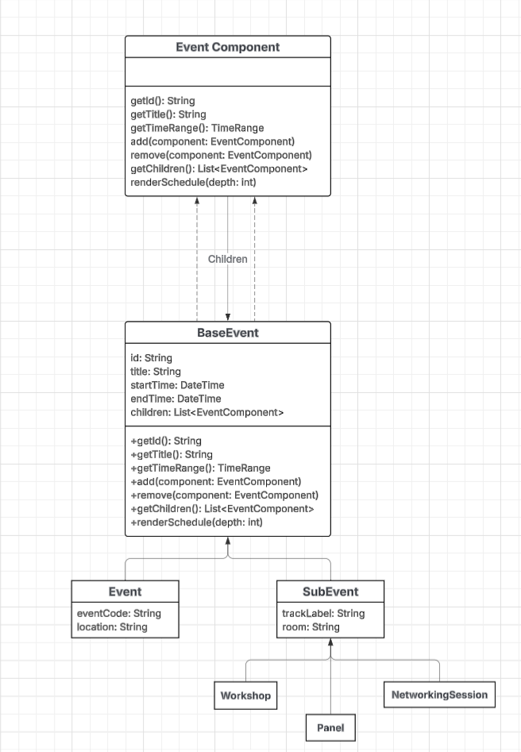

# LTT 62: Composite Pattern for Campus Events

## Objective

Use the Composite Design Pattern to model campus events and their subcomponents (e.g., workshops, panels, networking sessions) in a consistent and extensible way.

---

## Summary

The **Composite Design Pattern** is used to model campus recruiting events and nested subevents.

The goal is to represent both **top-level events** and **nested subevents** using a **uniform API**, so that traversal, rendering, and scheduling logic can treat them the same way—regardless of depth level.

---

## Design Criteria

- Model **campus events and nested subevents** using a tree structure.
- Has to treat `Event` and `SubEvent` **uniformly** during traversal.
- Must support extensibility so that new types can be added without modifying traversal logic.
- Provide a unified API for:
  - Adding / removing subevents
  - Iterating through children
  - Rendering event schedules

---

## Composite Structure Overview

| Component | Description | Purpose |
|-----------|-------------|----------|
| **EventComponent** | Common interface for all event types | Makes sure there is consistent interaction across all event objects |
| **BaseEvent** | Abstract build that implements management logic | Centralizes tree operations such as add/remove/traverse |
| **Event** | Represents full-scale campus events | Holds collections of nested subevents |
| **SubEvent** | Represents individual sessions or segments | Can act as leaf or composite if nested further |
| **Workshop / Panel / NetworkingSession** | Domain-specific leaf examples | Add expressiveness without changing architecture |

---

## UML (PlantUML) Diagram (class structure)

https://lucid.app/lucidchart/78b208f1-4299-48ac-96f2-48ec40b2476b/edit?viewport_loc=1384%2C-1270%2C3415%2C1452%2CHWEp-vi-RSFO&invitationId=inv_f178ec25-672e-4a69-8e4b-713d8f48c172

