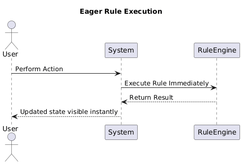
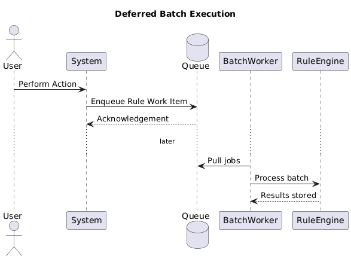
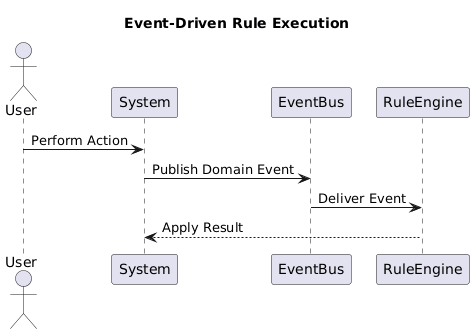

# LTT 59: Timing of Posting Rules

## Objective

Evaluate and determine the optimal timing mechanism for posting rules in the system to improve performance, consistency, and maintainability.

This analysis compares three timing strategies used in rule-execution workflows:
- Eager (Immediate Execution)
- Deferred (Batch Processing)
- Rule-Driven (Event-Based Execution)

---

## Context

The system processes candidate and recruiter interactions. Posting rules determine when updates should be computed after an interaction. Poor timing decisions can cause delays or inconsistent behavior. This document will help determine which timing strategy would work best for our system.

---

## Timing Strategy Analysis

### 1. Eager Execution (Immediate)
Rules execute as soon as a triggering action occurs.

Action A occurs → rule executes synchronously → results immediately reflected.

#### Advantages
- Real-time responsiveness
- Immediate visibility of updated state
- Easier to understand and debug

#### Disadvantages
- Poor performance under high load
- Increased latency when operations are expensive
- Can create cascading updates and race conditions

#### Best Use Cases
- Small datasets, low concurrency
- Simple evaluation logic that is fast to compute

---

### 2. Deferred Execution (Batch Processing)
Rules execute at a scheduled time interval or when a batch threshold is reached.

Actions enqueue work → batch worker processes queue periodically.

#### Advantages
- Smooth computational load distribution
- Improved predictability and performance stability
- Supports heavy operations without blocking real-time UI behavior

#### Disadvantages
- Results are not immediately visible
- Requires queue and scheduler infrastructure
- Possibility of backlog if capacity is insufficient

#### Best Use Cases
- Large-scale ranking or scoring operations
- Aggregated updates or analytics

---

### 3. Rule-Driven (Event-Based)
Rules execute only when specific domain events or conditions occur.

System listens for domain events → evaluate conditions → execute rule when required.

#### Advantages
- Executes only when necessary (efficient)
- Reduces redundant rule processing
- Scales well with event-stream architectures

#### Disadvantages
- Requires strong event modeling and monitoring
- Debugging is more complex
- Harder to reason about side effects

#### Best Use Cases
- Trigger-based notifications, threshold alerts
- Processes dependent on state transitions rather than time

---

## Comparison Table

| Strategy | Performance Impact | Implementation Complexity | Real-Time Accuracy | Best Use Case |
|----------|--------------------|---------------------------|--------------------|----------------|
| Eager | Low | Low | High | Simple, synchronous updates |
| Deferred | High | Medium | Medium | Heavy rules and high traffic |
| Event-Based | Very High | High | High | Event-triggered and scalable systems |

## Best approach 

Deferred execution would work best for production use due to its ability to handle large activity and computation without impacting real-time interactions.

Eager execution may still be used only when:
- Results need to be visible immediately
- Operations are inexpensive

Rule-driven execution may work in the future, especially with a proper event stream workflow.
